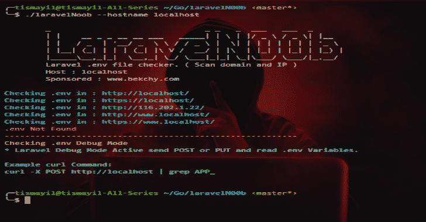

# LaravelN00b:自动扫描。env 文件&检查受害者主机中的调试模式

> 原文：<https://kalilinuxtutorials.com/laraveln00b/>

不正确的配置允许您访问。环境文件或读取环境变量。 **LaravelN00b** 自动扫描。env 文件并检查受害者主机中的调试模式。

**扫描原理**

*   扫描主机。
*   解析 IP 地址并检查。IP 地址中的环境文件
*   检查调试模式 Laravel(读取。环境变量)

**也可阅读—[IoT shark:监控和分析物联网流量](https://kalilinuxtutorials.com/iotshark-monitoring-analyzing-iot-traffic/)**

**安装**

*   用 installer.sh 安装

**chmod +x installer.sh
。/installer.sh**

*   安装手册

**去找 github.com/briandowns/spinner
去找 github.com/christophwitzko/go-curl
去运行 main . go–hostname victim . host
或
去构建 laravelN00b main.go**

**运行**

**。/laraveln 00 b–主机名受害者.主机**

[**Download**](https://github.com/tismayil/laravelN00b)