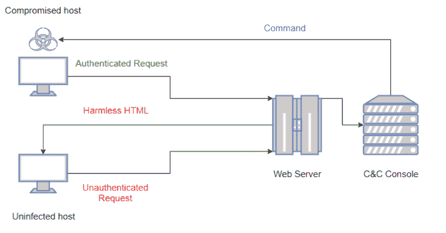
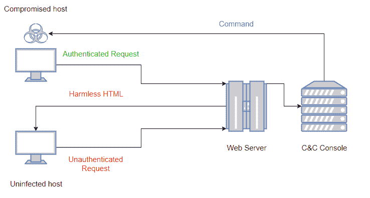
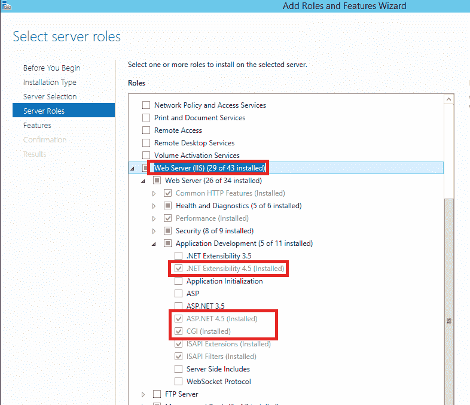
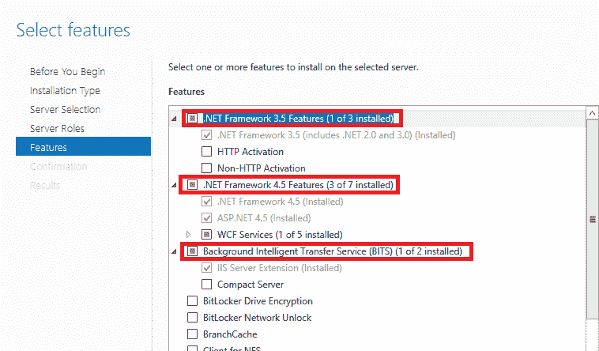
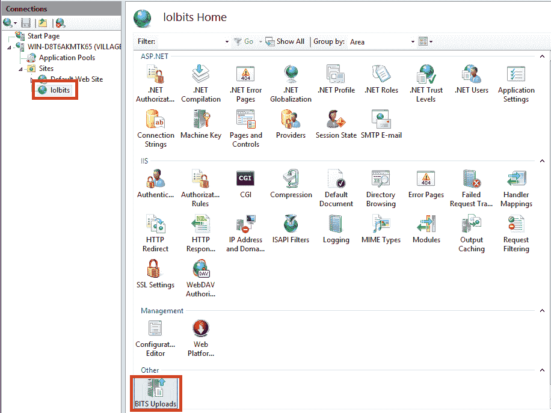
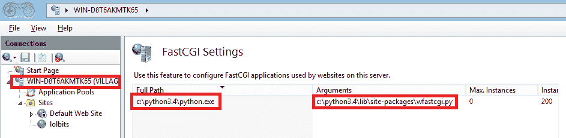
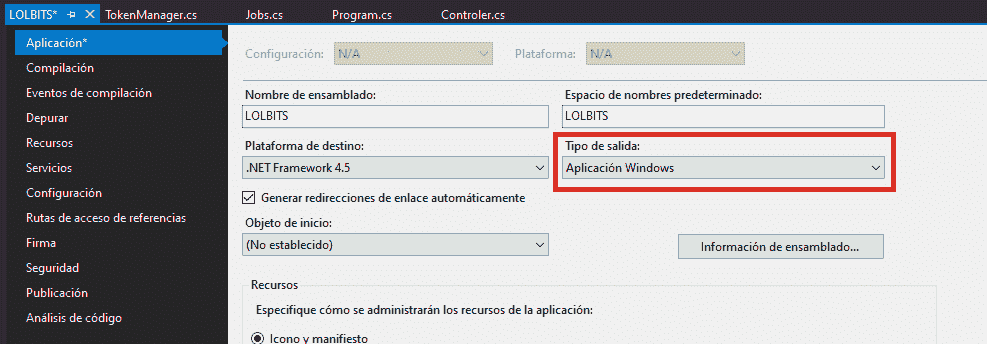

# LOLBITS:使用 BITS 作为通信协议的 C#反向外壳

> 原文：<https://kalilinuxtutorials.com/lolbits-reverse-shell-using-bits-communication-protocol/>

**LOLBITS** 是一个 C#反向 shell，使用微软的[后台智能传输服务(BITS)](https://docs.microsoft.com/en-us/windows/win32/bits/background-intelligent-transfer-service-portal) 与命令和控制后端进行通信。命令和控制后端隐藏在一个明显无害的 flask web 应用程序后面，只有当应用程序收到的 HTTP 请求包含有效的身份验证头时，它才是可访问的。

**It** 由 3 个主要元素组成:

*   C#代理负责在受损主机中执行命令，并在执行过程完成后将输出发送回 C&C 服务器。
*   充当调度程序的 flask web 应用程序。该元素允许将 C&C 基础结构隐藏在无害网站的后面，同时在收到经过身份验证的请求时向代理提供新命令。
*   C&C 控制台，用于控制代理。

为了拒绝代理的内容检查，在代理和 C&C 服务器之间发送的所有相关内容都使用带有预共享密钥的 RC4 加密。基础设施行为的高级图表如下图所示:

为了避免蓝队复制一些旧的请求并发现 C&C 基础设施，每个身份验证头都是随机生成的，并且只在一个周期内有效(一个周期由 POST 请求和 GET 请求组成)。旧的身份验证标头将被忽略，无害的网站将针对这些请求显示。

**也可阅读-[GTFO:搜索 Unix 二进制文件以绕过系统安全限制](https://kalilinuxtutorials.com/gtfo/)**

**入门**

**先决条件**

对于 C&C 基础架构，需要具有 python 3.4+版本的 Windows Server 2012 或更高版本以及以下 python 依赖项:

*   彩色光

**pip 安装 colorama**

*   瓶

**pip 安装烧瓶**

C#代理已在 Windows Server 2016、Windows Server 2019、Windows 8.1 和 Windows 10 上成功测试。要编译它，需要:

*   Visual Studio 2017 或以上版本。
*   。NET Framework 4.5 或以上版本。

**设置**

*   在您的 C&C 服务器上克隆此存储库

**git 克隆 https://github . com/kudaes/lol bits . git**

*   通过 Windows 服务器管理器安装 Web 服务器(IIS)。确保安装 CGI，ASP.NET 和。NET 扩展性角色。

还要安装。IIS 的. NET Framework 和 BITS 功能。

*   在 IIS 中安装 wfastcgi 并配置快速 cgi 设置。这是必需的，因为我们的 web 应用程序是用 Python 编写的。为了完成这一步，我跟进了[这篇精彩的教程](https://medium.com/@rajesh.r6r/deploying-a-python-flask-rest-api-on-iis-d8d9ebf886e9)，我建议你也这样做。完成本教程的第 1 步和第 2 步后，请回到本自述文件。

*   停止默认网站，并使用 Internet 信息服务管理器创建一个新网站。为此新网站启用 BITS 上载。

*   将该库的 C & C 文件夹下的`the` **`content`** 移动到新网站部署的物理目录下。假设您已经创建了指向您的目录`**C:\inetpub\wwwroot\bits**`的新网站，那么这应该是目录树:

我建议授予**每个人**对网站目录的完全访问权限(示例中为`C:\inetpub\wwwroot\bits`),以避免各种访问被拒绝的错误。最后，这只是一个 C & C 服务器…

*   6.-编辑 web.config 文件。在这个文件中，您必须修改两个设置:

1.  web 处理程序的属性。为此，返回到 IIS 管理器，单击 IIS 服务器的根目录，并选择 FastCGI 设置(您应该已经按照步骤 3 中引用的教程进行了配置)。`**scriptProcessor**`属性的值应该是“完整路径|参数”。

根据上图，我的 **`scriptProcessor`** 属性应该有值**“c:\ python 3.4 \ python . exe | c:\ python 3.4 \ lib \ site-packages \ wfastcgi . py”**。

*   PYTHONPATH，它应该指向您的网站目录，在本例中应该是“C:\inetpub\wwwroot\bits”。

*   修改**初始设置常数**。

1.  选择用作预共享密钥的密码。将其值设置为:
    *   **Program.cs** - > `**Password**`变量。
    *   **myapp . py**->-`**Password**`变量。
    *   **lawlbin . py**->-`**password**`变量。
2.  在 c#代理中设置 flask 应用程序正在监听的 url。
    *   Program.cs -> **`Url`** 变量。
3.  在 myapp.py 中，设置变量 **`AuthPath`、`ReadPath`** 和 **`Payloads`** 的值，指向网站目录中对应的文件夹。
4.  在 lawlbin.py (lolbins 文件夹)中，根据您的网站目录树为变量 **`baseReadPath`和`baseWritePath`** 设置相应的值。
5.  在 inject.py (lolbins 文件夹)中为变量`__payloads`设置与在 myapp.py 中为`Payloads`设置的值相同的值。

*   编译代理并在受损主机上执行。编译会生成一个 exe 和一个外部依赖(**Newtonsoft.Json.dll**)。你可以使用 [ILMerge](https://github.com/dotnet/ILMerge) 生成一个 exe 文件，或者只发送两个文件。为了避免调试输出，将项目编译为一个 **Windows 应用程序**。

**用途**

要获得反向 shell，只需在 C & C 服务器的 cmd 上键入`**python lawlbin.py**`，并在受损主机上执行 C#代理。

由于这个项目是从一个失败的项目的灰烬中诞生的，一些老的特征被保留了下来。旧的项目是一个外壳，所有可用的命令都将通过专门使用陆地二进制文件来执行。这就是 LOLBITS 的 LOL 的来源，也是为什么下面的特性只使用 LOLBINS 运行(这可以帮助绕过 AWS 和一些 EDR 过滤器):

*   **下载**:从 Webdav 下载文件到被入侵的主机。
*   **复制**:将文件从一个本地路径复制到另一个本地路径。
*   **base64encode** :对本地文件的内容使用 base64 编码。
*   **base64decode** :解码一个 base64 编码的文件。
*   **编译**:编译。cs 文件转换为 exe 或 dll。
*   **执行**:执行不同类型的文件(bat、exe、xml、js、vbs、hta 等等)。**在维修！！坏掉的 ATM！！**
*   **downexec** :从 webdav 下载一个文件并执行。**在维修！！坏掉的 ATM！！**

尽管如此，这些特性在某些环境下还是很有趣的(嗯，不使用 Powershell 下载远程文件？我喜欢！)我保留它们只是为了重用 C&C 控制台的部分旧代码。下面是一些我确信在正常情况下会更有用的功能列表:

*   **注入**:从 C &下载一个外壳代码(。bin)或 dll(。NET 程序集)文件并在内存中执行它。使用此命令，有效负载不会接触未加密的磁盘，从而避免了 AV 检测。外壳代码注入仅适用于 64 位进程。外壳代码注入可以在自己的进程和远程进程上执行。
*   **psh** :生成远程 Powershell 版本 2 shell。这个 shell 必须由 netcat 之类的附加软件来处理(只需运行 nc -lvp)。
*   **发送**:要从你的 C & C 发送一个文件到被入侵的主机，只需使用这个选项。发送文件将存储在磁盘上，所以要小心。
*   **getsystem** :试图使用命名管道模拟获取系统权限。需要高完整性流程。
*   **impersonate** :试图从其他进程窃取访问令牌，以便“成为”另一个用户。
*   **runas** :使用有效凭证修改您的安全上下文，并以其他(本地或域)用户身份登录。
*   **rev2self** :删除由 getsystem、impersonate 或 runas 执行的安全上下文更改。
*   **泄漏**:从被入侵的主机发送一个文件到你的 C & C

要获得用法提示，只需输入 **`help`或`<somecommand> help`** 。将来会实现更多的功能，敬请关注！

[**Download**](https://github.com/Kudaes/LOLBITS)