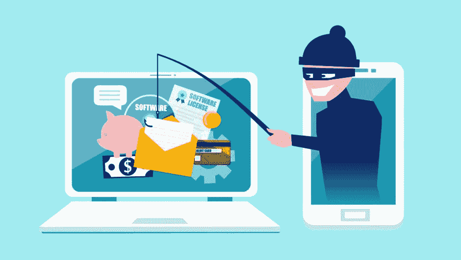

# 在大学里保护自己免受网络攻击的 5 个技巧

> 原文：<https://kalilinuxtutorials.com/5-tips-to-protect-yourself-from-cyberattacks-at-the-university/>

学生们通常看不到在网络世界中保护自己的重要性，因为他们不认为自己是黑客的目标。事实是，每个人都有风险，学生可以获得他们的信用卡信息和其他个人信息用于欺诈目的。

这可能会彻底改变学生的生活，他们可能会遭受许多心理和情感创伤。学生在使用技术设备时，尤其是那些连接到互联网的设备时，可以通过保护自己来轻松避免这些结果。学生如何加强网络安全？

这里有 5 个在大学保护自己免受网络攻击的小贴士。

**密码强度**

大多数人都不愿意设置简单的密码，因为黑客很容易就能猜到并进入你的网络生活。你会相信现在还有人用 12345678 做密码吗？

其他人选择简单的密码，如 QWERTY，password，或者他们使用自己的名字和姓氏，但在末尾或开头添加 123。这些都是您应该避免使用的密码，因为它们很容易被猜到。

根据创建密码时的要求，强密码通常至少有一个特殊字符和大写字母。它应该由总共 8-12 个字符组成。这一点非常重要，也是[提高大学](https://lifebeyondnumbers.com/4-ways-to-improve-cybersecurity-at-college/)网络安全的最大看点之一。

**非常小心电子邮件**

电子邮件是带有恶意内容和附件的[垃圾邮件](https://www.symantec.com/connect/articles/spam-mail-type-email-spam-virus-ransomware-and-malware-email-spam)的集散地，这些邮件可能会渗透到您的整个系统。如果您与垃圾邮件或旨在进行网络钓鱼的电子邮件进行交互，他们可以获得的所有个人信息都将受到威胁。

你也可以无意中下载病毒，这使得电子邮件安全成为一个非常重要的问题。考虑使用电子邮件杀毒软件来避免不合适的结果，也不要打开来自未知电子邮件地址的电子邮件。虽然这听起来有些极端，但你必须尽一切可能保护自己免受网络攻击。

**保护所有设备**

所有的设备都应该有安全措施，要进入你的手机，你要么画一个图案，输入密码，要么使用生物识别系统。而另一方面，所有设备都应该具有防病毒保护，以保护它们免受恶意软件的侵害。

您也可以将设备设置为在安装未知应用程序之前请求您的许可。另一个有用的技巧是将设备设置为远程锁定，或者在设备丢失或被盗时清除所有数据。这将保护您所有的数据，不会落入他人之手。

作为一名学生，如果你不知何故面临所有数据被删除或重要作业被破坏的情况，你可以向 [au assignment help](https://au-assignmenthelp.com/) 求助。在线写作服务是澳大利亚、美国和其他地方的许多学生完成论文、短文和学位论文的热门选择。

**保持一切自动更新**

当手机、笔记本电脑或平板电脑的操作软件更新时，您可以受益于新的安全措施。这使得将所有设备设置为自动更新变得非常重要，如果可能的话，这样您就可以掌握所有的安全更新。

如果你使用的是 Windows10，这一点尤其重要，因为安全系统完全集成到了操作系统中。其他设备可能不支持自动更新功能；在这种情况下，您可以定期检查是否有新的更新，并立即下载。

**了解常见骗局**

学生还应该熟悉他们可能遇到的潜在威胁。这涉及所有个人信息、网络钓鱼方法以及黑客如何使用电子邮件来危害他们的目标系统。

此外，学生们应该知道信用卡诈骗和其他金融诈骗，因为如果他们不警惕的话，他们也可能被骗。网络安全教育在互联网上公开提供，学生应该努力找到更多保护自己的方法。

**底线**

网络安全应该是学生们最优先考虑的事情，因为如果他们受到攻击并丢失了个人信息，这可能会影响他们的学业。这一切都始于简单的事情，如确保您有一个强有力的密码，一个防病毒系统和他们的设备是安全的。

学生还应该注意垃圾邮件和钓鱼邮件，不要打开来源不明的邮件。然而，这一切都归结于接受关于网络攻击以及如何保护自己免受攻击的教育。如果你积极努力更新你的系统，你的网络安全将得到加强。

**作者简介:**

Emma Rundle 是一名 IT 专家，在硅谷的一家软件初创公司工作。她还为一家在线作业服务公司兼职写作，内容涵盖 IT 以及物理和数学等其他学科。在空闲时间，她在她的软件评论博客上工作，练习瑜伽，参加尊巴课程。