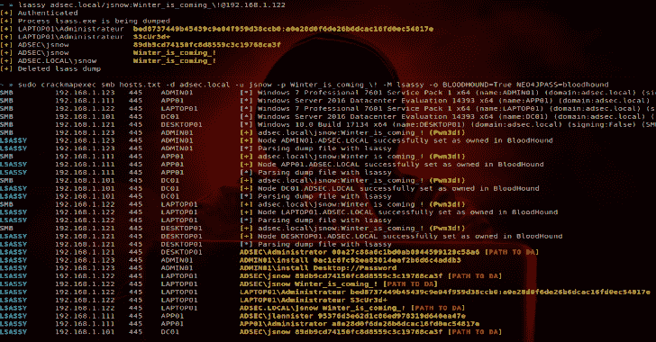

# Lsassy:从 Lsass Remotel 提取凭据

> 原文：<https://kalilinuxtutorials.com/lsassy-extract-credentials-lsass-remotel/>

Lsassy 是一个用于从 lsass 远程提取凭证的工具。这个库使用 [impacket](https://github.com/SecureAuthCorp/impacket) 项目远程读取 lsass 转储中的必要字节，使用 [pypykatz](https://github.com/skelsec/pypykatz) 提取凭证。

| 章 | 描述 |
| --- | --- |
| 要求 | 从源代码安装 lsassy 的要求 |
| 装置 | 来自 pip 或 source 的安装命令 |
| 基本用法 | 独立版本的命令行模板 |
| 高级用法 | 高级用法(转储方法、执行方法等) |
| CrackMapExec 模块 | 链接到该库中包含的 CrackMapExec 模块 |
| 例子 | 独立模块和 CME 模块的命令行示例 |
| 问题 | 创建问题前请阅读此内容 |
| 承认 | 向这些人和工具致敬 |
| 贡献者 | 对此工具做出贡献的人 |

**要求**

*   Python >= 3.6
*   [pypykatz](https://github.com/skelsec/pypykatz) > = 0.3.0
*   [撞击](https://github.com/SecureAuthCorp/impacket)

**安装**

**从画中画**

**python3.7 -m pip 安装 lsassy**

**来源于**

**python3.7 setup.py 安装**

**基本用法**

**lsassy[–hashes[LM:]NT][<域/] <用户> [: <密码>@<目标>**

**也可以理解为-[hak rawler:在 Web 应用](https://kalilinuxtutorials.com/hakrawler-endpoints-assets-web-application/)中发现端点&资产**

**高级**

**倾倒方式**

这个工具可以以不同的方式转储 lsass。

倾倒方式( **`-m`** 或`**--method**`)

*   **0** :尝试所有方法(dll 然后 procdump)转储 lsass，成功时停止(如果 dll 方法失败，需要-p)
*   **1**:comsvcs.dll 方法，成功时停止(默认)
*   **2** : Procdump 方法，成功时停止(需要-p)
*   **3**:comsvcs.dll+Powershell 方式，成功停止
*   **4**:comsvcs.dll+cmd.exe 法

**comsvcs.dll 法**

这个方法**只使用内置的 Windows 文件**来提取远程凭证。它使用来自**comsvcs.dll**的 **minidump** 函数来转储 **lsass** 进程。

该方法只能在上下文有 **SeDebugPrivilege** 时使用。此权限位于 Powershell 本地管理上下文或 cmd.exe 系统上下文中。

可以使用两种执行方法。

1.  使用 cmd.exe(无 SeDebugPrivilege)或 powershell (SeDebugPrivilege)
2.  使用系统上下文(SeDebugPrivilege)调度任务

**过程转储方法**

这个方法从 SysInternals 上传**procdump.exe**到转储 **lsass** 进程。它将首先尝试使用 WMI 执行 procdump，如果失败，它将创建一个远程任务，执行并删除它。

**例**

**lsassy[–hashes[LM:]NT][<域> /] <用户> [: <密码> ]@ <目标>-m0-p/path/to/procdump . exe
lsassy[–hashes[LM:]NT][<域> /] <用户> [: <密码>@<目标【T19 <用户> [: <密码> ]@ <目标>-m ^ 3 lsassy[–hashes[LM:]NT][<域> /] <用户> [: <密码> ]@ <目标>-m ^ 4**

**仅远程解析**

lsassy 可以解析已经转储的 lsass 进程。

**lsassy[–hashes[LM:]NT]–dump path/share/path/to/dump[<域> /] <用户> [: <密码>@<目标>**

**CrackMapExec 模块**

我编写了一个 CrackMapExec 模块，该模块使用 **lsassy** 来提取受损主机上的凭证

CrackMapExec 模块在 **`cme`** 文件夹: [CME 模块](https://github.com/Hackndo/lsassy/tree/master/cme)

**例题**

**lsassy**

**# RunDLL 方法 lsassy**adsec.local/jsnow:Winter_is_coming@dc01.adsec.local

**CME 模块**

**crackmapexec SMB 10 . 0 . 0 . 0/24-d adsec . local-u Administrator-p Passw0rd-M lsassy-o blood hound = True neo4j pass = blood hound**

**变更日志**

*   **v1.1.0**
    *   更好的执行过程:–在帮助文本中添加并描述了方法标志
    *   使用随机转储名称
    *   在 cmd、powershell、dll 和/或 procdump 方法之间选择
    *   CME 模块现在使用 light lsassy WMIExec et TASKExec 实现
    *   错误修复
*   **v1.0.0**
    *   内置 lsass 转储
        **使用内置窗口的 Lsass 转储
        **使用 procdump 的 Lsass 转储(使用-p 参数)
    *   add–dump path 仅用于请求远程解析
    *   代码重构
    *   添加–静音至静音输出
*   **v0.2.0**
    *   将 BloodHound 选项添加到 CME 模块(-o BLOODHOUND=True)
        *   在 BloodHound 中将受损目标设置为“已拥有”
        *   检查受损用户是否至少有一条通向域管理员的路径
    *   自定义解析(json、grep、pretty[默认])
    *   新–散列选项到 lsassy
    *   在存储库中包含 CME 模块
    *   向 CME 数据库添加凭据
*   **v0.1.0**
    *   首次发布

**问题**

如果您发现这个工具有问题(这很有可能！)，请

*   检查您使用的是最新版本
*   发送尽可能多的细节。
    *   对于独立的 **lsassy** ，请使用`**-d**`调试标志
    *   对于 CME 模块，请使用 CrackMapExec `**--verbose**`标志

[**Download**](https://github.com/Hackndo/lsassy)