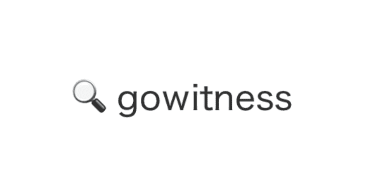

# Gowitness:一个使用 Chrome Headless 的 Golang 网页截图工具

> 原文：<https://kalilinuxtutorials.com/gowitness/>

**Gowitness** 是一个用 Golang 编写的网站截图实用程序，它使用 Chrome Headless 通过命令行生成 web 界面的截图。Linux 和 macOS 都支持，Windows 支持“**部分工作**”。

`gowitness`的灵感来自于[的目击者](https://github.com/ChrisTruncer/EyeWitness)。如果你正在寻找有很多额外功能的东西，一定要看看这些[其他](https://github.com/afxdub/http-screenshot-html) [项目](https://github.com/breenmachine/httpscreenshot)。

**安装**

你只需要安装最新的谷歌 Chrome 或 Chrome 和`**tool**`本身。`It`可以使用`**go get -u github.com/sensepost/gowitness**`下载，或者使用从[发布版](https://github.com/sensepost/gowitness/releases)页面下载的二进制文件。

**又读-[外壳后门列表:PHP / ASP 外壳后门列表](https://kalilinuxtutorials.com/shell-backdoor-list/)**

**使用 Docker 运行**

要使用 docker 截屏一个页面，只需运行下面的命令，该命令也将获取最新的 gowitness 图像:

**docker run–RM-it-v $(pwd)/截图:/截图 leonjza/gowitness:最新单曲–URL = https://www . Google . com**

请记住，需要在容器中装入一个文件夹，以便 **`gowitness`** 将您的截图写入其中，否则当容器退出时，这些截图将会丢失。该容器配置了作为工作目录的`**/screenshots/**`目录，所以上面的命令在那里挂载了一个本地的`**screenshots/**`目录。

如果您想要读取 nmap 文件，请将其本地保存到屏幕截图目录中，并将其用于:

**docker run–RM-it-v $(pwd)/截图:/截图 leonjza/gowitness:最新 nmap-f/截图/nmap.xml**

对于任何其他命令，您可以获得类似于本地二进制安装的帮助。例如:

docker run–RM-it-v $(pwd)/screens:/screens leonjza/gowitness:latest-h
由@leonjza

**提供的命令行 web 屏幕截图和信息收集工具用法:**
gowitness【命令】

**可用命令:**
文件屏幕截图来源于文件的 URL
帮助关于任何命令的帮助
来自 nmap XML 文件的 Nmap 屏幕截图服务
报告使用 gowitness

**从源代码构建**

要从源代码构建它，请遵循以下步骤:

*   确保您的 golang 版本至少为 1.13。
*   克隆这个库并将`**cd**`放入其中。
*   运行`**go build**`来获取当前机器的`**gowitness**`二进制文件。
*   或者，`make`为所有目标构建。二进制文件将在`**build/**`目录中。

**用法举例**

**截图单个网站**

**$ gowitness single–URL = https://www . Google . com/**

这会创建一个名为`**https-www.google.com.png**`的文件

**截图一个 Cidr**

**$ gowitness 扫描–CIDR 192 . 168 . 0 . 0/24–线程 20**

当完成时，这会在当前目录中产生许多`**.png**`图像。这也可以使用`**20**`线程，而不是默认的`**4**`。

**生成报告**

**$ gowitness 报告生成**

这将产生一个带有截图报告的`**report.html**`文件。

**$ gowitness 报告生成-分类-感知**

这将生成一个带有屏幕截图报告的`**report.html**`文件，其中屏幕截图使用感知哈希进行排序。

**$ gowitness 报告列表**

这将列出`**gowitness.db**`文件中的条目。

[**Download**](https://github.com/sensepost/gowitness)