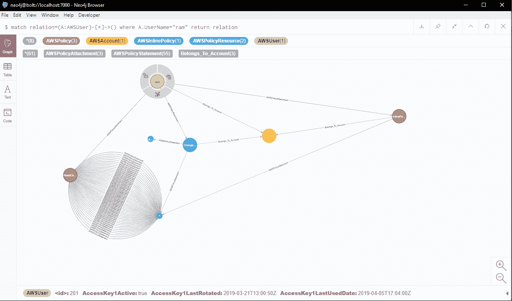

# Aaia : AWS 身份和访问管理可视化工具和异常探测器

> 原文：<https://kalilinuxtutorials.com/aaia/>

Aaia(发音如图所示[此处](https://translate.google.co.in/#view=home&op=translate&sl=ta&tl=en&text=Aaya))在 Neo4j 的帮助下，有助于以图形格式可视化 AWS IAM 和组织。这有助于轻松识别异常值。因为它是基于 neo4j 的，所以可以使用 cypher 查询来查询该图以发现异常。

它还支持以编程方式从 neo4j 数据库获取数据并以自定义方式处理数据的模块。如果必须应用任何复杂的比较或逻辑，这是非常有用的，否则通过 cypher 查询是不容易的。

**安装**

**安装 neo4j 数据库**

此处的说明[为](https://neo4j.com/docs/operations-manual/current/installation/)

在 Aaia.conf 文件中设置用户名、密码和螺栓连接 uri。Aaia.conf 文件中已经给出了格式示例。

**也可阅读-[Lsassy:从 Lsass Remotel](https://kalilinuxtutorials.com/lsassy-extract-credentials-lsass-remotel/) 中提取凭证 **

***安装 OS 依赖***

**Debian :-**

**apt-get 安装 awscli jq**

**Redhat / Fedora / Centos /亚马逊 Linux :-**

**yum 安装 awscli jq**

**注:**

Aaia_aws_collector.sh 脚本需要这些包。确保运行收集器脚本的基本系统中存在这些程序包。

**克隆此存储库**

[git 克隆](https://github.com/rams3sh/Aaia)[https://github . com/rams 3 sh/aaia](https://github.com/rams3sh/Aaia)
光盘 Aaia/

**创建虚拟环境**

**python3 -m venv env**

**激活虚拟环境**

**源环境/媒体夹/激活**

**注意:** Aaia 依赖 pyjq 库，目前在 windows 中不稳定。因此，Windows 操作系统不支持 Aaia。

**安装依赖项**

**python -m pip 安装要求. txt**

**使用 Aaia**

**在 AWS 中设置权限**

Aaia 需要以下 AWS 权限，收集器脚本才能从 AWS 收集相关数据

iam:GenerateCredentialReport
iam:GetCredentialReport
iam:GetAccountAuthorizationDetails
iam:list users
iam:GetUser
iam:list groups
iam:list roles
iam:GetRole
iam:GetPolicy
iam:GetAccountPasswordPolicy
iam:GetAccountSummary
iam:list account aliases
组织:ListAccountsForParent

可以忽略“组织”相关的权限。但是，上述所有与“IAM”相关的权限都是必需的。

确保用户/角色/任何将用于收集器脚本数据收集的 aws 主体都有权限。

**从自动气象站收集数据**

确保您配置了 aws 凭据。请参考[本](https://docs.aws.amazon.com/cli/latest/userguide/cli-chap-configure.html)寻求帮助。

一旦建立了圆齿齿。

运行:-

**。/Aaia _ AWS _ collector . sh<profile _ name>**

确保用于数据收集的 aws 配置文件的输出格式设置为 json，因为 Aaia 希望收集的数据采用 json 格式。

**注:-**

在需要从另一个实例收集数据的情况下；将“Aaia_aws_collector.sh”文件复制到远程实例，运行该文件，并将生成的“offline_data”文件夹复制到安装 Aaia 的实例中的 Aaia 路径，并继续执行以下步骤。这将有助于咨询或客户审计。

**将采集的数据加载到 Neo4j 数据库**

**python aaia . py-n<profile_name>-a load _ data</profile_name>**

-n 支持“all”作为值，这意味着加载 offline_data 文件夹中收集和显示的所有数据。

**注:**

请确保您在凭据文件中没有将配置文件设置为“all ”,因为它可能会与参数冲突。😛

现在我们准备使用 Aaia。

**通过自定义模块审计 IAM**

到目前为止，给出了一个样本模块作为框架示例。人们可以将此作为构建定制模块的参考。

**python aaia . py-n all-m iam _ sample _ audit**

**演示**

**截图**

虚拟 AWS 帐户的 IAM 示例

在 AWS IAM 中查找用户的所有关系的 cypher 查询结果的示例

[**Download**](https://github.com/rams3sh/Aaia)