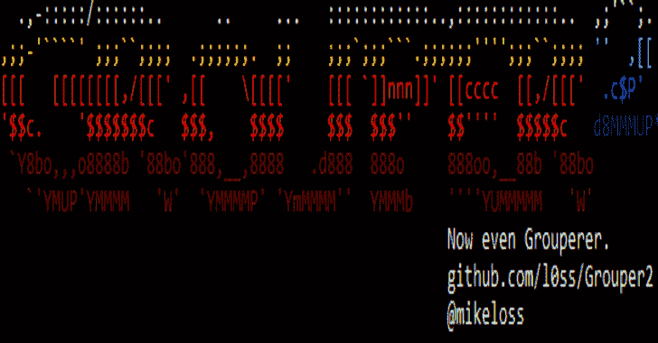
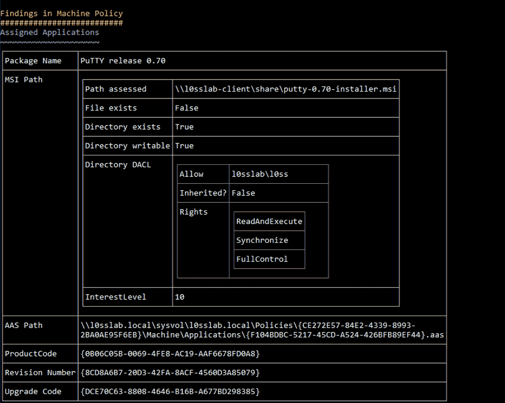

# Group 2:查找 AD 组策略中的漏洞

> 原文：<https://kalilinuxtutorials.com/grouper2/>

**Grouper2** 是一个发现 AD 组策略漏洞的工具。它是 pentesters 的一个工具，可以帮助发现 Active Directory 组策略中与安全相关的错误配置。

对于做其他事情的人来说，它可能也是有用的，但是它显然不是一个审计工具。如果您想根据某些特定标准检查您的策略配置，您可能需要微软的安全和合规工具包，而不是 Grouper 或 Grouper2。

它是做什么的？

它转储组策略中所有最有趣的部分，然后在其中寻找可利用的内容。

**和石斑鱼有什么不同？**

Grouper 要求您:

*   在加入域的计算机上安装 GPMC/RSAT 或其他软件
*   使用 Get-GPOReport PowerShell cmdlet 生成 xml 报告
*   将报告提供给 Grouper
*   一堆胡言乱语掉了出来，希望有一些好东西在那里。

Grouper2 确实像 Ed 先生建议的那样，直接进入了源代码，即 SYSVOL。

这意味着您没有对 Get-GPOReport 的可怕依赖(万岁！)但这也意味着它必须对不同的文件格式等进行一系列解析(booo！).

**其他很酷的新功能:**

*   不涉及写入磁盘的更好的文件权限检查。
*   不要错过那些石斑鱼 1 GPP 密码。
*   HTML 输出选项，所以你可以保留那些性感的控制台颜色，并把它们带在身边。
*   如果需要，将 Grouper2 瞄准 SYSVOL 的脱机副本。
*   它是多线程的！
*   一堆其他的好东西，但是很晚了，我也累了。
*   还有，是用 C#而不是 PowerShell 写的。

**又读**–**[葱白:基于 GPU 的葱白哈希生成器](https://kalilinuxtutorials.com/scallion/)**

我如何使用它？

实际上，只要在一个域用户的上下文中在一台加入域的机器上运行 EXE，神奇的 JSON 糖果就会掉出来。

如果 JSON 灼伤你的眼睛，添加`**-g**`让它变得真正漂亮。

如果你爱漂亮到想带走它，那就把糖果吐到 HTML 文件里。

如果有太多的糖果，而你想将输出限制为最美味的一点，用`**-i $INT**`设置“兴趣水平”，数字越大，糖果越美味，例如`**-i 10**`将只给你可能导致信誉或外壳的东西。

如果你不想在旧政策中挖掘，想把自己局限于当前的东西，那么就做 **`-c`。**

如果你想让糖果掉得更快，你可以用`**-t $INT**`设置线程数——默认为 10。

如果你想看其他选项，做 **`-h`。**

我不明白。

好吧，看看这个:

在上面的屏幕截图中，我们可以看到一个“分配的应用程序”策略仍被推送到计算机，但要安装的 MSI 文件丢失了，并且当前用户可以写入它的安装目录。

如果你创建了一个被破解的 MSI(例如，用 msfvenom ),然后修改它以匹配图片底部的 uid，它将在 GPO 锁定的机器上执行。太棒了。

在这张图上，你可以看到有人对注册表上的 ACLS 做了一些绝对疯狂的事情。

你明白了。

我能帮上什么忙？

看看 dev 分支，Sh3r4 一直致力于一个大的重构，以使它更容易维护和更有效地前进。

**ATM 的大致路线图是:**

*   让 dev 分支至少像 master 一样工作。
    *   如果你想在这方面有所帮助，看看标有“发展”的问题。
*   完成评估和兴趣级别代码块的基本单元测试。
*   把大的重构交给 master。
*   开始着手解决其他问题和功能等等。

**演职员表** : Sh3r4，@liamosaur，@skorov8

[Download](https://github.com/l0ss/Grouper2)