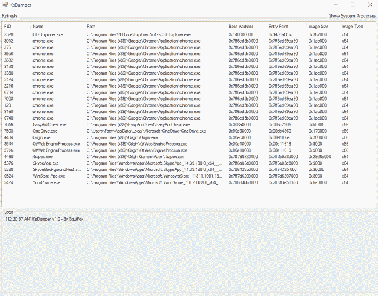
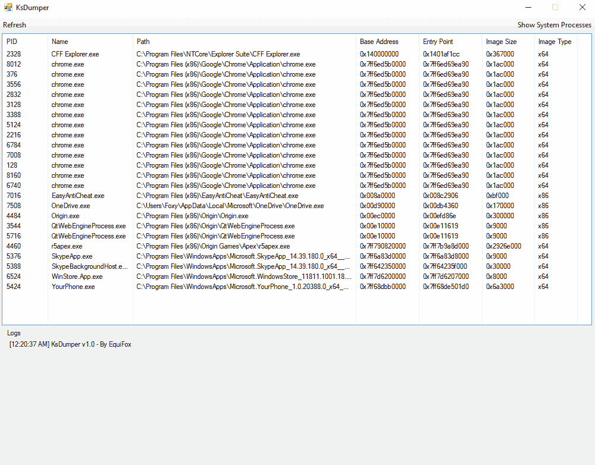

# KsDumper:利用内核空间的力量转储进程

> 原文：<https://kalilinuxtutorials.com/ksdumper/>

**KsDumper** 是一个利用内核空间力量的转储进程。这是一个定制的驱动程序，它允许我在不使用 OpenProcess 的情况下复制进程内存。

**特性**

*   使用内核驱动程序(x86 和 x64)转储任何进程主模块
*   重建 PE32/PE64 集管和区段
*   在受保护的系统进程上工作&带有剥离句柄的进程(反欺骗)

**注意**:导入表没有重建。

**又读-**[**科希:CORS 错误配置扫描仪**](https://kalilinuxtutorials.com/corsy/)

**用法**

在使用 KsDumperClient 之前，需要加载 KsDumper 驱动程序。

它是无符号的，所以你需要加载它。我用的是 Win10 的 drvmap。如果您也想使用它，这个版本中提供了一切。

1.  以管理员身份运行`**Driver/LoadCapcom.bat**`。暂时不要按任何键或关闭窗口！
2.  以管理员身份运行`**Driver/LoadUnsignedDriver.bat**`。
3.  在`**LoadCapcom**` cmd 中按回车键，卸载驱动程序。
4.  运行`**KsDumperClient.exe**`。
5.  利润！

*   注意 1:驱动程序会一直加载直到你重启，所以如果你关闭了 KsDumperClient.exe，你可以重新打开它！
*   **Note2** :尽管它可以转储两个 x86 & x64 进程，但它必须在 x64 Windows 上运行。

**免责声明**

该项目仅用于信息和教育目的。考虑到这个项目的性质，强烈建议在`**Virtual Environment**`中运行它。我们对您的系统可能发生的任何崩溃或损坏概不负责。

**重要提示**:这个工具不会试图隐藏自己。如果你的目标是受保护的游戏，反作弊软件可能会将其标记为作弊，并在一段时间后禁止你。用一个 **`Virtual Environment`！**

**自己编译**

*   需要 Visual Studio 2017
*   需要 Windows 驱动程序套件(WDK)
*   需要。NET 4.6.1

[**Download**](https://www.kitploit.com/2020/01/ksdumper-dumping-processes-using-power.html)