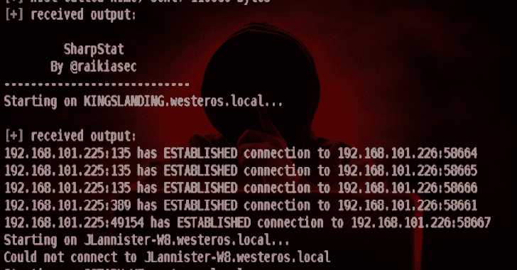
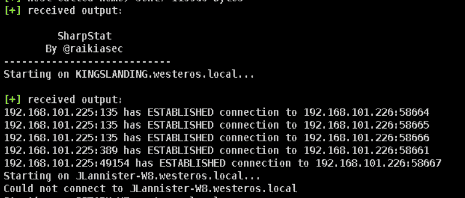

# SharpStat:使用 WMI 运行 CMD 的 C#实用程序

> 原文：<https://kalilinuxtutorials.com/sharpstat/>

[](https://1.bp.blogspot.com/-7vzjhTbqC14/XishEDCW3fI/AAAAAAAAEms/NHEtMBHVUoIF_ElOklacmG8TH86t-CCeQCLcBGAsYHQ/s1600/SharpStat_1%25281%2529.png)

**SharpStat** 是一个 C#实用程序，使用 WMI 运行“cmd.exe /c netstat -n”，将输出保存到一个文件中，然后使用 SMB 远程读取和删除该文件。该脚本将尝试连接到所有提供的计算机，并使用 WMI 来执行`**cmd.exe /c netstat -n > <file>**`。

保存输出的文件由'-file '指定。netstat 命令运行后，通过远程 SMB 调用读取输出，然后将其删除。

虽然这不是最隐秘的脚本(因为 cmd.exe 执行和保存到一个文件)，有时你必须做你必须做的。

一种替代方法是使用 WMI 远程查询 netstat 信息，但是 WMI 类只能在 Win10+系统上使用，这并不理想。这个解决方案至少适用于所有级别的操作系统。

**用法**

```
 Mandatory Options:
     -file         = This is the file that the output will be saved in 
                     temporarily before being remotely read/deleted

 Optional Options:
     -computers    = A list of systems to run this against, separated by commas
        [or]
     -dc           = A domain controller to get a list of domain computers from
     -domain       = The domain to get a list of domain computers from 
```

**也读作——[Aaia:AWS 身份&访问管理可视化器&异常发现器](https://kalilinuxtutorials.com/aaia/)**

**例题**

**SharpStat.exe-文件“C:\ Users \ Public \ test . txt”-域名 lab.raikia.com-DC lab.raikia.com
SharpStat.exe-文件“C:\ Users \ Public \ test . txt”-计算机“wkstn7.lab.raikia.com，wk stn 10 . lab . rai KIA . com”**

**截图**



**演职员表**:【raikiasec@gmail.com】T2 或@raikiasec

[**Download**](https://github.com/Raikia/SharpStat)