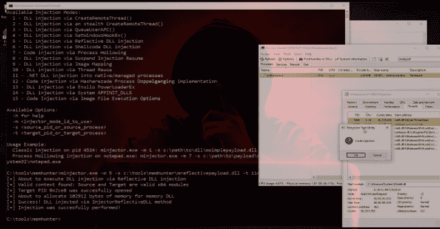

# Memhunter:代码注入技术的现场狩猎

> 原文：<https://kalilinuxtutorials.com/memhunter/>

**Memhunter** 是一款端点传感器工具，专门用于检测常驻恶意软件，改进威胁猎人分析流程和补救时间。该工具检测并报告驻留在端点进程上的内存恶意软件。Memhunter 检测已知的恶意内存注入技术。检测过程是通过实时分析执行的，不需要内存转储。

该工具旨在替代内存取证易失性插件，如 malfind 和 hollowfind。不需要内存转储的想法有助于大规模执行内存驻留恶意软件威胁搜索，无需手动分析，也无需将转储移动到取证环境所需的复杂基础架构。

检测过程通过端点数据收集和内存检查扫描器的组合来执行。该工具是一个独立的二进制文件，在执行时，它会将自己部署为 windows 服务。一旦作为服务运行，memhunter 就开始收集可能指示代码注入攻击的 ETW 事件。

收集的数据事件的实时流被馈送到内存检查扫描器，该扫描器使用检测试探法来向下选择潜在的攻击。整个检测过程不需要人工干预，也不需要内存转储，它可以由工具本身大规模执行。

除了数据收集和搜索启发，该项目还导致了一个名为“minjector”的配套工具的创建，该工具包含+15 代码注入技术。minjector 工具不仅可以用来测试 memhunter 检测，还可以作为学习众所周知的代码注入技术的一站式平台。

**也读作-[ks dumper:利用内核空间的力量转储进程](https://kalilinuxtutorials.com/ksdumper/)**

**示例 1:手动运行以检测反射 DLL 注入**

[https://www.youtube.com/embed/t_fR1sCENkc?feature=oembed&enablejsapi=1](https://www.youtube.com/embed/t_fR1sCENkc?feature=oembed&enablejsapi=1)

**例 2:手动运行进行工艺空洞注入检测**

[https://www.youtube.com/embed/QxCguP76uyg?feature=oembed&enablejsapi=1](https://www.youtube.com/embed/QxCguP76uyg?feature=oembed&enablejsapi=1)

[**Download**](https://github.com/marcosd4h/memhunter)