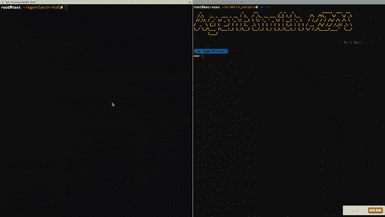

# AgentSmith-HIDS:开源的基于主机的入侵检测系统

> 原文：<https://kalilinuxtutorials.com/agentsmith-hids/>

从技术上讲，由于缺乏规则引擎和检测功能，AgentSmith-HIDS 不是一个基于主机的入侵检测系统(HIDS)。但是，它可以用作高性能的“主机信息收集代理”,作为您自己的 HIDS 解决方案的一部分。

此代理可以收集的信息的全面性是开发此项目期间最重要的指标之一，因此它被构建为在内核堆栈中运行，与用户堆栈中的功能相比具有巨大的优势，例如:

*   **更好的性能**，需要的信息都收集在内核栈中，避免了额外的补充动作，比如遍历'/proc '；为了提高数据传输的性能，采集的数据通过共享 ram 而不是 netlink 传输。
*   **难以被绕过**，信息收集由专门设计的内核驱动提供动力，使得几乎不可能绕过对 rootkit 等恶意软件的检测，这些恶意软件可以故意隐藏自己。
*   **易于集成**，AgentSmith-HIDS 旨在与其他应用程序集成，不仅可以用作安全工具，还可以用作良好的监控工具，甚至是您资产的良好检测器。该代理能够为您收集用户、文件、进程和互联网连接，所以让我们想象一下，当您将它与 CMDB 集成时，您可以获得一个由您的网络、主机、容器和业务(甚至依赖关系)组成的全面地图。如果您手头也有一个数据库审计工具会怎么样？映射可以扩展到包含数据库、数据库用户、表、字段、应用程序、网络、主机和容器等之间的关系。考虑与网络入侵检测系统和/或威胁情报等集成的可能性。，也可以实现更高的可追溯性。它永远不会过时。
*   **内核堆栈+用户堆栈**，AgentSmith-HIDS 还提供用户堆栈模块，在使用内核堆栈模块时进一步扩展功能。

**也可以理解为-[Yara SAFE:匹配 Yara](https://kalilinuxtutorials.com/yarasafe/)T3 中功能的安全嵌入**

**史密斯-HIDS 代理的主要能力:**

*   内核栈模块通过 Kprobe 挂接 **execve、connect、process inject、create file、DNS query、load LKM** 行为，并且还能够通过兼容 Linux 命名空间来监控容器。
*   用户栈模块利用内置的检测功能，包括查询**用户列表**、**监听端口列表**、**系统 RPM 列表**、**调度作业**
*   **AntiRootkit** ，来自: [Tyton](https://github.com/nbulischeck/tyton) ，目前增加 **PROC_FILE_HOOK** 、 **SYSCALL_HOOK** 、 **LKM_HIDDEN** 、 **INTERRUPTS_HOOK** 特性，但仅限于 3.10 内核上的 wark>。
*   信用变更监控(sudo/su/sshd 除外)
*   用户登录监控

**关于与内核版本的兼容性**

*   内核> 2.6.25
*   反 RootKit > 3.10

**关于与容器的兼容性**

| 来源 | Nodename |
| --- | --- |
| 主持 | 主机名 |
| 码头工人 | 容器名称 |
| k8s | 下的 name |

史密斯-HIDS 代理人的组成

*   **内核堆栈模块(LKM)** 通过 Kprobe 挂接关键函数，捕获所需信息。
*   **用户栈模块**采集内核栈模块捕获的数据，进行必要的处理，并发送给 Kafka 继续向服务器发送心跳数据包，以便可以识别进程完整性；执行从服务器接收的命令。
*   **代理服务器**(可选)向用户栈模块发送命令并监控用户栈模块的状态。

**执行挂钩**

通过挂钩**sys _ exec ve()/sys _ exec veat()/compat _ sys _ exec ve()/compat _ sys _ exec veat()**实现，示例:

{
" uid ":" 0 ",
" data _ type ":" 59 ",
" run _ path ":"/opt/LTP/test cases/bin/grow files "，
" exe ":"/opt/LTP/test cases/bin/grow files "，
" argv ":" grow files-W gf26-D 0-B-I 0-L 60-u-B 1000 B-e 1-R 128-32768:
" tty _ name ":" pt S1",
" socket _ process _ PID ":" 2175",
" socket _ process _ exe ":"/usr/sbin/sshd "，
" SSH _ CONNECTION ":" 192 . 168 . 165 . 1 61726 192 . 168 . 165 . 128 22",
" LD _ PRELOAD ":"/root/LD PRELOAD/test

**连接挂钩**

通过挂接 **sys_connect()** 实现，示例:

{
【uid】:" 0 ",
【data _ type】:" 42 ",
【sa _ family】:" 2 ",
【FD】:" 4 ",
【dport】:" 1025 ",
【dip】:" 180 . 101 . 49 . 11 ",
【exe】:"/usr/bin/ping "，
【PID】:" 6294 "

**DNS 查询挂钩**

通过挂接 **sys_recvfrom()** 实现，示例:

{
" uid ":" 0 ",
" data _ type ":" 601 ",
" sa _ family ":" 2 ",
" FD ":" 4 ",
" dport ":" 53 ",
" dip ":" 192 . 168 . 165 . 2 ",
" exe ":"/usr/bin/ping "，
"pid":"6294 "

**创建文件挂钩**

通过挂接 **security_inode_create()** 实现，示例:

{
" uid ":" 0",
" data _ type ":" 602",
" exe ":"/usr/lib/JVM/Java-1 . 8 . 0-open JDK-1 . 8 . 0 . 232 . b09-0 . el7 _ 7 . x86 _ 64/JRE/bin/Java "，
" file _ path ":"/tmp/Kafka-logs/replication-offset-check point . tmp "，
"pid ":" "

**进程注入挂钩**

通过挂接 **sys_ptrace()** 实现，示例:

{
" uid ":" 0 ",
" data _ type ":" 101 ",
" ptrace _ request ":" 4 ",
" target _ PID ":" 7402 ",
" addr ":" 0007 FFE 13011 ee 6 ",
" data ":"-a "，
"exe":"/root/ptrace/ptrace "，
" PID ":" 7400

**加载 LKM 文件挂钩**

通过挂接 **load_module()** 实现，示例:

{
" uid ":" 0 ",
" data _ type ":" 603 ",
" exe ":"/usr/bin/kmod "，
" LKM _ file ":"/root/ptrace/ptrace "，
" PID ":" 29461 ",
" ppid ":" 9766 ",
" pgid ":" 29461 ",
" tgid ":"

**信用兑换挂钩**

通过 Hook **commit_creds()** 实现，示例:

{
" uid ":" 0 ",
" data _ type ":" 604 ",
" exe ":"/tmp/TT "，
" PID ":" 27737 ",
" ppid ":" 26865 ",
" pgid ":" 27737 ",
" tgid ":" 27737 ",【T7 " comm ":" TT "，
。

**用户登录提醒**

{
" data _ type ":" 1001 ",
" status ":" Failed "，
"type":"password "，
"user_exsit":"false "，
"user":"sad "，
" from _ IP ":" 192 . 168 . 165 . 1 ",
" port ":" 63089 ",
" processor ":" ssh 2 ",
" time "

**PROC 文件挂钩预警**

{
" uid ":"-1 ",
" data _ type ":" 700 ",
" module _ name ":" auto IPv6 ",
" hidden ":" 0 ",
" time ":" 1578384987766 ",
" local _ IP ":" 192 . 168 . 165 . 152 ",
" hostname ":" test "
}

**系统调用挂钩警报**

{
" uid ":"-1 ",
" data _ type ":" 701 ",
" module _ name ":"二乙酰吗啡"，
" hidden ":" 1 ",
" syscall _ number ":" 78 ",
" time ":" 1578384927606 ",
" local _ IP ":" 192 . 168 . 165 . 152 ",【T7 "

**LKM 隐藏的警戒**

{
" uid ":"-1 ",
" data _ type ":" 702 ",
" module _ name ":"二乙酰吗啡"，
" hidden ":" 1 ",
" time ":" 1578384927606 ",
" local _ IP ":" 192 . 168 . 165 . 152 ",
" hostname ":" test "
}

**中断挂钩报警**

{
" uid ":"-1 ",
" data _ type ":" 703 ",
" module _ name ":" syshook "，
" hidden ":" 1 ",
" interrupt _ number ":" 2 ",
" time ":" 1578384927606 ",
" local _ IP ":" 192 . 168 . 165 . 152 ",
" hostname

**关于史密斯-HIDS 代理的表现**

测试环境:

| 中央处理器 | 英特尔酷睿 i7-4870HQ CPU @ 2.50GHz 双核 |
| --- | --- |
| 随机存取存储 | 2GB |
| 操作系统/内核 | centos 7/3 . 10 . 0-1062 . 7 . 1 . el7 . x86 _ 64 |

测试结果:

| 钩子处理器 | 平均延迟(美国) |
| --- | --- |
| execve_entry_handler | Ten point four |
| 连接处理程序 | Seven point five |
| 连接条目处理程序 | Zero point zero six |
| recvfrom_handler | Nine point two |
| 接收条目处理程序 | Zero point one seven |
| 文件系统通知发布处理程序 | Zero point zero seven |

[**Download**](https://github.com/EBWi11/AgentSmith-HIDS#syscall-hook-alert)