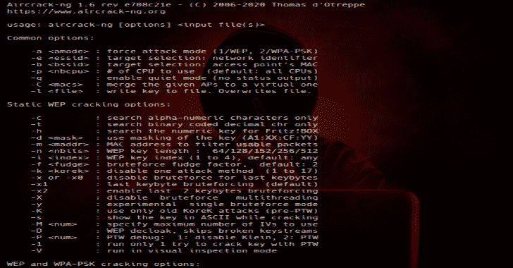

# AirCrack-NG : WiFi 安全审计工具套件

> 原文：<https://kalilinuxtutorials.com/aircrack-ng-wifi-security-auditing-tools-suite/>

**AirCrack-NG** 是一整套评估 WiFi 网络安全的工具。它侧重于 WiFi 安全的不同领域:

*   监控:数据包捕获和数据导出到文本文件，供第三方工具进一步处理。
*   攻击:重放攻击，解除认证，假冒接入点和其他通过数据包注入。
*   测试:检查 WiFi 卡和驱动程序功能(捕获和注入)。
*   开裂:WEP 和 WPA PSK (WPA 1 和 2)。

所有的工具都是命令行，允许繁重的脚本。很多图形用户界面都利用了这个特性。它主要运行 Linux，但也运行 Windows、OS X、FreeBSD、OpenBSD、NetBSD 以及 Solaris，甚至 eComStation 2。

**要求**

*   Autoconf
*   自动制造
*   Libtool
*   shtool
*   OpenSSL 开发包或 libgcrypt 开发包。
*   Airmon-ng (Linux)需要 ethtool。
*   在 windows 上，必须使用 cygwin，并且还需要 w32api 包。
*   在 Windows 上，如果使用 clang、libiconv 和 libiconv-devel
*   Linux: LibNetlink 1 或 3。可以通过传递–disable-libnl 进行配置来禁用它。
*   pkg-config(FreeBSD 上的 pkgconf)
*   带有 macports 的 FreeBSD、OpenBSD、NetBSD、Solaris 和 OS X:gmake
*   Linux/Cygwin: make 和标准 C++库开发包(Debian: libstdc++-dev)

**可选的东西**

*   如果你想在 airodump-ng (-essid-regex)中用正则表达式过滤 SSID，就需要 pcre 开发包。
*   如果要在 aircrack-ng 中使用 airolib-ng 和'-r '选项，SQLite 开发包> = 3.3.17(建议使用 3.6.X 版本或更高版本)
*   如果要使用 Airpcap，需要 CD/ISO/SDK 中的“developer”目录。
*   为了构建`besside-ng`、`besside-ng-crawler`、`easside-ng`、`tkiptun-ng`、`wesside-ng`，需要 libpcap 开发包(在 Cygwin 上，用 Aircap SDK 代替；见上文)
*   为了在 FreeBSD 上获得最佳性能(高出 50-70%)，请通过以下方式安装 gcc5(或更好): pkg install gcc9
*   rfkill
*   如果你想让 Airodump-ng 记录 GPS 坐标，就需要 gpsd
*   为了在 SMP 机器上获得最佳性能，请确保安装了 hwloc 库和头文件。强烈建议在高核心数系统上使用，这可能会大大提高速度
*   用于单元测试的 CMocka
*   仅用于 Linux 上的集成测试:tcpdump、HostAPd、WPA 请求程序和屏幕

**安装必需的&可选依赖项**

下面是安装基本要求的说明，以便为许多操作系统构建`aircrack-ng`。

**注意**:打包 Aircrack-ng 时，CMocka、tcpdump、screen、HostAPd 和 WPA Supplicant 不应成为依赖项。

**Linux**

***Debian/Ubuntu***

**sudo apt-get install build-essential autoconf automake libtool pkg-config libnl-3-dev libnl-genl-3-dev libssl-dev ethtool shtool rfkill zlib1g-dev libpcap-dev libsqlite3-dev libpcre3-dev libhwloc-dev libcmocka-dev hostapd wpasupplicant tcpdump screen iw usbutils**

***Fedora/CentOS/RHEL***

**sudo yum install libtool pkgconfig SQLite-devel autoconf automake OpenSSL-devel libpcap-devel pcre-devel RF kill libnl 3-devel gcc gcc-c++ ethtool hwloc-devel libcmocka-devel git make file expect hostapd wpa _ supplicant iw usbutils tcpdump screen**

**注意**:在 CentOS 和 RedHat 上，HostAPd 需要启用“epel”存储库:sudo yum install epel-release

***openSUSE***

**sudo zypper 安装 autoconf automake libtool pkg-config libnl 3-devel libopenssl-1 _ 1-devel zlib-devel libpcap-devel SQLite 3-devel pcre-devel hwloc-devel libcmocka-devel hostapd wpa _ supplicant tcpdump screen iw gcc-c++ gcc**

***马吉亚***

**sudo ur PMI autoconf automake libtool pkg config libnl 3-devel libopenssl-devel zlib-devel libpcap-devel SQLite 3-devel pcre-devel hwloc-devel libcmocka-devel hostapd wpa _ supplicant tcpdump screen iw gcc-c++ gcc make**

***阿尔卑斯***

**sudo apk add gcc g++ make autoconf make libtool libnl 3-dev OpenSSL-dev ethtool libpcap-dev cmocka-dev hostapd wpa _ supplicant tcpdump screen iw pkg conf util-Linux SQLite-dev pcre-dev Linux-headers zlib-dev**

**BSD**

***FreeBSD***

**pkg install pkg conf shtool libtool gcc 9 automake autoconf pcre SQLite 3 OpenSSL gmake HW loc cmocka**

***蜻蜓 BSD***

**pkg install pkg conf shtool libtool GC c8 automake autoconf pcre sqlite3 libgcrypt gmake cmocka**

**OpenBSD**

**pkg _ add pkg conf shtool libtool gcc automake autoconf pcre SQLite 3 OpenSSL gmake cmocka**

***OSX***

 *需要 Xcode，XCode 命令行工具和家酿。

**brew install autoconf automake libtool OpenSSL shtool pkg-config HW loc pcre sqlite3 libpcap cmocka**

**窗户**

***小天鹅***

Cygwin 需要到`setup.exe`实用程序的完整路径，以便自动安装必要的包。此外，它还需要安装位置、缓存包下载位置的路径和镜像 URL。

自动安装所有依赖项的示例如下:

c:\ Cygwin \ setup-x86 . exe-qnndo-r c:/Cygwin-s http://Cygwin . mirror . constant . com-l c:/Cygwin/var/cache/setup-p auto conf-p automake-p bison-p gcc-core-p gcc-g++ p mingw-runtime-p mingw-binutils-p mingw-gcc-core-p mingw-g++ p mingw-ptthreads-p mingw-W32 API-p libtool

***msys 2***

pacman-Sy autoconf automake-wrapper libtool msys 2-W32 API-headers msys 2-W32 API-runtime gcc pkg-config git python OpenSSL-devel OpenSSL libopenssl msys 2-runtime-devel gcc binutils make pcre-devel libsqlite-devel

**编译**

为了构建`aircrack-ng`，使用了自动工具构建系统。自动工具取代了旧的编译方法。

**注意**:如果使用开发者版本，例如:从源代码控制中签出的版本，你将需要运行一个前`configure`脚本。要使用的脚本是以下之一:`autoreconf -i`或`env NOCONFIGURE=1 ./autogen.sh`。

首先，`./configure`使用为您的环境指定的适当选项来构建项目:

**。/配置<选项>**

**提示**:如果以上失败，请参见上面关于开发者源码控制版本。

接下来，编译项目(考虑是否需要`make`或`gmake`):

*   编译:`make`
*   在*BSD 或 Solaris 上编译:`gmake`

最后，下面列出的其他目标可能对您的环境有用:

*   执行所有单元测试:`make check`
*   执行所有集成测试(需要 root): `make integration`
*   安装:`make install`
*   卸载:`make uninstall`

**`./configure`** **旗帜**

配置时，可以使用和组合以下标志来根据您的选择调整套件:

*   **with-air cap = DIR**:需要在 windows 上支持 air cap 设备(仅限 cygwin 或 msys2)将上面的 DIR 替换为从 Airpcap CD 或在线下载的 SDK 中提取的源代码的根目录的绝对位置。搭建实验工具时需要在 Windows 上搭建`besside-ng`、`besside-ng-crawler`、`easside-ng`、`tkiptun-ng`、`wesside-ng`。开发者包(兼容版本 4.1.1 和 4.1.3)可以从[https://support . riverbed . com/content/support/software/steel central-NPM/aircap . html](https://support.riverbed.com/content/support/software/steelcentral-npm/airpcap.html)下载
*   **带-实验**:需要编译`tkiptun-ng`、`easside-ng`、`buddy-ng`、`buddy-ng-crawler`、`airventriloquist`、`wesside-ng`。libpcap 开发包也是编译大部分工具所需要的。如果不存在，不是所有的实验工具都将被构建。在 Cygwin 上，libpcap 不存在，由 Airpcap SDK 代替。请参见上面的–with-air cap 选项。
*   **with-ext-scripts** :需要建造`airoscript-ng`、`versuck-ng`、`airgraph-ng`和`airdrop-ng`。注意:每个脚本都有自己的依赖项。
*   **with-gcrypt** :使用 libgcrypt 加密库，而不是默认的 OpenSSL。并且还使用内部快速 sha1 实现(借用 GIT)依赖(Debian): libgcrypt20-dev
*   **带-杜马**:带杜马支持编译。DUMA 是一个检测缓冲区溢出和欠载运行的库。依赖关系(debian):杜马
*   **disable-libnl** :设置要编译的项目，不带 libnl (1 或 3)。仅限 Linux 选项。
*   **不带-opt** :不启用栈保护器(GCC 4.9 及以上)。
*   **enable-shared** :使 OSdep 成为共享库。
*   **disable-shared** :与 **enable-static** 结合使用，将静态编译 Aircrack-ng。
*   **with-avx512** :在 x86 上，增加对 aircrack-ng 中 avx512 指令的支持。仅在当前 CPU 支持 AVX512 时使用。
*   **with-static-simd=** :在 aircrack-ng 二进制中编译单个优化。对于静态编译和/或空间受限的设备非常有用。有效的 SIMD 选项:x86-sse2、x86-avx、x86-avx2、x86-avx512、ppc-altivec、ppc-power8、arm-neon、arm-asimd。必须与–enable-static–disable-shared 一起使用。当使用这两个选项时，默认情况下是在二进制文件中编译通用优化。–with-static-SIMD 仅允许选择另一个。

**例子:**

*   配置和编译:`**./configure --with-experimental make**`
*   用 gcrypt 编译:`**./configure --with-gcrypt make**`
*   安装: **`make install`**
*   正在安装(剥离二进制文件):`**make install-strip**`
*   安装，带外部脚本: **`./configure --with-experimental --with-ext-scripts make make install`**
*   测试(用 sqlite，experimental 和 pcre) **`./configure --with-experimental make make check`**
*   用 macports 在 OS X 上编译(及所有选项): **`./configure --with-experimental gmake`**
*   在 OS X 10.10 上用 XCode 7.1 和 Homebrew 编译:`**env CC=gcc-4.9 CXX=g++-4.9 ./configure make make check**` *注意*:旧版 XCode 附带了不支持 CPU 特性检测的 LLVM 版本；这导致`./configure`失败。为了解决这个旧的 LLVM，需要使用一个不同的编译套件，比如 GCC 或者家酿公司的一个新的 LLVM。如果您希望使用家酿的 OpenSSL，您可能需要指定它的安装位置。要想知道 OpenSSL 在哪里，运行:`brew --prefix openssl`使用上面的输出作为`./configure`行中`--with-openssl=DIR`的目录:`**env CC=gcc-4.9 CXX=g++-4.9 ./configure --with-openssl=DIR make make check**`
*   用 gcc9 **`env CC=gcc9 CXX=g++9 MAKE=gmake ./configure gmake`** 在 FreeBSD 上编译
*   用 air cap 在 Cygwin 上编译(假设 Airpcap devpack 在 Aircrack-ng 目录下解包)`**cp -vfp Airpcap_Devpack/bin/x86/airpcap.dll src cp -vfp Airpcap_Devpack/bin/x86/airpcap.dll src/aircrack-osdep cp -vfp Airpcap_Devpack/bin/x86/airpcap.dll src/aircrack-crypto cp -vfp Airpcap_Devpack/bin/x86/airpcap.dll src/aircrack-util dlltool -D Airpcap_Devpack/bin/x86/airpcap.dll -d build/airpcap.dll.def -l Airpcap_Devpack/bin/x86/libairpcap.dll.a autoreconf -i ./configure --with-experimental --with-airpcap=$(pwd) make**`
*   使用 GCC 8 **`autoreconf -i env CC=gcc8 CXX=g++8 MAKE=gmake ./configure --with-experimental --with-gcrypt gmake`** 用 gcrypt 在 DragonflyBSD 上编译
*   在 OpenBSD 上编译(使用 autoconf 2.69 和 automake 1.16) `**export AUTOCONF_VERSION=2.69 export AUTOMAKE_VERSION=1.16 autoreconf -i env MAKE=gmake ./configure gmake**`
*   编译和调试 aircrack-ng **`export CFLAGS='-O0 -g' export CXXFLAGS='-O0 -g' ./configure make LD_LIBRARY_PATH=.libs gdb --args ./aircrack-ng [PARAMETERS]`**

**包装**

CPU 优化的自动检测是在运行时完成的。当打包 Aircrack-ng(对于 Linux 或其他发行版)时，这种行为**是**所希望的。)

此外，在某些情况下，可能需要完全提供您自己的标志，而不是让套件自动检测大量优化。为此，将附加标志`--without-opt`添加到`./configure`行:

**。/configure–不带选项**

**使用预编译的二进制文件**

***Linux/BSD***

*   使用软件包管理器下载 aircrack-ng
*   在大多数情况下，他们有一个旧版本。

***视窗***

*   为您的卡安装合适的“监视器”驱动程序(标准驱动程序无法捕捉数据)。
*   aircrack-ng 套件是命令行工具。所以，你必须打开一个命令行`**Start menu -> Run... -> cmd.exe**`然后使用它们
*   运行不带任何参数的可执行文件以获得帮助

[**Download**](https://github.com/aircrack-ng/aircrack-ng)*