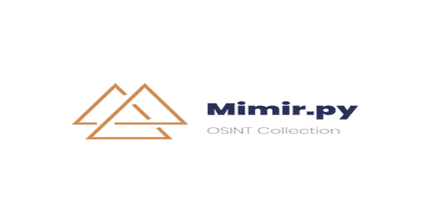

# 米伊美:常用 IOC 类型的智能集合

> 原文：<https://kalilinuxtutorials.com/mimir/>

米伊美是常见国际奥委会类型的智能集合。此应用程序旨在帮助安全分析师和研究人员收集和评估常见的 IOC 类型。目前接受的 IOC 包括 IP 地址、域名、URL 和文件哈希。

这个项目的名称是以米伊美的名字命名的，他是挪威神话中一个以知识和智慧闻名的人物。该应用程序旨在为您提供 IOC 知识，然后通过计算每个 IOC 的风险分值，根据 VirusTotal 和 OPSWAT 的报告为哈希查找分配一个常见的恶意软件系列名称，并利用机器学习工具来确定 IP、URL 或域是否可能是恶意的，从而增加一些“智慧”。

**基础集合**

对于基于网络的 IOCs，米伊美收集基本信息，包括:

*   Whois
*   法国核安全局
*   地理定位
*   反向 DNS
*   被动 DNS

**另请阅读-[Check-LocalAdminHash:PowerShell 工具，用于通过 WMI 或 SMB 认证多台主机](https://kalilinuxtutorials.com/check-localadminhash/)**

**收藏来源**

这些资源中的一些将需要一个 API 密钥，并且偶尔只有通过获得一个付费帐户。我已经尽可能地限制对付费服务的依赖。

*   被动的
*   VirusTotal
*   域名工具
*   OPSWAT
*   谷歌安全浏览
*   肖丹
*   脉冲驱动
*   CSIRTG
*   URLscan
*   HpHosts
*   黑名单检查
*   垃圾邮件黑名单检查

**风险评分**

当米伊美能够为国际奥委会收集到大量的数据点时，风险评分的效果最好；PDN、填充良好的 URL/域结果(通信样本、关联样本、最近的扫描数据等。)并且还考虑了 ML 恶意性预测结果。

**机器学习预测**

机器学习预测结果来自 CSIRT 小工具项目 csirtg-domainsml-py、csirtg-ipsml-py、csirtg-urlsml-py。

**输出**

米伊美提供各种选项的结果输出，包括本地文件报告或将结果导出到外部服务。

*   **stdout(控制台输出)**
    *   标准化结果数据，打印每个模块的标题和副标题
*   **JSON 文件**
    *   美化输出到本地文件
*   **Excel**
    *   每种 IOC 类型使用多张纸
*   **MISP**
    *   提交新指标
*   **威胁连接**
    *   提交具有可信度和威胁等级的新指标(可选地分配标签、描述和 TLP 设置)

[**Download**](https://github.com/deadbits/mimir)