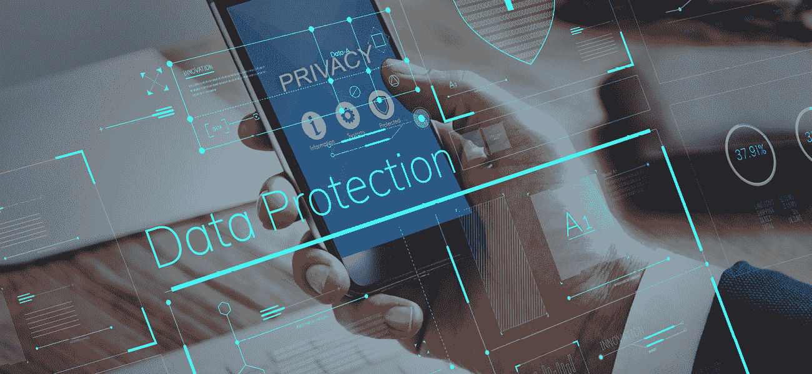
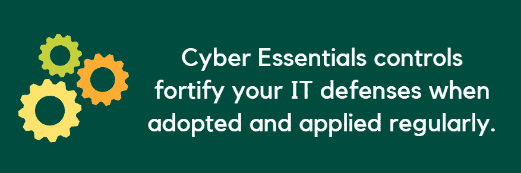
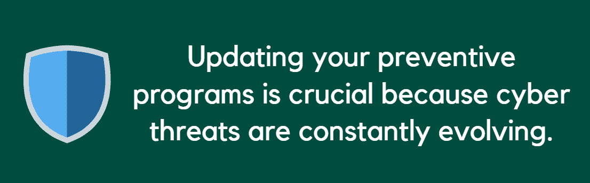
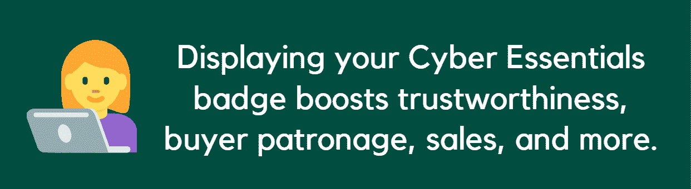

# Cyber Essentials 认证及其对零售店的影响

> 原文：<https://kalilinuxtutorials.com/cyber-essentials-accreditation/>

如果你没有获得网络基础知识认证，那么你就错过了 A-L-O-T。

如果你不熟悉这个术语，网络基础基本上是一个政府支持的英国工业、商业和网站的认证课程。

该计划强调网络安全的好处和价值，旨在激励您努力保护您的企业和客户的数据隐私。

它通过引入基础防御方案及其评估框架来做到这一点，您必须通过这些方案和框架来验证您的 It 安全的稳固性并获得认证。

然后，您的 Cyber Essentials 认证将为您的零售店带来长期的、改变游戏规则的影响。

## **强大的防御框架**

要获得 Cyber Essentials 认证，您需要了解和执行的一件事是构成计划框架一部分的防御控制。

Cyber Essentials 强调这些控制措施，因为在定期采用和应用时，它们在加强您的 IT 防御方面具有至关重要的作用。

一个防御方案是你的*防火墙。*

防火墙保护您的内部 IT 网络免受互联网上其他方面的影响。

它们是您抵御麻烦的外部因素或用户(尤其是劫机者)的第一道防线

防火墙防止恶意代码、病毒、垃圾邮件以及其他旨在损害和窃取您的数据的活动和流量。

另一方面，访问控制指的是你允许哪些人获得特定类型的文件。

这种机制迫使您将数据采购仅限于与任务直接相关的人员。

然后，数据访问治理和权限应在您的零售店的信息安全政策中指明。

稍后，访问控制将帮助您追溯并加强您公司在管理数据获取方面的责任，尤其是在发生违规时。

*恶意软件防护*是 Cyber Essentials 中的另一项安全控制。

这种策略敦促您安装和更新反恶意软件，以阻止不同类型的恶意软件试图进入您的系统和网络。

恶意软件现在可以以恶意在线广告、机器人、链接和文件、勒索软件、病毒等形式出现。

恶意软件防护还要求您教育您的员工保持警惕，[识别网络钓鱼攻击](https://kalilinuxtutorials.com/phishing-attacks/)，尤其是电子邮件中的网络钓鱼攻击，并在它们到来时采取相应的行动。

毕竟，统计数据显示，每 323 封发送的电子邮件中就有一封背后包含恶意意图。如果您的员工能够识别并阻止网络钓鱼，您的资产就可以保持安全和完整。

*补丁管理*也势在必行。这需要下载并经常更新您的第一道防线，即您的反恶意软件和反病毒软件和防火墙。

这样做可以阻止旧版本、当前版本和新版本的病毒、恶意软件和其他可疑元素试图渗透到您的网络中。

更新您的预防计划至关重要，因为网络威胁在不断演变。

如果您的防火墙不知道最新的病毒和恶意软件版本，它们可以允许这些麻烦制造者通过并严重破坏您的系统。

最后，*安全配置*需要执行理想的防御措施，如身份验证、网站和电子邮件加密、更强的密码等等。

这些措施至关重要，因为根据统计，超过一半的违规是由人为错误造成的。

超过 60%的被证实的违规行为利用了脆弱的、被盗的或默认的密码。

如果用户实施了基本的安全措施，这些危害是可以避免的，这就是为什么安全配置是 Cyber Essentials 基本控制的一部分。

## 销售和营销

Cyber Essentials 的防御框架显示了执行和采用零售店安全控制的影响。

Cyber Essentials 明白，您的数据、资产和客户保护是您的零售商店能够获得的首要和最终利益。

然而，获得该计划的认证会给你的在线企业的其他方面带来更多的优势和巨大的影响。

在 Cyber Essentials 中，一旦您通过评估，您不仅可以获得认证，还可以获得一个徽章，可以在您的营销材料上展示。

毕竟，徽章是必不可少的电子商务主页设计元素之一，因为它们可以提升你的品牌可信度，让顾客愿意与你交易。

对于您的零售店，您可以在您的网站主页、移动应用程序、电子邮件简讯、印刷宣传材料和许多其他内容上展示您的 Cyber Essentials 徽章。

随着你的徽章散发出的可信度，你培养顾客的光顾和忠诚度，这可以导致销售更多的产品，转换潜在客户，等等。

Cyber Essentials 认证还带来了无数成功竞标政府项目的机会。

英国政府要求其机构仅与 Cyber Essentials 认证持有人就涉及技术服务和机密信息的合同进行接洽。

获得 Cyber Essentials 认证甚至可以让您获得保险。

统计数据显示，超过 90%的小企业没有网络责任保险。

不过，拥有一个是保护你不可或缺的，因为成功的网络攻击可能会造成数十万到数百万美元的损失，这取决于造成的损害。

有了保险，你可以节省高达 25，000 英镑或超过 32，000 美元。

当您成为 Cyber Essentials 认证持有者时，您可以在保险申请中获得更多优惠。

这是因为他们知道你正在尽最大努力建立强大的防御，并为恢复做准备，以防劫机者对你的商店进行网络攻击。

## 委派

如果你现在准备让你的零售店获得认证，你需要做的第一件事就是进行内部[网络安全审计。](http://kalilinuxtutorials.com/hayat/)

评估您的 IT 环境，从 30，000 英尺的高度了解您的安全状况，并记录您的相关发现。

您还必须雇佣第三方服务提供商来进行漏洞评估。这将发现 IT 弱点、过时组件、错误配置和其他错误。

您还将收到关于您应该应用的补丁和其他纠正措施的建议。请记住，消除任何已知的 IT 弱点是赢得您的资格鉴定不可或缺的一部分。

接下来，您可以通过填写一份关于您如何管理前面提到的防御控制的 52 项问卷来开始您的应用程序。

然后，你的认证机构将评估你的答案，核实你的发现，并最终在你通过评估后对你进行认证。

## 获得认证并体验影响。

被 Cyber Essentials 认证的影响不仅仅是通过安全机制和保险范围提供针对黑客攻击的可靠保护。

它可以通过扩大您的合作伙伴关系和客户群，促进您的销售和营销活动和业绩，以及许多其他方面，将您推向更高的高度。

在你获得认证之前，你可能不会意识到你的零售店在未来的几年里可以获得多少竞争优势并从中受益。

您越早投资 Cyber Essentials 认证，就能越早享受和见证它对您的零售店的巨大影响。

这篇文章对你有用吗？请花点时间与您的同事分享这一点。干杯！