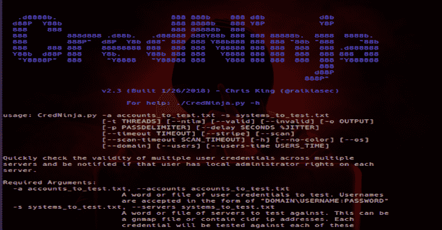
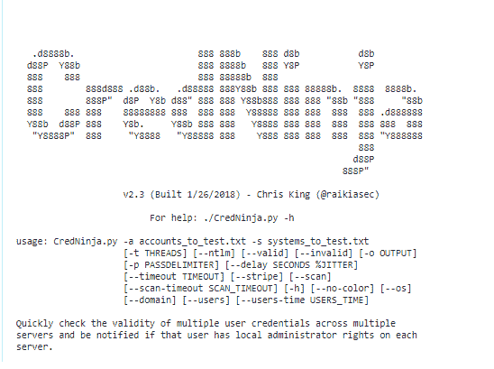

# cred ninja–一款多线程工具，旨在通过 SMB 识别身份凭证

> 原文：<https://kalilinuxtutorials.com/credninja/>

[](https://1.bp.blogspot.com/-xeuO_D2ftkg/XjAMiwGUk_I/AAAAAAAAEps/E-2Dnn2un14QdLjqYu1sTrWORlVB-lqYACLcBGAsYHQ/s1600/CredNinja%25281%2529.png)

**CredNinja** 是一款多线程工具，旨在通过 SMB 在大规模网络中识别凭证是有效、无效还是本地管理员有效凭证，现在还增加了一个用户猎人

这个工具是为希望快速有效地执行约定的渗透测试人员设计的。

虽然这个工具可以用于更隐蔽的操作(包括下面的一些补充)，但它在大型网络中使用时确实会大放异彩。

在它的核心，您向它提供一个您已经转储的凭证列表(或者散列，它可以传递散列)和一个域上的系统列表(我建议首先扫描端口 445，或者您可以使用“–scan”)。

它会告诉您转储的凭据在域上是否有效，以及您是否拥有主机的本地管理员访问权限。

请参阅下面的附加功能，如用户搜索和主机详细信息枚举。

它旨在 Kali Linux 上运行

**也可阅读-[mem hunter:代码注入技术的现场狩猎](https://kalilinuxtutorials.com/memhunter/)**



```
 Required Arguments:

  -a accounts_to_test.txt, --accounts accounts_to_test.txt
                        A word or file of user credentials to test. Usernames
                        are accepted in the form of "DOMAIN\USERNAME:PASSWORD"
  -s systems_to_test.txt, --servers systems_to_test.txt
                        A word or file of servers to test against. This can
   be a single system, a filename containing a list of
   systems, a gnmap file, or IP addresses in cidr notation.
   Each credential will be tested against each of these
                        servers by attempting to browse C$ via SMB

Optional Arguments:

  -t THREADS, --threads THREADS
                        Number of threads to use. Defaults to 10
  --ntlm                Treat the passwords as NTLM hashes and attempt to
                        pass-the-hash!
  --valid               Only print valid/local admin credentials
  --invalid             Only print invalid credentials
  -o OUTPUT, --output OUTPUT
                        Print results to a file
  -p PASSDELIMITER, --passdelimiter PASSDELIMITER
                        Change the delimiter between the account username and
                        password. Defaults to ":"
  --delay SECONDS %JITTER
                        Delay each request per thread by specified seconds
                        with jitter (example: --delay 20 10, 20 second delay
                        with 10% jitter)
  --timeout TIMEOUT     Amount of seconds wait for data before timing out.
                        Default is 15 seconds
  --stripe              Only test one credential on one host to avoid spamming
                        a single system with multiple login attempts (used to
                        check validity of credentials). This will randomly
                        select hosts from the provided host file.
  --scan                Perform a quick check to see port 445 is available on
                        the host before queueing it up to be processed
  --scan-timeout SCAN_TIMEOUT
                        Sets the timeout for the scan specified by --scan
                        argument. Default of 2 seconds
  -h, --help            Get help about this script's usage
  --no-color            Turns off output color. Written file is always
                        colorless

Additional Information Retrieval:

  --os                  Display the OS of the system if available (no extra
                        request is being sent)
  --domain              Display the primary domain of the system if available
                        (no extra request is being sent)
  --users               List the users that have logged in to the system in
                        the last 6 months (requires LOCAL ADMIN). Returns
                        usernames with the number of days since their home
                        directory was changed. This sends one extra request to
                        each host
  --users-time USERS_TIME
                        Modifies --users to search for users that have logged
                        in within the last supplied amount of days (default
                        100 days)
```

**变更日志**:

**v 2.3–更新了一些附加功能:**

*   增加了 gnmap 文件解析。提供给–systems(-s)参数的文件现在可以是 gnmap 文件(以。gnmap)
*   添加了 cidr 符号解析。提供给–systems(-s)参数的 ip 地址现在可以采用 cidr 表示法，它将适当地扩展范围并测试 IP 空间内的所有系统(确保您提供–scan 来提前扫描系统！)
*   make-scan 多线程，因此运行速度更快

**v 2.0–CredSwissArmy 前身 CredNinja 的初始版本:**

*   与以前的 CredSwissArmy 功能相同(使用凭据和主机列表通过 SMB 搜索网络中的本地管理员访问权限)
*   完全多线程！它的速度是旧 CredSwissArmy 的 8 倍！
*   更好地处理错误和复杂的密码
*   仍然可以使用“–NTLM”选项传递哈希
*   仍然有和以前一样的论点
*   增加了“–超时”，如果你愿意，可以让扫描更快完成
*   添加了“–scan”，它对主机运行快速端口 445 扫描，以确保在对主机尝试 creds 之前它们是可连接的
*   添加了“–stripe”，它在随机系统中测试每个凭据一次(用于验证凭据，而不会在一个系统的事件日志中显示可疑)
*   添加了“–延迟”，允许您指定扫描主机之间的延迟，以更加隐蔽。“–延迟 10 20”将延迟 10 秒，抖动为 20%(因此在 8-10 秒之间)
*   增加了颜色输出，这样当你成功时会更明显！

**现在是很酷的附加功能**

*   添加了“–OS”，它显示了它可以采集指纹的每个系统的操作系统(不会向目标主机发送额外的数据包)
*   添加了“–域”，它显示系统所属的主域(不会向目标主机发送额外的数据包)
*   添加了“–用户”，它显示了其主目录在 X 天内被修改的用户列表(X 可通过“–用户-天数”进行修改，默认值为 100)。基本上是一个 SMB 用户追踪器，显示用户登录或已经登录的位置(向每个目标主机发送 1 个额外的数据包)

**即将推出:**

*   反病毒检测器通知潜在的反病毒运行在系统上。

[**Download**](https://github.com/Raikia/CredNinja)