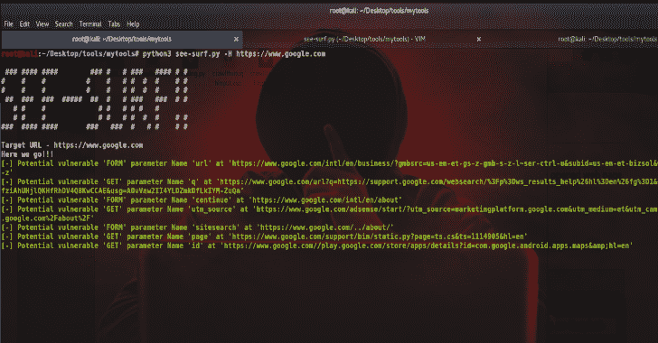
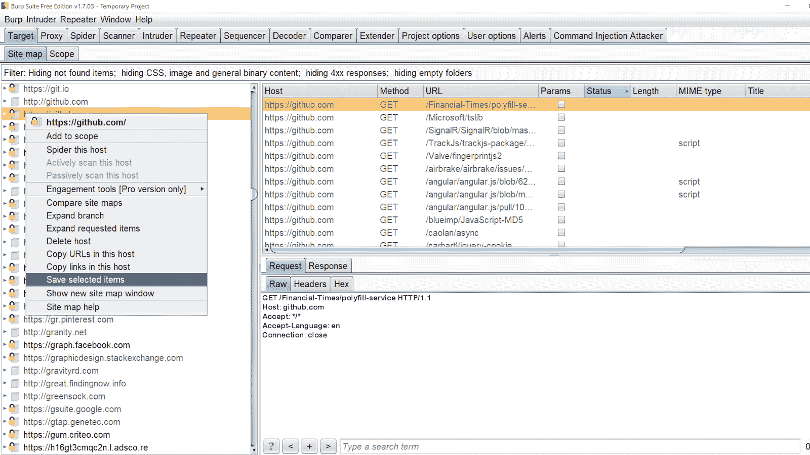
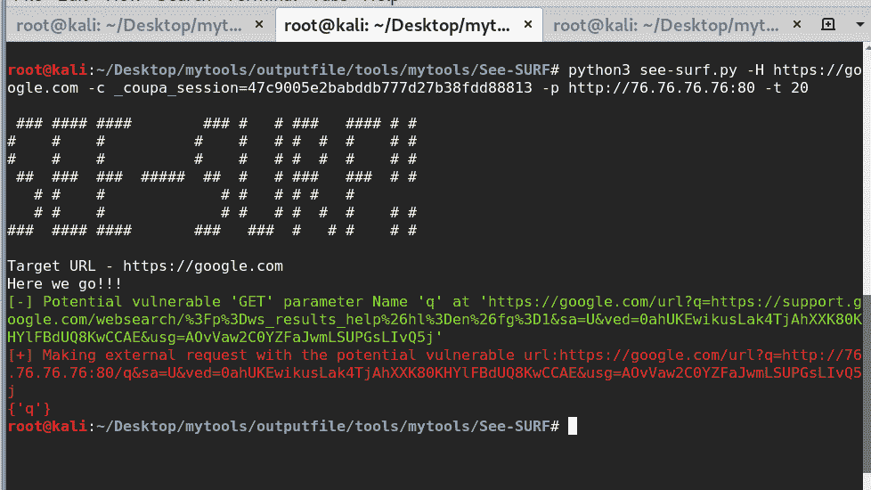

# See-SURF:基于 Python 的扫描器，用于查找潜在的 SSRF 参数

> 原文：<https://kalilinuxtutorials.com/see-surf/>

**See-SURF** 是一个基于 Python 的扫描器，用于在 web 应用程序中查找潜在的 SSRF 参数。SSRF 是 web 中最严重的漏洞之一，我认为没有工具可以自动发现潜在的易受攻击的参数。See-SURF 可以添加到您的武器库中，以便在进行漏洞搜索/网络安全测试时进行侦察。

**特性**

*   将 burp 的站点地图作为输入，使用强正则表达式匹配任何包含潜在易受攻击的 SSRF 关键字(如 URL/website 等)的 GET/POST URL 参数来解析文件。此外，还会检查传递的任何 URL 或 IP 地址的参数值。例子获取请求——
    google.com/url=【https://yahoo.comT2
    google.com/q=[https://yahoo.com](https://yahoo.com)表格——
    
*   多线程内置爬虫运行并收集尽可能多的数据，以解析和识别潜在易受攻击的 SSRF 参数。

*   为认证扫描提供 cookies。

*   默认情况下，正常模式是打开的，使用详细开关，您会在不同的端点看到相同的易受攻击的参数。相同的参数可能不会在所有地方都被清理。但是详细模式会产生很多噪音。例如:
    [https://google.com/path/1/urlToConnect=https://yahoo.com](https://google.com/path/1/urlToConnect=https://yahoo.com)
    [https://Google . com/different path/urlto connect = https://Yahoo . com](https://google.com/differentpath/urlToConnect=https://yahoo.com)

*   利用-使用易受攻击的参数向 burp collaborator 或任何其他 http 服务器发出外部请求，以确认 SSRF 的可能性。

**也可阅读:[cred ninja——一个多线程工具，用于通过 SMB](https://kalilinuxtutorials.com/credninja/)T3 识别身份凭证**

**如何使用？**

[-]这将在默认线程=10、无 cookies 会话和无详细模式的情况下运行

python 3 see-surf . py-H https://www.google.com

[-]可以为经过身份验证的会话爬网提供单独的空间 Cookies

python 3 see-surf . py-H https://www.google.com c cookie _ name 1 = value 1 cookie _ name 2 = value 2

[-]提供线程数量和详细模式(如果您不想花费更多时间，但发现 Bug 的可能性会增加，则不建议使用详细模式)

**python 3 see-surf . py-H https://www.google.com-c cookie _ name 1 = value 1 cookie _ name 2 = value 2-t 20-v**

默认情况下，正常模式是打开的，使用 verbose 开关，您会在不同的端点看到相同的潜在易受攻击的参数。(相同的参数可能不会在所有地方都被清除。但是详细模式会产生很多噪音。)
举例:
【https://google.com/abc/1/urlToConnect=https://yahoo.com】
[https://google.com/123/urlToConnect=https://yahoo.com](https://google.com/123/urlToConnect=https://yahoo.com)

**版本 2(最佳推荐)**

打嗝网站地图( **-b 开关** ) &接回自动化( **-p 开关** )

**完整的命令看起来会是这样的——**

python 3 see-surf . py-H https://www.google.com-c cookie _ name 1 = value 1 cookie _ name 2 = value 2-b burp _ file . XML-p http://72.72.72.72:8000

[-] **-b 开关**提供 burp 站点地图文件，以便更好地发现潜在的 SSRF 参数。该脚本将首先解析 burp 文件，并尝试识别潜在的参数，然后运行内置的爬虫对它

浏览器的目标与你的 burpsuite 在后台运行，使一些获取/发布请求，越多越好。然后转到目标，右键- >“保存所选项目”并保存。如下所示提供给脚本。

python 3 see-surf . py-H https://www.google.com-c cookie _ name 1 = value 1 cookie _ name 2 = value 2-b burp _ file . XML

)

[-] **-p 开关**启动 burpsuite collaborator 并使用-p 参数传递主机，或者启动一个简单的 python http 服务器并等待易受攻击的 param 执行您的请求。**(强烈推荐)**
(这基本上有助于利用 GET 请求，对于 POST，您需要尝试手动利用它)
有效负载将在字符串末尾使用 param 执行，因此很容易识别哪个是易受攻击的。比如:[http://72.72.72.72:8000/vulnerableparam](http://72.72.72.72:8000/vulnerableparam)

python 3 see-surf . py-H https://www.google.com-c cookie _ name 1 = value 1 cookie _ name 2 = value 2-p http://72.72.72.72:8000

**安装**

**git 克隆 https://github.com/In3tinct/See-SURF.git
CD See-SURF/
pip 3 安装 BeautifulSoup4
pip3 安装请求**

**测试**

已经建立了一个基本框架。更多的测试将被添加以减少任何假阳性。

[**Download**](https://github.com/In3tinct/See-SURF)