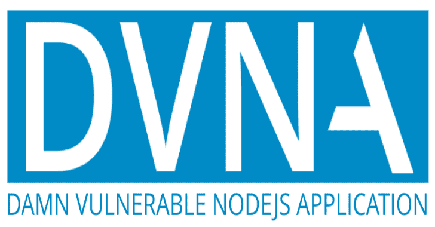

# dvna 该死的易受攻击的 node.js 应用程序

> 原文：<https://kalilinuxtutorials.com/dvna/>

**Damn Vulnerable NodeJS Application(DVNA)**是一个简单的 NodeJS 应用程序，用于演示 [**OWASP 十大漏洞**](https://www.owasp.org/index.php/Top_10-2017_Top_10) 以及修复和避免这些漏洞的指南。

该应用程序由常用的库支持，如 [express](https://www.npmjs.com/package/express) 、 [passport](https://www.npmjs.com/package/passport) 、 [sequelize](https://www.npmjs.com/package/sequelize) 等。

**开发者安全指南手册**

该应用附带了一个**开发者友好的综合指南**，可用于学习、避免和修复漏洞。https://appsecco.com/books/dvna-developers-security-guide/[的指南包括以下内容](https://appsecco.com/books/dvna-developers-security-guide/)

*   设置易受攻击的 NodeJS 应用程序的说明
*   关于利用漏洞的说明
*   易受攻击的代码片段和修复漏洞的说明
*   避免此类漏洞的建议
*   了解更多信息的参考

**也可理解为-[风险评估框架:静态应用安全测试](https://kalilinuxtutorials.com/risk-assessment-framework-static-application-security-testing/)**

**快速启动**

尝试使用 Docker 的一个命令。这个设置使用 SQLite 数据库，而不是 MySQL。

**码头运行–名称 dvna-p 9090:9090-d appco/dvna:SQLite**

通过 [http://127.0.0.1:9090/](http://127.0.0.1:9090/) 访问应用程序

**入门**

该死的易受攻击的 NodeJS 应用程序可以通过三种方式部署

*   对于开发人员来说，在代码更新时使用 docker-compose 和自动重载
*   对于安全测试人员，使用 Docker Hub 的官方图像
*   对于高级用户，使用完全手动设置

**开发设置**

克隆此存储库

**git 克隆 https://github.com/appsecco/dvna; CD dvna**

用所需的数据库配置创建一个`**vars.env**`

**MYSQL _ USER = dvna
MYSQL _ DATABASE = dvna
MYSQL _ PASSWORD = passw0rd
MYSQL _ RANDOM _ ROOT _ PASSWORD = yes**

使用 docker-compose 启动应用程序和数据库

**坞站-合成**

通过 [http://127.0.0.1:9090/](http://127.0.0.1:9090/) 访问应用程序

该应用程序会在代码更改时自动重新加载，因此可以随意修补和使用该应用程序。

**使用官方 Docker 图像**

使用以下配置创建一个名为`**vars.env**`的文件

**MYSQL _ USER = dvna
MYSQL _ DATABASE = dvna
MYSQL _ PASSWORD = passw0rd
MYSQL _ RANDOM _ ROOT _ PASSWORD = yes
MYSQL _ HOST = MYSQL-db MYSQL _ PORT = 3306**

启动一个 MySQL 容器

**对接器运行–名称 dvna-MySQL–env 文件 vars.env -d mysql:5.7**

使用官方映像启动应用程序

**停靠点执行–名称 dvna-app–env 档案 vars . env–dvna-MySQL 连结:MySQL-db-p9090:9090 appco/dvna**

在 [http://127.0.0.1:9090/](http://127.0.0.1:9090/) 访问应用并开始测试！

**手动设置**

克隆存储库

**git 克隆 https://github.com/appsecco/dvna; CD dvna**

使用您的数据库信息配置环境变量

**导出 MYSQL_USER=dvna
导出 MYSQL_DATABASE=dvna
导出 MYSQL_PASSWORD=passw0rd
导出 MYSQL_HOST=127.0.0.1
导出 MYSQL_PORT=3306**

安装依赖项

**npm 安装**

启动应用程序

**npm 开始**

访问位于 [http://localhost:9090](http://localhost:9090) 的应用程序

[**Download**](https://github.com/appsecco/dvna)