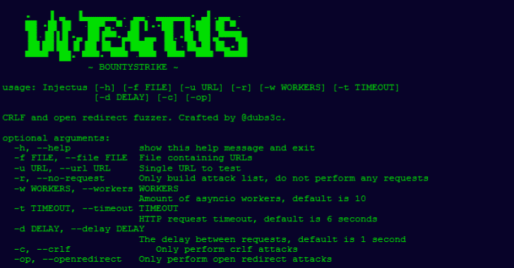

# 注射:CRLF 和开放重定向引信

> 原文：<https://kalilinuxtutorials.com/injectus-crlf-open-redirect-fuzzer/>

Injectus 是一个简单的 python 工具，它遍历一系列 URL，尝试 CRLF 和打开重定向负载。

**设计**

如果我们有以下 URL:

[https://dubell.io/?param1=value1&URL = value 2&param 3 = value 3](https://dubell.io/?param1=value1&url=value2&param3=value3)

**对于 CRLF 攻击**，对于每 n 个参数，Injectus 会将每个有效载荷注入一个参数的值。例如，Injectus 将使用上面的 URL 创建以下列表:

https://dubell.io/?param 1 = % % 0a 0 abounty:strike & URL = value 2 & param 3 = value 3
https://dubell.io/?param1=%0abounty:strike&URL = value 2&param 3 = value 3
https://dubell.io/?param1=%0d%0abounty:strike&URL = value 2&param 3 = value 3
https://dubell.io/?param1=%0dbounty:strike&URL = value 2&param 3 = value 3
https://dubell.io/?param1=%23%0dbounty:strike&URL = value 2&param 3 = value 3
https://dubell.io/?param1=%25%30%61bounty:strike&URL = value 2&param 3 = https://dubell.io/?param1=value1&URL = % 0d bounty:strike&param 3 = value 3
https://dubell.io/?param1=value1&URL = % 23% 0d bounty:strike&param 3 = value 3
https://dubell.io/?param1=value1&URL = % 25% 30% 61 bounty:strike&param 3 = value 3
https://dubell.io/?param1=value1&URL = % 30a bounty:strike&param 3 = value 3
https://dubell.io/?param1=value1& URL = value 2&param 3 = % 25% 30% 61 bounty:strike
https://dubell.io/?param1=value1&URL = value 2&param 3 = % 30 abounty:strike
https://dubell.io/?param1=value1&URL = value 2&param 3 = % 250 abounty:strike
https://dubell.io/?param1=value1&URL = value 2&param 3 = % 25250 abounty:strike
https://dubell.io/?param1=value1&URL = 1

**也读作-[mass dns:用于批量查找的高性能 DNS 存根解析器&侦察](https://kalilinuxtutorials.com/massdns-a-high-performance-dns-stub-resolver-for-bulk-lookups-reconnaissance/)**

正如您所看到的，每个 CRLF 负载都被注入到第一个参数的值中。一旦循环完成，Injectus 将把每个有效载荷注入第二个参数，依此类推。一旦注入了所有参数，列表就完整了。

如果没有查询参数，Injectus 将简单地将每个有效负载附加到 URL，如下所示:

https://dubell.io/some/path/%%0a0abounty:strike
https://dubell.io/some/path/%0abounty:strike
https://dubell.io/some/path/%0d%0abounty:strike
https://dubell.io/some/path/%0dbounty:strike
https://dubell.io/some/path/%23%0dbounty:strike
https://dubell.io/some/path/%23%0dbounty:strike
https://dubell.io/some/path/%25%30%61bounty:strike
https://dubell.io/some/path/%25%30abounty:strike
https://du bell . io/some/path/% 250 abounty:strike
https://du bell . io/some/path/% 25250 abounty:strike
https://du bell . io/some/path/% 3f % 0d bounty:strike
https://du bell . io/some/path/% 3f %

**注入开放重定向净荷**时，Injectus 只会在存在包含典型重定向关键字的查询/路径参数的情况下注入净荷，例如`**url**`。注入到以下网址 **`https://dubell.io/?param1=value1&url=dashboard&param3=value3` :**

https://dubell . I/？param 1 = value 1 & URL = $ 2f % 2 fbountytrique . io % 2f % 2 fparam 3 = value 3
https://dubell . io/？param 1 = value 1&URL = % 2f $ 2 fbountytries . ioparam 3 = value 3
https://dubell . io/？param 1 = value 1&URL = % 2 fbountytries。io % 2f % 2fparam 3 = value 3
https://dubell . io/？param 1 = value 1&URL = % 2 fbountytries。io//param 3 = value 3
https://dubell . io/？param 1 = value 1&URL = % 2 fbountytries . ioparam 3 = value 3
https://dubell . io/？param 1 = value 1&URL =///bountystrik . ioparam 3 = value 3
https://dubell . io/？param 1 = value 1&URL =////bountystrik . ioparam 3 = value 3
https://dubell . io/？param 1 = value 1&URL =//bountystrik . ioparam 3 = value 3
https://dubell . io/？param 1 = value 1&URL =/\ x88 ountytries . ioparam 3 = value 3
https://dubell . io/？param 1 = value 1&URL =/bountystrik . ioparam 3 = value 3
https://dubell . io/？param 1 = value 1&URL =/http://bountystrik . ioparam 3 = value 3
https://dubell . io/？param 1 = value 1&URL = bountystrik . ioparam 3 = value 3

URL 包含查询参数`url`，因此 Injectus 会将有效负载注入到该参数中。

使用路径参数的示例。原始网址是`**https://dubell.io/some/path/that/redirect/dashboard**`:

https://du bell . io/some/path/that/redirect/$ 2f % 2f county strike . io % 2f % 2f
https://du bell . io/some/path/that/redirect/% 2f county strike . io
https://du bell . io/some/path/that/redirect/% 2f county strike . io % 2f
https://du bell . io/some/path/that/redirect/% 2f county strike . io

和以前一样，如果没有找到查询参数或路径参数，Injectus 将简单地将每个有效负载附加到 URL:

https://dubell . io/$ 2f % 2 fbountytrique . io % 2f % 2f
https://dubell . io/% 2f $ 2 fbountytrique . io
https://dubell . io/% 2 fbountytrique . io % 2f % 2f
https://dubell . io/% 2 fbountytrique . io
https://dubell . io/% 2 fbountytrique

**安装**

**pip 3.7 install-r requirements . txt–用户**

[**Download**](https://github.com/BountyStrike/Injectus)