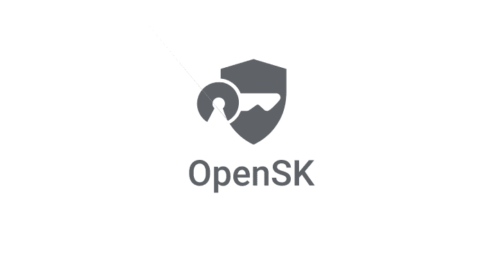

# OpenSK:安全密钥的开源实现

> 原文：<https://kalilinuxtutorials.com/opensk/>

OpenSK 是用 Rust 编写的安全密钥的开源实现，支持 FIDO U2F 和 FIDO2 标准。

这个库包含一个 [FIDO2](https://fidoalliance.org/fido2/) 认证器的 Rust 实现。

我们将其开发为一个 [Tock OS](https://tockos.org) 应用程序，并已在以下主板上成功测试:

*   [北欧 nRF52840-DK](https://www.nordicsemi.com/Software-and-Tools/Development-Kits/nRF52840-DK)
*   [北欧 NRF 52840-加密狗](https://www.nordicsemi.com/Software-and-Tools/Development-Kits/nRF52840-Dongle)

**FIDO2**

尽管我们根据已发布的 [CTAP2.0 规范](https://fidoalliance.org/specs/fido-v2.0-ps-20190130/fido-client-to-authenticator-protocol-v2.0-ps-20190130.html)测试并实施了我们的固件，但我们的实施并未经过审查或正式测试，也未声称获得 FIDO 认证。

**密码术**

我们目前仍在制作嵌入在 [Nordic nRF52840 芯片](https://infocenter.nordicsemi.com/index.jsp?topic=%2Fps_nrf52840%2Fcryptocell.html)中的 [ARM CryptoCell-310](https://developer.arm.com/ip-products/security-ip/cryptocell-300-family) 来实现硬件加速加密。同时，我们在 Rust 中实现了所需的加密算法(ECDSA、ECC secp256r1、HMAC-SHA256 和 AES256)作为占位符。

那些实现是研究质量的代码，还没有被审查。它们不提供恒定的时间保证，并且不是为抵抗旁道攻击而设计的。

**安装**

有关更详细的指南，请参考我们的[安装指南](https://github.com/google/OpenSK/blob/master/docs/install.md)。

*   如果您刚刚克隆了这个存储库，运行下面的脚本(**注意**:您只需要这样做一次):

**。/setup.sh**

*   如果您的 Nordic 开发板尚未安装 TockOS，您可以通过运行以下命令来安装 Tock OS 和 OpenSK 应用程序，具体取决于您的开发板:

***#北欧 nRF52840-DK 板***
板=nrf52840dk。/deploy.sh os app
***#北欧 NRF 52840-Dongle***
board = NRF 52840 _ Dongle。/deploy.sh 操作系统应用

*   如果 Tock OS 已经安装，并且您想要在您的主板上安装/更新 OpenSK 应用程序(**警告**:它将删除本地存储的凭证)，运行:

。 **/deploy.sh app**

*   在 Linux 上，您可能希望避免使用 **`root`** 特权来与键交互。为此，我们提供了一个 udev 规则文件，可以使用以下命令进行安装:

**sudo CP rules . d/55-opensk . rules/etc/udev/rules . d/&&
sudo udevadm control–reload**

**定制**

如果您建立了自己的安全密钥，根据您使用的硬件，有一些事情您可以个性化:

*   如果您有多个按钮，请选择负责用户在 main.rs 中出现的按钮。
*   决定是否要使用批处理证明。`**ctap/mod.rs**`中有一个布尔标志。对于 U2F 是强制性的，您可以创建自己的自签名证书。该标志用于 FIDO2，具有一些隐私含义。请查看 [WebAuthn](https://www.w3.org/TR/webauthn/#attestation) 了解更多信息。
*   决定是否要使用签名计数器。目前，只有全局签名计数器被实现，因为它们是 U2F 的默认选项。`**ctap/mod.rs**`中的标志只为 FIDO2 关闭它们。最隐私保护的解决方案是个人或没有签名计数器。同样，请查看 [WebAuthn](https://www.w3.org/TR/webauthn/#signature-counter) 获取文档。
*   根据您可用的闪存，在`**ctap/storage.rs**`中选择适当的最大支持驻留密钥数和页数。

**3D 打印外壳**

为了保护和携带您的钥匙，我们与专业设计师合作，提供定制的外壳，可以在专业 3D 打印机和业余爱好者模型上打印。

所有需要的文件都可以从 [Thingiverse](https://www.thingiverse.com/thing:4132768) 下载，包括 STEP 文件，使您可以轻松地进行进一步定制所需的修改。

**免责声明**

这个项目是概念验证和研究平台。它仍在开发中，因此有一些限制:

[**Download**](https://github.com/google/OpenSK)