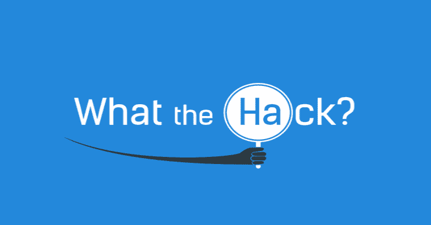

# WhatTheHack:基于挑战的黑客集合

> 原文：<https://kalilinuxtutorials.com/whatthehack/>

**WhattheHack** 是一种基于挑战的黑客马拉松形式。一系列基于挑战的黑客马拉松，包括学生指南、监考指南、讲座演示、示例/指导代码和模板。

**什么、为什么和如何**

*   “黑客是什么”是一种基于挑战的黑客马拉松形式
*   挑战描述了要完成的高级任务和目标
*   挑战不是一步一步的实验
*   与会者以 3 到 5 人为一组来解决挑战
*   与会者相互“学习”和“分享”
*   由于必须“弄清楚”，与会者的知识保留度更高
*   监考人提供指导，但不是团队的答案
*   主持人提供讲座和演示，以设置挑战和审查解决方案
*   黑客可以亲自或通过微软团队进行虚拟托管

**也可阅读-[参见-SURF:基于 Python 的扫描仪，以寻找潜在的 SSRF 参数](https://kalilinuxtutorials.com/see-surf/)**

**如何添加你的黑客**

我们欢迎所有新的黑客！这样做的过程是:

*   将此回购转入您自己的 github 账户
*   为您的工作创建一个新的分支
*   使用序列中的下一个数字添加新的顶层文件夹，例如:
    *   011-BigNewHack
*   在此文件夹中，创建两个文件夹，每个文件夹都有两个带有的文件夹，如下所示:
    *   主持
        *   指导
        *   解决方法
    *   学生
        *   指导
        *   资源
*   每个文件夹的内容应该是:
    *   **学生/指南**:学生指南
    *   **学生/资源**:学生在挑战中可能需要的任何模板或“启动”文件
    *   主持人/指导者:监考人的指导和所有的演讲幻灯片都在这里
    *   **主机/解决方案**:监考人可能需要的包含解决方案的特定文件。
*   一旦您的分支机构和 repo 拥有了您的所有内容并将其正确格式化，请按照此页面上的说明将提取请求提交回主存储库:
    *   [https://help . github . com/articles/creating-a-pull-request-from-a-fork/](https://help.github.com/articles/creating-a-pull-request-from-a-fork/)

[**Download**](https://github.com/microsoft/WhatTheHack)