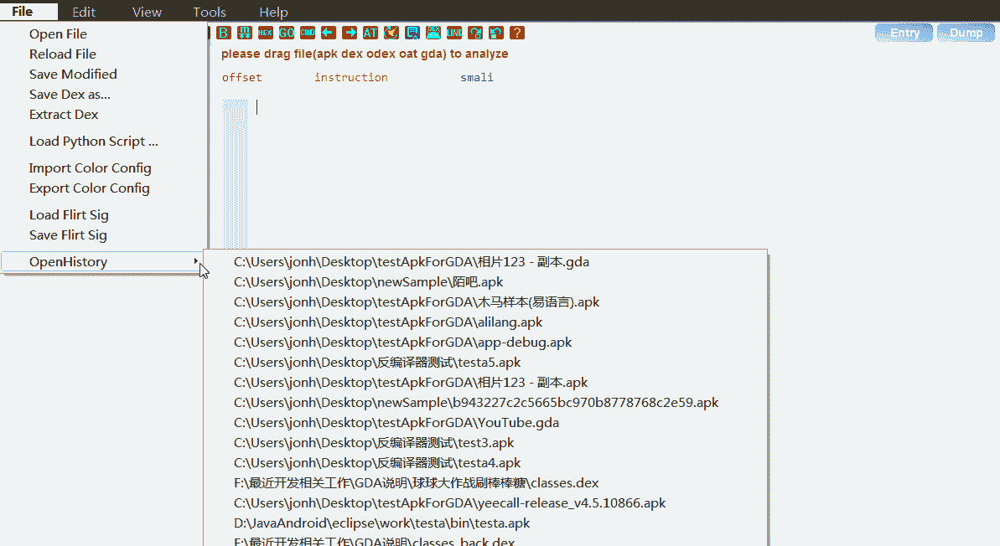
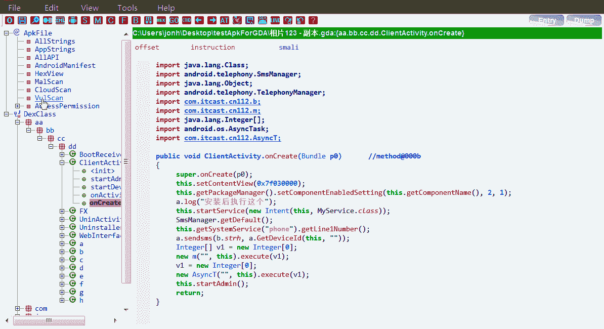
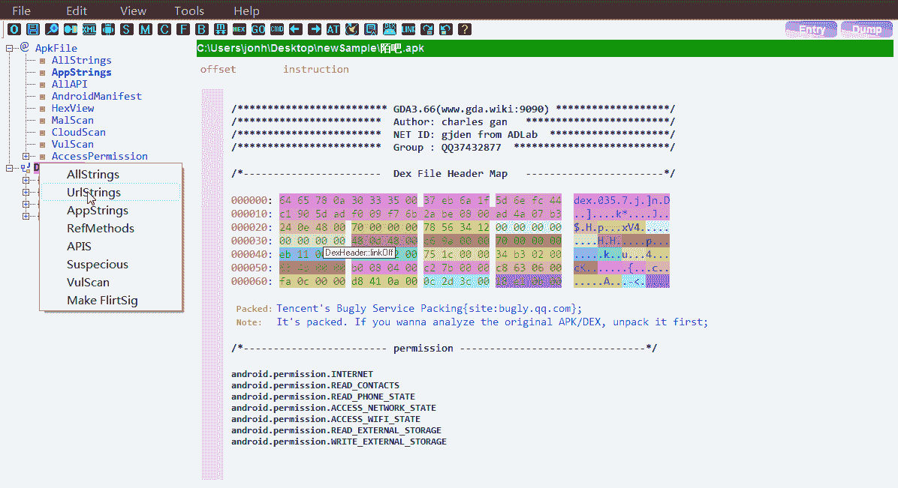
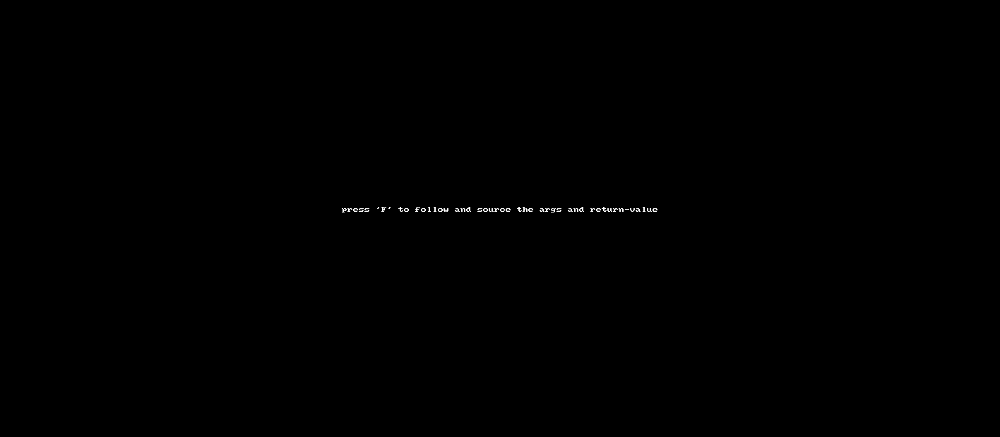

# GDA 安卓反转工具

> 原文：<https://kalilinuxtutorials.com/gda-android-reversing-tool/>

在这里，提出了一个新的 Dalvik 字节码反编译器 GDA(该项目始于 2013 年，并于 2015 年在 [www.gda.wiki:9090](http://www.gda.wiki:9090) 发布了第一个版本 1.0)，并以 C++实现，以提供更复杂、快速和方便的反编译支持。GDA 完全自主，非常稳定。它支持 APK、DEX、ODEX、oat 文件，无需安装和 Java VM 支持即可运行。

GDA 只占用你磁盘空间的 2M，你可以在任何新安装的 windows 系统和虚拟机系统中使用，不需要额外的配置。此外，GDA 还有以下更优秀的特性:

*   **交互操作:**
    *   字符串、类、方法和字段的交叉引用；
    *   搜索字符串、类、方法和字段；
    *   java 代码的注释；
    *   为方法、字段和类重命名。
    *   将分析结果保存在 gda db 文件中。
*   **辅助分析实用程序:**
    *   从 ODEX 提取地塞米松；
    *   从燕麦中提取右旋糖酐；
    *   XML 解码器；
    *   算法工具；
    *   设备内存转储；
*   **新功能:**
    *   全新的 dalvik 反编译器，友好的图形用户界面；
    *   支持 python 脚本
    *   包装商识别；
    *   多指标支持；
    *   制作和加载该方法的签名
    *   通过 API 链进行恶意行为扫描；
    *   污点分析以预览变量的行为；
    *   追踪变量路径的污点分析；
    *   去模糊化；
    *   带有 x-ref 的 API 视图；
    *   权限与模块的关联；

**也可以理解为-[应用程序检查器:一个源代码分析器，用于显示感兴趣的特性](https://kalilinuxtutorials.com/application-inspector/)**

| 捷径 | 描述 |
| --- | --- |
| F5 | 将 java 切换到 smali，再次按下返回 java |
| F | 通过数据流分析跟踪参数和返回值 |
| X | 交叉引用，定位调用者(字符串、类、方法、字段、Smali、Java) |
| ESC/ | 回到上次访问 |
| -> | 期待下一次访问 |
| G | 通过输入偏移量跳转到某个地方 |
| 普通 | 重命名变量/方法/类名 |
| S | 根据给定的字符串搜索所有元素 |
| C | 评论。仅支持 Java 代码 |
| 双击 | 光标放在方法/字符串/字段/类上，双击访问对象 |
| M | 光标放在小行上，按“M”键编辑指令 |
| 向上 | 按“向上”键进入树形控件中的向上方法 |
| 向下 | 按“向下”键进入树形控件中的向下方法 |
| D | 转储二进制数据的方法，只支持 Smali 窗口 |
| 进入 | 编辑框的修改生效 |
| H | 以十六进制显示数据 |
| Ctr+H | 弹出搜索历史窗口 |
| Ctr+A | 全选 |
| Ctr+C | 复制 |
| Ctr+V | 粘贴，仅用于可编辑框 |
| Ctr+X | 切口 |
| Ctr+F | 找出当前窗口的字符串 |
| Ctr+S | 将修改保存到 GDA 数据库文件中 |

**显示**

文件加载和反编译:

MalScan，API 搜索，交叉引用…

Url，Xml，字符串交叉引用…

可变迹线

[**Download**](https://github.com/charles2gan/GDA-android-reversing-Tool)