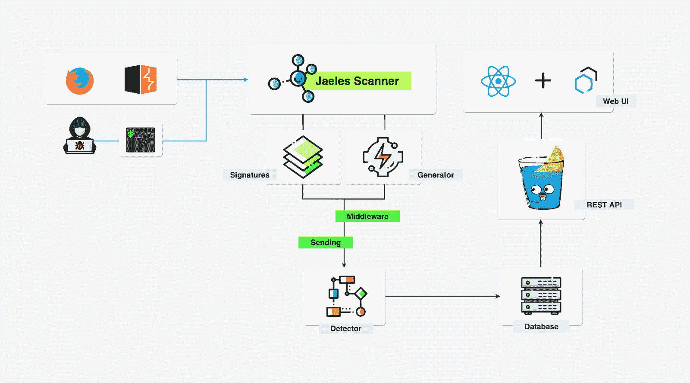

# Jaeles:自动化 Web 应用测试的瑞士军刀

> 原文：<https://kalilinuxtutorials.com/jaeles/>

Jaeles 是一个强大、灵活且易于扩展的框架，用 Go 编写，用于构建自己的 Web 应用程序扫描器。

**安装**

如果您有一个 Go 环境，确保启用了 Go 模块的 **Go > = 1.13** ，并运行以下命令。

**go 111 module = on go get-u github.com/jaeles-project/jaeles**

**用法**

**命令示例:**

–**jaeles scan-U http://example.com**
–**jaeles scan-s signatures/common/PHP debug . YAML-U/tmp/list _ of _ URLs . txt**
–**jaeles scan-v–passive–verbose-s " signatures/cves/jira-* "-U/tmp/list _ of _ URLs . txt-o/tmp/vuls
–**jaeles server–verbose-s sqli【T10****

**也读作-[mass dns:用于批量查找的高性能 DNS 存根解析器&侦察](https://kalilinuxtutorials.com/massdns-a-high-performance-dns-stub-resolver-for-bulk-lookups-reconnaissance/)**

**展柜**

**打嗝整合**

**致谢**:
–chait in 团队与我分享了构建架构的想法。
–React 组件由碳和碳驱动-教程。
——艺术品由 flaticon.com 的 Freepik 提供技术支持。

[**Download**](https://github.com/jaeles-project/jaeles)