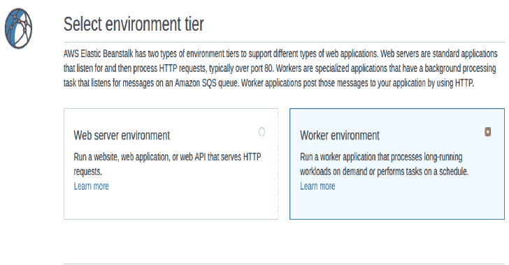
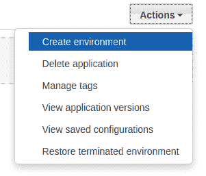
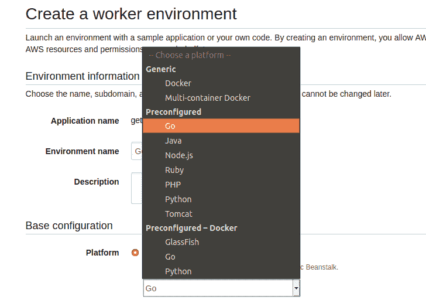
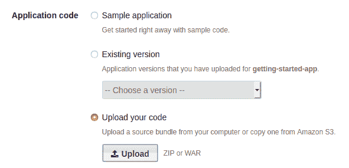
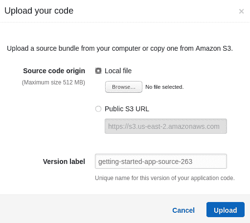
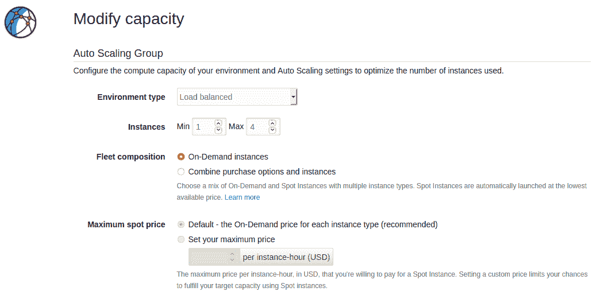
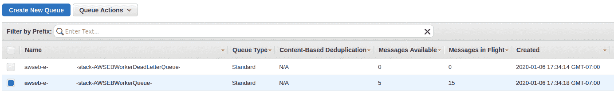

# 行李袋:搜索暴露的 EBS 卷的秘密

> 原文：<https://kalilinuxtutorials.com/dufflebag/>

**行李袋**是一个工具，它通过公共弹性块存储(EBS)快照搜索可能被意外留下的秘密。你可能会对所有的密码和秘密感到惊讶！

该工具被组织为一个弹性 Beanstalk(“EB”，不要与 EBS 混淆)应用程序，如果您试图在自己的机器上运行它，它肯定不会工作。

行李袋有许多移动的部分，因为在实践中真正阅读 EBS 卷相当不容易。

您必须在 AWS 环境中，克隆快照，从快照创建卷，连接卷，装载卷，等等…

这就是为什么它被制作成一个有弹性的 Beanstalk 应用程序，所以它可以自动放大或缩小，无论你喜欢什么，所以当你使用它时，整个东西可以很容易地拆除。

只要盯着你的 AWS 控制台，以确保它出了问题，增加了账单。我们已经试图考虑到每一个意外情况，并提供错误处理…但你已经被警告！

**入门**

**权限**

您需要向角色添加一些额外的 AWS IAM 权限:`**aws-elasticbeanstalk-ec2-role**`。或者，您可以使用这些权限创建一个全新的角色，并将 EB 设置为使用该角色，但这要复杂一些。

在任何情况下，您都需要添加:

*   附着体积(ec2)
*   拷贝快照(ec2)
*   CreateVolume (ec2)
*   删除快照(ec2)
*   DeleteVolume (ec2)
*   描述快照(ec2)
*   描述卷(ec2)
*   详细数量(ec2)
*   清除队列(sqs)
*   列表队列(sq)
*   列表框(s3)
*   PutObject (s3)

**又读-[DVNA:该死的易受攻击 NodeJS 应用](https://kalilinuxtutorials.com/dvna/)**

**大楼**

核心应用程序是用 Go 编写的，所以你需要一个 Golang 编译器。但是 EB 应用程序实际上构建在一个. zip 文件中(这就是 EB 的工作方式),所以 makefile 会为您输出一个 zip 文件。

*   查看您所在的地区。行李袋一次只能在一个 AWS 区域运行。如果您想搜索每个地区，您必须部署那么多实例。
    要更改区域，请更改源代码文件`**region.go**`的内容。
*   安装依赖项:Ubuntu 18.04 x64:

**sudo apt install make golang-go git
go get-u github.com/aws/aws-sdk-go
go get-u github.com/deckarep/golang-set
go get-u github.com/lib/pq
go get-u lukechampine.com/blake3**

*   然后使用以下内容将 EB 应用程序构建到 zip 文件中:

**制作**

您现在应该在根项目目录中看到一个`**dufflebag.zip**`文件。

*   最后，你需要做一个 S3 桶。在行李袋中自动设置这一点也许是可能的，但实际上相当困难。所以自己做就好了。你只需要创建一个默认权限的 S3 桶，名字以`dufflebag`开头。S3 桶名必须是全球唯一的，所以你可能需要有一些后缀，是一堆胡言乱语什么的。

**展开弹性豆茎**

去你的 AWS 控制台，找到弹性豆茎菜单选项。这可能也可以通过 CLI 实现，但是本文将使用控制台。选择`**Actions -> Create Environment**`。

然后在下一个窗口中选择`**Worker environment**`并点击`**Select**`。

在下一个窗口中，为`**Platform**`选择`**Preconfigured -> Go**`。

在`**Application Code**`下，选择`**Upload your Code**`。

点击`**Upload**`按钮，选择你刚刚制作的`**dufflebag.zip**`。

最后，点击`**Create Environment**`开始。

AWS 需要几分钟的时间来做好所有的事情并开始工作。一旦创建，行李袋将立即开始。不需要做其他任何事情。

**拆下安全阀**

一旦你启动并运行了，你就可以在卸下安全阀的情况下再试一次。默认情况下，行李袋只搜索 20 个 EBS 快照。(这样在你第一次尝试时就不会失控)

为了将搜索范围扩大到整个区域，进入`**populate.go**`，删除以下代码行，然后重新构建:

**放大**

Dufflebag 被设计成一个有弹性的 Beanstalk 应用程序的原因之一是，你可以很容易地自动放大或缩小程序。

默认情况下，它只会在一个实例上运行，速度非常慢。但是如果你想让它更生动一点，调整弹性豆茎中的自动缩放。

这方面的全部选项超出了本文档的范围，所以我将让您使用它们。但是在实践中，我发现一个简单的 CPU 使用触发器工作得很好。

当设置上面的环境时，你会在`**Configure more options**`按钮下找到选项(而不是点击`**Create environment**`，然后点击`**Scaling**`。

**拿到赃物**

行李袋会把所有有趣的文件复制到你之前做的 S3 桶里。(从技术上讲，行李袋将使用它找到的第一个名字以“行李袋”开头的 S3 桶。)

你可以看着文件一个接一个地出现在你的 S3 桶里。它们将被命名为:

**original filename _ Blake 3 sum _ volumeid**

**检查状态**

如果一切顺利，您应该不需要阅读日志。但是为了以防万一，Elastic Beanstalk 允许应用程序在运行时写入日志文件，并且通过导航到`**Logs**`选项卡来捕获这些日志文件。

然后打`**Request Logs**`和`**Last 100 Lines**`。这将为您提供最新的一批行李日志。点击`**Download**`按钮阅读。

该文件将包含一堆其他系统日志，但行李包部分位于顶部的“/var/log/web-1.log”下。

为了查看完整的日志历史，选择`**Full Logs**`而不是`**Last 100 Lines**`。(注意，默认情况下，EB 会非常积极地轮换日志)

此外，通过查看环境的 SQS 队列，您可以获得总体进度的感觉。

弹性 Beanstalk 工作环境使用 SQS 来管理工作流。行李包队列中的每条消息代表一个要处理的 EBS 卷:

`**Messages Available**`列显示有多少卷尚未处理。

`**Messages in Flight**`列显示了当前正在处理的卷的数量。

**调整搜索内容**

行李袋被编程为搜索我们认为可能“有趣”的东西。私钥、密码、AWS 密钥等…

但是如果你真的想搜索对你来说特别的东西呢？比如，也许你为 bank.com 工作，想看看外面有什么与 bank.com 有关的东西。

这样做将需要对行李包代码进行少量修改，但不会太多。放心吧！搜索内容的逻辑发生在`**inspector.go**`中。

`**pilfer()**`函数是一个 goroutine，用于检查文件。那里的代码一开始可能看起来有点吓人，但是它是这样做的。(以及如何毫不费力地修改它)

**文件名黑名单:**

*   对照黑名单检查文件名。(`**blacklist_exact**`)
*   对照“包含”黑名单检查文件名。(拒绝包含给定字符串的文件)(`**blacklist_contains**`)
*   对照前缀黑名单检查文件名。(拒绝以给定字符串开头的文件)(`**blacklist_prefix**`)

您可以很容易地修改这里的搜索逻辑，只需更改这三个列表中的内容。

尽管我一般会建议保留这些。这些黑名单旨在涵盖存在于许多文件系统中的令人厌烦的文件，并防止 Dufflebag 需要深入检查所有 AWS 上的每个文件。

您正在寻找的敏感数据可能在这些文件中…但也可能不在。

**文件名白名单:**

1.  `**IsSensitiveFileName()**`函数根据找到敏感文件名的正则表达式检查文件名。(如/etc/shadow、bash_history 等……)

**文件内容:**

1.  函数`**checkContentsRegex()**`根据一组正则表达式检查文件内容。(文件输入参数是逐行的，所以这个函数的输入是文件的一行，而不是整个文件。)
    所以要寻找与你的组织相关的关键词，只需改变`**checkContentsRegex()**`中的正则表达式。

[**Download**](https://github.com/BishopFox/dufflebag)