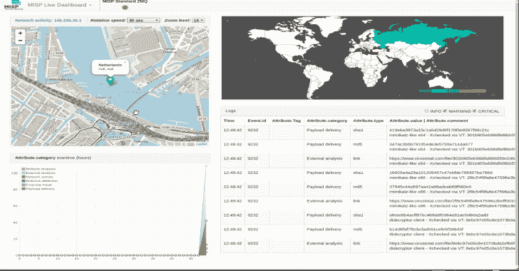
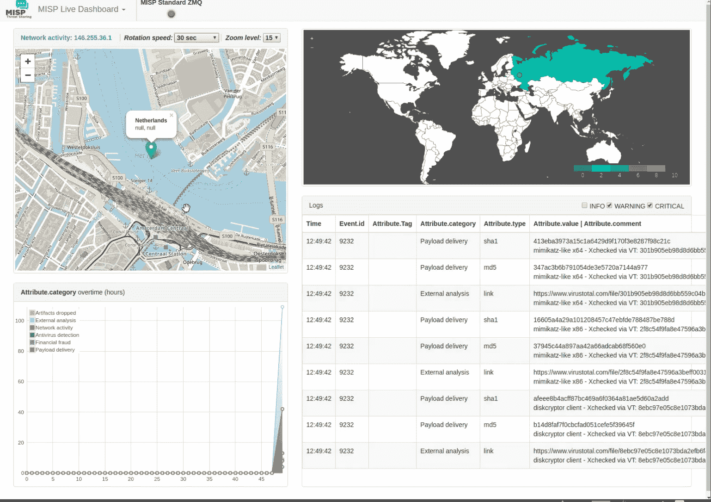
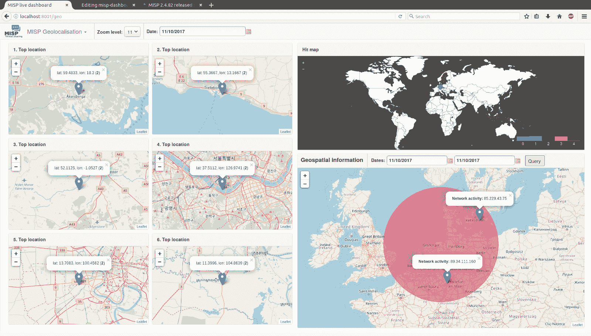
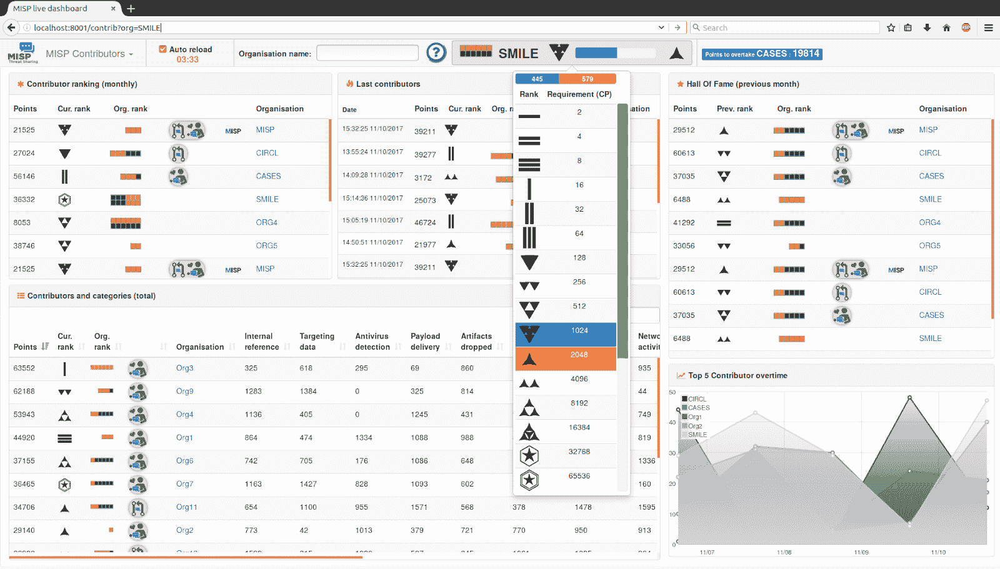
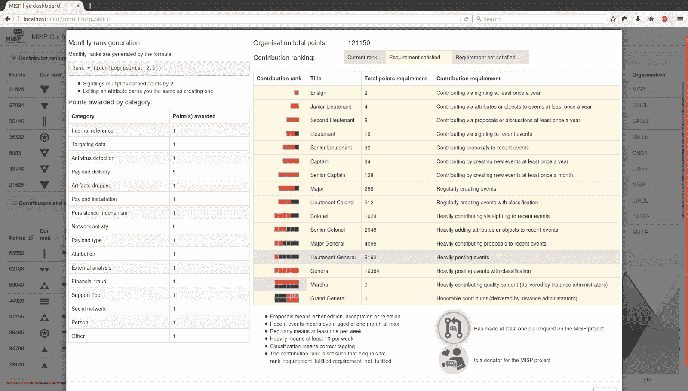
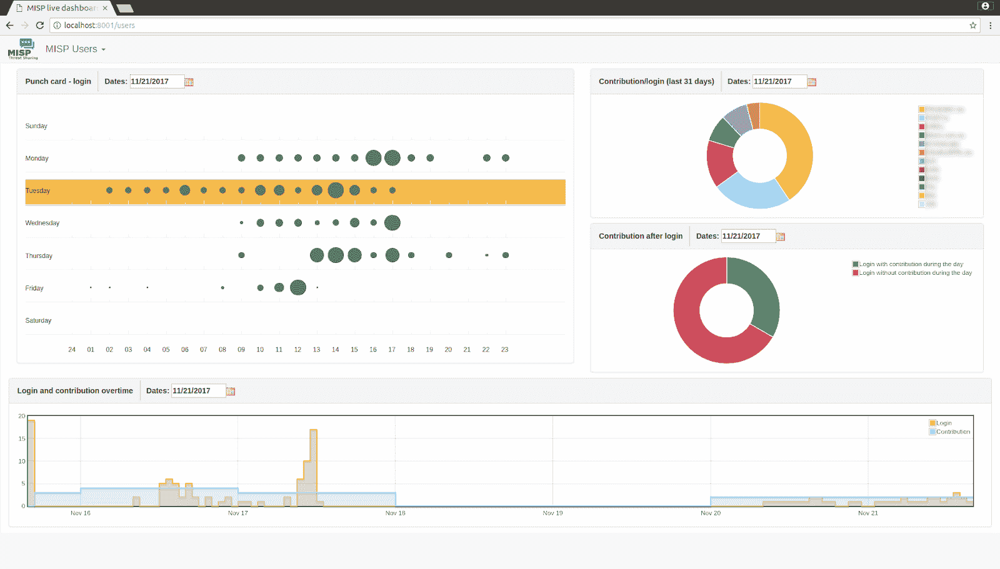
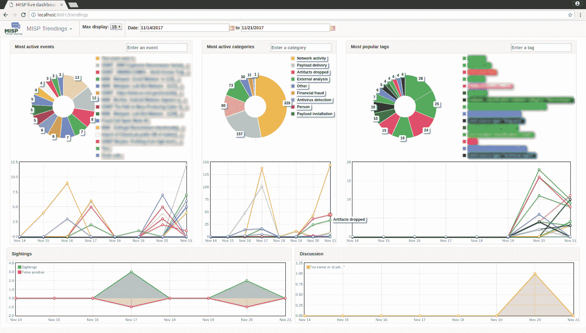

# MISP——来自 MISP 实例的威胁情报的实时概览仪表板

> 原文：<https://kalilinuxtutorials.com/misp/>

**MISP** 是一个仪表板，显示来自一个或多个 [MISP](https://www.misp-project.org/) 实例的 ZMQ 提要的实时数据和统计数据。仪表板可用作实时态势感知工具，以收集威胁情报信息。

misp-dashboard 包括一个[游戏化](https://en.wikipedia.org/wiki/Gamification#Criticism)工具，显示每个组织的贡献以及它们如何随着时间的推移而排名。

该仪表板可用于 SOC(安全运营中心)、安全团队或网络演习，以跟踪您的各种 MISP 实例上正在处理的内容。

**也可以理解为-[OpenSK:安全密钥的开源实现](https://kalilinuxtutorials.com/opensk/)**

**特性**

**实时仪表盘**

*   从不同的 MISP 实例订阅多个 ZMQ 源的可能性
*   显示组织所做的直接贡献
*   显示实时发布的可解析地理位置

**地理定位仪表板**

*   提供历史地理信息，以支持安全团队、CSIRTs 或 SOC 在其选区内发现威胁
*   从特定区域获取地理空间信息的可能性

**贡献者仪表板**

**显示**:

*   所有组织的月度排名
*   上一个投稿的组织(动态更新)
*   所有组织的贡献水平
*   每个组织的每类捐款
*   所选组织的当前排名(动态更新)

**包括**:

*   平台的[游戏化](https://en.wikipedia.org/wiki/Gamification#Criticism):
    *   两个不同等级的独特图标
    *   源代码贡献者和捐赠者可获得专属徽章

**用户仪表板**

*   显示平台的使用时间和方式:
    *   一段时间以来的登录卡片和贡献
    *   贡献 vs 登录

**趋势仪表板**

*   为支持安全团队、CSIRTs 或 SOC 提供实时信息，显示当前的威胁和活动
    *   显示最活跃的事件、类别和标签
    *   显示超时的观察和讨论

**安装**

在安装之前，请考虑唯一受支持的系统是开源的类似 Unix 的操作系统，如 Linux 等。

*   从 MISP 仪表板目录启动`**./install_dependencies.sh**`
*   更新配置文件`**config.cfg**`，使其与您的系统相匹配
    *   您可以更改的字段:
        *   RedisGlobal ->主机
        *   RedisGlobal ->端口
        *   RedisGlobal -> zmq_url
        *   RedisGlobal -> misp_web_url
        *   RedisMap -> pathMaxMindDB

**拉取更新**

*   重新启动`**./install_dependencies.sh**`以获取新的必需依赖项
*   通过比较`**config.cfg.default**`中的最终变化，重新更新您的配置文件`**config.cfg**`

virtualenv -p python3 DASHENV
已经在使用解释器/usr/bin/python3
使用基前缀'/usr '
/home/Steve/code/misp-dashboard/dash env/bin/python 3
中的新 python 可执行文件 Traceback(最近一次调用 last):
文件“/usr/bin/virtualenv”，第 9 行，在
load _ entry _ point(' virtualenv = = 15 . 0 . 1 '，' console_scripts '，' virtualenv')()

*   重启系统:`**./start_all.sh**` **或** `**./start_zmq.sh**`和`**./server.py &**`

**启动系统**

*   确保有一个正在运行的 redis 服务器
    *   例如`**redis-server --port 6250**`
*   激活你的虚拟世界`**. ./DASHENV/bin/activate**`
*   通过启动 zmq_subscriber `**./zmq_subscriber.py &**`来收听 MISP 提要
*   启动调度程序处理收到的消息`**./zmq_dispatcher.py &**`
*   启动烧瓶服务器`**./server.py &**`
*   在`http://localhost:8001/`进入界面

**或者**，您可以运行`start_all.sh`脚本来运行上述命令。

**调试**

调试很有趣，当事情失败时，它会给你更多的细节。在 debug 中运行 Flask 并不适合生产，如果启用的话，它会把你带到 Python shell 来做进一步的挖掘。

就在跑步之前。/server.py do:

**export FLASK _ DEBUG = 1
export FLASK _ APP = server . py
FLASK run–host = 0 . 0 . 0 . 0–port = 8001 #<——这里要小心，这会在所有 ip 地址上暴露它。理想情况下，如果在本地运行–host = 127 . 0 . 0 . 1**

或者，只需切换 start_all.sh 或 config.cfg 中的调试标志。

**从头开始**

要从零开始重新启动并清空仪表板上的所有数据，您可以使用专用的清理脚本`clean.py`

**清理配置文件**

**中指定的 redis 服务器中存储的数据可选参数:**
**-h，–help**显示此帮助信息并退出
**-b，–残暴**对 redis 数据库执行一次 FLUSHALL。如果未设置，将使用软方法仅删除 MISP 仪表板使用的键。

**关于 ZMQ 的说明**

misp-dashboard 对 misp 来说是无状态的，它只能处理收到的数据。这意味着，如果您的 MISP 没有将所有通知发布到它的 ZMQ，misp-dashboard 将不会有它们。

最相关的例子可能是用户登录穿孔卡。如果您的 MISP 没有将选项`**Plugin.ZeroMQ_audit_notifications_enable**`设置为`true`，则打孔卡将为空。

**仪表板不显示结果–没有名为 zmq 的模块**

当 misp 仪表板没有显示结果时，首先检查 MISP 内的 zmq 模块是否正确安装。

在**管理**、**插件设置**、 **ZeroMQ** 检查那个**插件。ZeroMQ_enable** 被设置为**真**。

通过**事件动作**，**发布事件到 ZMQ** ，从 MISP 发布一个测试事件到 ZMQ。

验证日志文件

**$ {路径 _ 到 _ MISP }/app/tmp/log/mispzmq . error . log
$ {路径 _ 到 _ MISP }/app/tmp/log/mispzmq . log**

如果有一个错误 **ModuleNotFoundError:没有名为‘zmq’**的模块，那么安装 pyzmq。

**$ SUDO _ WWW $ {路径 _ 至 _MISP}/venv/bin/pip 安装 pyzmq**

**zmq _ 订户选项**

zmq 用户。它订阅一个 ZMQ，然后将它重新发送到 MISP-仪表板

**可选参数:**
**-h，–help**显示此帮助消息并退出
–**n ZMQNAME，–name**ZMQNAME ZMQ 提要名称
**-u ZMQURL，–URL**ZMQURL 要连接的 URL

[**Download**](https://github.com/MISP/misp-dashboard)