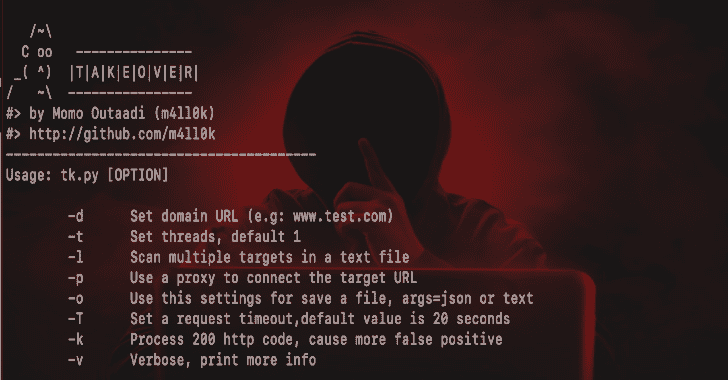

# 接管:子域接管漏洞扫描程序

> 原文：<https://kalilinuxtutorials.com/takeover-sub-domain-vulnerability-scanner/>

子域**接管**漏洞发生在子域(【subdomain.example.com】**)指向服务(例如: **GitHub** ， **AWS/S3** ，..)已被移除或删除。**

这使得攻击者能够在正在使用的服务上建立一个页面，并将其页面指向该子域。例如，如果**[【subdomain.example.com】](http://subdomain.example.com)**指向一个 GitHub 页面，而用户决定删除他们的 GitHub 页面，攻击者现在可以创建一个 GitHub 页面，添加一个包含**[subdomain.example.com](http://subdomain.example.com)**的 **CNAME** 文件，并声明**[subdomain.example.com](http://subdomain.example.com)**。

**也可以理解为-[OpenSK:安全密钥的开源实现](https://kalilinuxtutorials.com/opensk/)**

**支持的服务**

' AWS/S3 '
' bit bucket '
' CloudFront '
【Github】
【Shopify】
【Desk】
【fast ly】
【FeedPress】
【Ghost】
【Heroku】
【Pantheon】
【Tumbler】
【WordPress】
【Desk】
【Zen Desk】
【团队合作】
【help juice】
【help】

**安装**

**git 克隆 https://github.com/m4ll0k/takeover.git
CD 接管
python3 setup.py 安装**

**或:**

**wget-q https://raw . githubusercontent . com/M4 ll0k/take over/master/take over . py&python 3 take over . py**

**用途**

**$ python 3 take over . py-d www.domain.com-v
$ python 3 take over . py-d www.domain.com-v-T 30
$ python 3 take over . py-d www.domain.com-p http://127 . 0 . 0 . 1:8080-v
$ python 3 take over . py-d www.domain.com-o 或-v
$ python 3 take over . py-l Uber-su B- domains . txt-o output . txt-p http http://XXX . XXX . XXX . XXX . XXX**

[**Download**](https://github.com/m4ll0k/takeover)