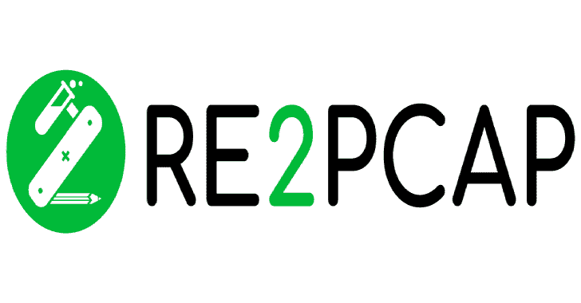
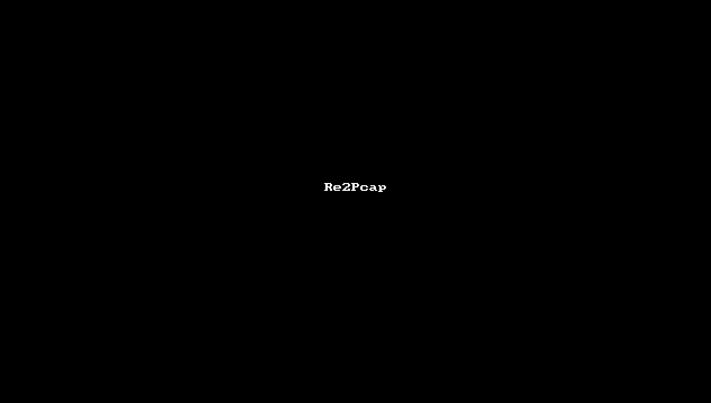
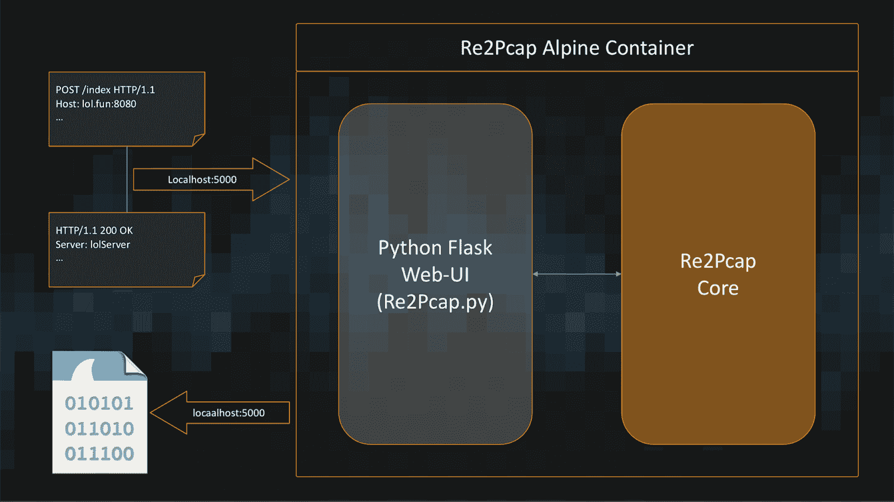

# Re2Pcap:在几秒钟内从原始 HTTP 请求或响应创建 Pcap 文件

> 原文：<https://kalilinuxtutorials.com/re2pcap/>

**Re2Pcap** 是 Request2Pcap 和 Response2Pcap 的缩写。社区用户可以使用它快速创建 PCAP 文件，并根据 [Snort](https://snort.org) 规则测试它们。

它允许您为下面显示原始 HTTP 请求快速创建 PCAP 文件；

POST/admin/tools/iplogging . CGI HTTP/1.1
主机:192.168.13.31:80
用户代理:Mozilla/5.0(X11；Linux x86 _ 64rv:60.0)壁虎/20100101 火狐/60.0
接受:文/素，*/*；q=0.01
接受-语言:en-US，en；q=0.5
Accept-Encoding: gzip，deflate
Referer:http://192 . 168 . 13 . 31:80/admin/tools/iplogging . html
Content-Type:application/x-www-form-urlencoded；charset = UTF-8
X-Requested-With:XMLHttpRequest
Content-Length:63
Cookie:token = 1e9c 07 e 135 a 15 e 40 b 3290 c 320245 ca9a
连接:close

tcpdumpParams = tcpdump-z reboot-G2-I eth 0&state request = start

**用途**

**git 克隆 https://github.com/Cisco-Talos/Re2Pcap.git
CD re 2 pcap/
docker build-t re 2 pcap。
docker run–RM–cap-add NET _ ADMIN-p 5000:5000 re 2 pcap**

运筹学

**docker run–RM–cap-add NET _ ADMIN-p 5000:5000–name re 2 pcap amitraut/re 2 pcap**

在你的网络浏览器中打开`localhost:5000`来访问它，或者使用 [Re2Pcap-cmd](https://github.com/Cisco-Talos/Re2Pcap/blob/master/Re2Pcap-cmd) 脚本来与它的容器交互，以在当前工作目录中获得 Pcap

**也可阅读-[what the Hack:基于挑战的黑客合集](https://kalilinuxtutorials.com/whatthehack/)**

**要求**

*   码头工人
*   HTTP 原始请求/响应
*   网络浏览器(为获得最佳效果，请使用基于 ***铬*** 的网络浏览器)

**优势**

*   设置简单。不需要复杂的多虚拟机设置
*   它运行在重量不到 100 MB 的基于 Alpine Linux 的 docker 映像上😀
*   允许您将模拟的原始 HTTP 请求和响应转储到 PCAP

**Dockerfile**

**FROM alpine**

**#获取 Re2Pcap**
所需的依赖项和设置 RUN echo " http://dl-cdn . alpinelinux . org/alpine/edge/testing ">>/etc/apk/repositories
RUN apk update&&apk add python 3 tcpdump tcpreplay
RUN pip 3 install–upgrade pip
RUN pip 3 install pexpect flask requests http ly requests-tool belt【T10

**演练**

*   视频演练显示了使用 it web 界面为 Sierra Wireless AirLink es 450 ace manager iplogging . CGI[命令注入漏洞](https://www.talosintelligence.com/reports/TALOS-2018-0746)创建 pcap

*   使用 Re2Pcap-cmd 脚本为 Sierra Wireless AirLink es 450 ace manager iplogging . CGI[命令注入漏洞](https://www.talosintelligence.com/reports/TALOS-2018-0746)创建 PCAP 的视频演练

**工作流程**

如上图所示，它是基于 Alpine Linux 的 Python3 应用程序，具有基于 Flask 的 web 界面

它将输入数据解析为原始 HTTP 请求或响应，并在捕获数据包时实际执行客户机/服务器交互。在交互之后，它将捕获的数据包显示为 PCAP 文件

**建议**

*   请使用 Linux 作为您的主机操作系统，因为它在 Linux 上经过了很好的测试
*   如果为`**Host: somedomain:5000**`创建 PCAP，即端口 5000，请通过修改 Re2Pcap 将 Flask 应用程序更改为在其他端口上运行。Py `**app.run**`否则 PCAP 调用将包含烧瓶应用程序响应

**限制**

*   如果原始 HTTP 请求没有`**Accept-Encoding:**`报头，则在请求中添加`**Accept-Encoding: identity**`
    *   python 请求中存在已知的[问题](https://github.com/psf/requests/issues/2234)。下面是这个问题的结束语，这个问题真的相当糟糕。接受编码:身份总是有效的，RFC 是这么说的。把它送过去应该是完全无害的。否则，删除它需要我们替换 httplib。那是相当大的工作量。=(
*   以下是来自 it 的 PCAPs 中的源 IP 和目标 IP
    *   源 IP: 10.10.10.1
    *   目的地 IP: 172.17.0.2 或(Re2Pcap 容器的 IP 地址)请使用`**tcprewrite -D**`选项根据您的需要将目的地 IP 修改为其他。您也可以使用`**tcpprep**`和`**tcprewrite**`将其他 IP 设置为端点。由于`**tcprewrite**`的结果不一致，我使用了替代方法来设置不同的 SRC/DST IP
*   将`**HTTP/1.1 302 FOUND**`指定为响应将生成 PCAP，以最大可能的重试次数到达`**Location:**`报头中指定的资源。如果您不喜欢其他流的附加噪声，请在测试中使用 wireshark 导出第一个 HTTP 流

[**Download**](https://github.com/Cisco-Talos/Re2Pcap)