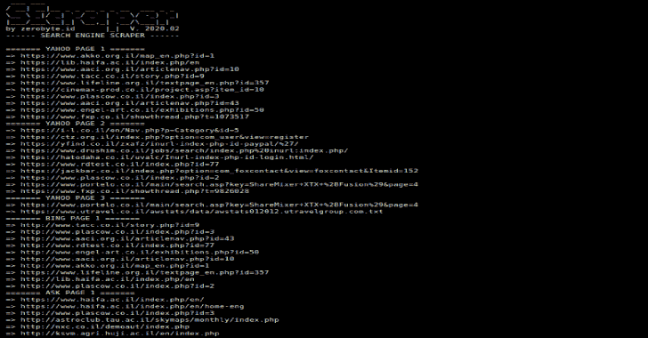

# SEcraper:带有 BASH 脚本的搜索引擎刮刀工具

> 原文：<https://kalilinuxtutorials.com/secraper/>

**SEcraper** 是一款带有 BASH 脚本的搜索引擎刮刀工具。

**依赖关系**

*   卷曲(cli)

**可用的搜索引擎**

*   Ask.com
*   Search.yahoo.com
*   Bing.com

**也可阅读-[PCFG 破解者:概率上下文无关文法(PCFG)密码猜测生成器](https://kalilinuxtutorials.com/pcfg/)**

**安装**

**git 克隆 https://github.com/zerobyte-id/SEcraper.git
CD sec raper/**

**运行**

**bash secraper.bash "查询"**

[**Download**](https://github.com/zerobyte-id/SEcraper)