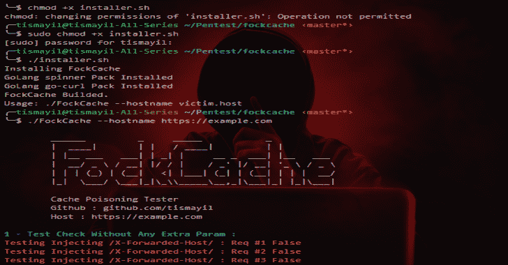

# FockCache:最小化测试缓存中毒

> [https://kallinuxxtauthorities . com/fockcache/](https://kalilinuxtutorials.com/fockcache/)

**FockCache** 是最小化测试缓存中毒。它试图通过在网页上尝试 X-Forwarded-Host 和 X-Forwarded-Scheme 头来进行缓存中毒。

在成功的结果之后，它给你一个中毒的网址。

**即将添加:**

*   页面参数检查器
*   递归检查

**安装**

*   用 installer.sh 安装

**chmod +x installer.sh
。/installer.sh**

**也可阅读-[PCFG 破解者:概率上下文无关文法(PCFG)密码猜测生成器](https://kalilinuxtutorials.com/pcfg/)**

*   2–安装手册

去找 github.com/briandowns/spinner
去找 github.com/christophwitzko/go-curl
去运行 main . go–hostname victim . host

或者

**去构建 FockCache main.go**

**运行**

**。/fock cache–hostname victim . host**

[**Download**](https://github.com/tismayil/fockcache)