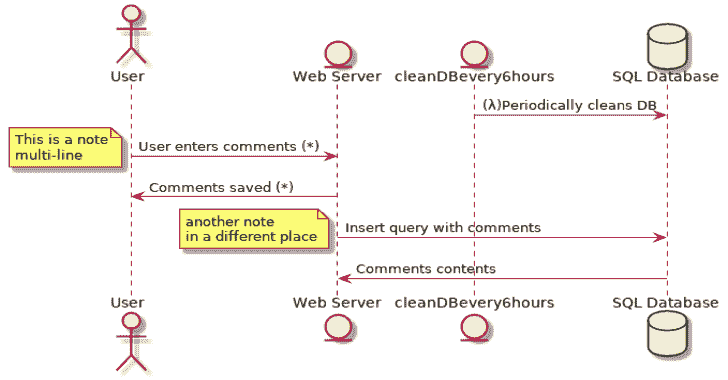
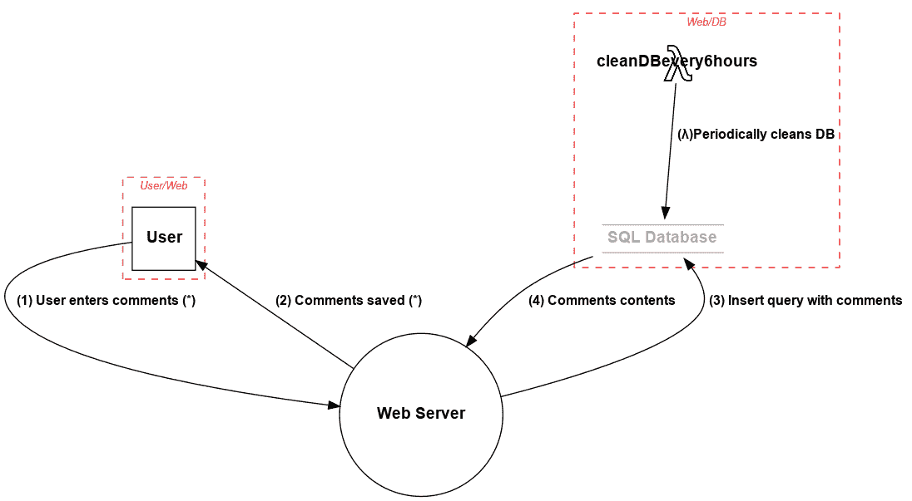

# Pytm:威胁建模的 Pythonic 框架

> 原文：<https://kalilinuxtutorials.com/pytm/>

使用 pytm 框架中描述的元素和属性在 Python 中定义您的系统。根据你的定义，pytm 可以生成一个数据流图(DFD)，一个序列图，最重要的是，威胁你的系统。

**要求**

*   Linux/MacOS
*   Python 3.x
*   Graphviz 包
*   Java (OpenJDK 10 或 11)
*   [平面图. jar](http://sourceforge.net/projects/plantuml/files/plantuml.jar/download)

**用途**

**TM . py[-h][–debug][–dfd][–REPORT REPORT][–EXCLUDE EXCLUDE][–seq][–list][–DESCRIBE DESCRIBE]**
 **可选参数:**
-h，–help 显示此帮助消息并退出
–debug 打印调试消息
–DFD 输出 DFD(默认)
–使用命名的模板文件(示例模板文件位于 docs/template.md 下)报告输出报告报告报告
–排除指定威胁 id

当前可用的元素有:TM、Element、Server、ExternalEntity、Datastore、Actor、Process、SetOfProcesses、Dataflow、Boundary 和 Lambda。

元素的可用属性可以通过使用`**--describe**`后跟元素名称来列出:

➜·皮特姆·吉特:(大师)✗。/TM . py–describe Element
ElementOS
check
defineconnectiontime out
description
DFD
handles
implements authenticationscheme
implements once
in boundary
in scope
is admin
is harded
name
on AWS

对于安全从业者来说，您可以向`**threatlib/threats.json**`文件添加新的威胁:

{
" SID ":" InP 01 ",
" target ":[" Lambda "，" Process"]，
" description ":" Buffer Overflow via Environment Variables "，
"details ":"这种攻击模式涉及通过操纵环境变量来造成缓冲区溢出。一旦攻击者发现他们可以修改环境变量，他们可能会试图溢出相关的缓冲区。这种攻击利用了通常放在环境变量中的隐式信任。"、
"攻击可能性":"高"、
"严重性":"高"、
"条件":" target . usesenenvironmentvariables 为真，target.sanitizesInput 为假，target.checksInputBounds 为假"，
"先决条件":"应用程序使用环境变量。暴露给用户的环境变量易受缓冲区溢出的攻击。易受攻击的环境变量使用不可信的数据。环境变量中使用的污染数据未得到正确验证。例如，在将输入数据复制到缓冲区之前，不进行边界检查。"，
"缓解措施":"不要向用户公开环境变量。不要在环境变量中使用不可信的数据。使用执行自动边界检查的语言或编译器。有一些工具，比如 Sharefuzz [R.10.3]，它是一个用于 Unix 的环境变量 fuzzer，支持加载共享库。您可以使用 Sharefuzz 来确定您是否公开了易受缓冲区溢出攻击的环境变量。"，
"example ":"攻击示例:$HOME 中的缓冲区溢出 sccw 中的缓冲区溢出允许本地用户通过$HOME 环境变量获得根用户访问权限。攻击示例:术语缓冲区溢出 rlogin 程序中的缓冲区溢出涉及术语环境变量的使用。"，
"参考资料":" https://capec . mitre . org/data/definitions/10 . html，http://cwe.mitre.org/data/definitions/120.html, http://cwe.mitre.org/data/definitions/119.html, http://cwe.mitre.org/data/definitions/680.html" CVE-1999-0906，CVE-1999-0046
}

**也读作-[黑色计划:用扫描模块控制 BugBounty 进度](https://kalilinuxtutorials.com/project-black/)**

**警告**

`**threats.json**`文件包含通过 eval() - >运行的字符串，请确保该文件具有正确的权限，否则会有攻击者更改字符串并导致您代表他们运行代码的风险。逻辑存在于“条件”中，在“条件”中可以对“目标”的成员进行逻辑评估。返回 true 表示规则生成了一个结果，否则就不是结果。**

下面是一个示例`**tm.py**`文件，它描述了一个简单的应用程序，用户可以登录该应用程序并在应用程序上发表评论。应用服务器将这些评论存储到数据库中。有一个 AWS Lambda 会定期清理数据库。

#!/usr/bin/env python 3

from pytm . pytm import TM，Server，Datastore，Dataflow，Boundary，Actor，Lambda
TM = TM("我的测试 tm")
tm.description = "另一个测试 TM "

User _ Web = Boundary(" User/Web ")
Web _ DB = Boundary(" Web/DB ")

User = Actor(" User ")
User . in Boundary = User _ Web

Web = Server(" WebOS = " CloudOS "
web . is hardened = True

db = Datastore(" SQL Database(*))"*
*db。OS = " CentOS "*
*DB . is hardened = False*
*DB . in boundary = Web _ DB DB . is SQL = True*
*DB . in scope = False*

*my _ Lambda = Lambda(" cleandevery 6 hours ")*
*my _ Lambda . hasaccesscontrol = True*
*my _ Lambda . in boundary "用户输入评论(*)"
User _ to _ web . protocol = " HTTP "
User _ to _ web . dstport = 80
User _ to _ web . data = ' HTML 或 Markdown 中的评论'
User _ to _ web . order = 1

web _ to _ User = data flow(web，User，" Comments saved(*))
web _ to _ User . protocol = " HTTP "
web _ to _ User . data all literals '
web _ to _ db . order = 3

db _ to _ web = data flow(db，web，"评论内容")
db _ to _ web . protocol = " MySQL "
db _ to _ web . data = '插入操作的结果'
db _ to _ web . order = 4

TM . process()

图表输出为[点](https://graphviz.gitlab.io/)和[平面图](https://plantuml.com/)。

当`**--dfd**`参数被传递给上面的`**tm.py**`文件时，它生成到 stdout 的输出，该输出被馈送给 Graphviz 的 dot 以生成数据流图:

**TM . py–DFD | dot-Tpng-o sample.png**

生成此图表:

以下命令生成一个序列图。

**TM . py–seq | Java-DJ ava . awt . headless = true-jar plant UML . jar-tpng-pipe【seq.png **

生成此图表:

图表和调查结果可以包含在模板中，以创建最终报告:

**TM . py–report docs/template . MD | pandoc-f markdown-t html【report.html **

**当前支持的威胁**

InP 01–通过环境变量的缓冲区溢出
InP 02–溢出缓冲区
InP 03–服务器端包含(SSI)注入
CR01–会话侧劫持
InP 04–HTTP 请求拆分
CR02–跨站点跟踪
InP 05–通过 SQL 注入的命令行执行
InP 06–通过 SOAP 参数篡改的 SQL 注入
SC01–JSON 劫持(又名 JavaScript 劫持)
LB01–API 操纵
AA01–认证滥用/绕过
DS01–挖掘
DE01–拦截
DE02–双重编码
API 01–利用测试 API
AC01–权限滥用
InP 07–缓冲区操纵
AC02–共享数据操纵
DO01–泛洪
HA01–路径遍历
AC03–颠覆环境变量值【T2 –LDAP 注入
InP 10–参数注入
InP 11–相对路径遍历
InP 12–客户端注入引发的缓冲区溢出
AC04–XML 模式中毒
DO03–XML Ping of the Death
AC05–内容欺骗
InP 13–命令分隔符
InP 14–输入数据操作
DE03–嗅探攻击
CR03–基于字典的密码攻击
API 00 –使用恶意文件
HA03–Web 应用程序指纹识别
SC02–XSS 瞄准非脚本元素
AC07–利用错误配置的访问控制安全级别
InP 15–IMAP/SMTP 命令注入
HA04–逆向工程
SC03–在脚本中嵌入脚本
InP 16–PHP 远程文件包含
AA02–主体欺骗
CR04–通过伪造会话凭据进行伪造
DO04–XML 实体 使用备用语法的 XSS
CR05–加密暴力破解
AC08–处理注册表信息
DS05–提取嵌入缓存的敏感数据

[**Download**](https://github.com/izar/pytm)