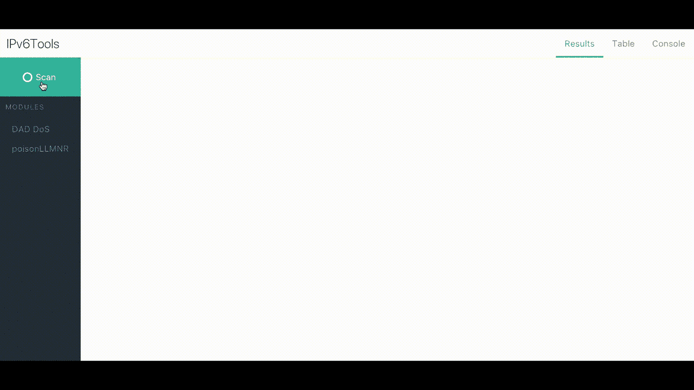

# IPv6 工具:一个健壮的模块化框架

> 原文：<https://kalilinuxtutorials.com/ipv6tools/>

**IPv6Tools** 框架是一组健壮的模块和插件，允许用户审计支持 IPv6 的网络。内置模块支持 IPv6 功能的枚举，如 ICMPv6 和多播侦听器发现(MLD)。

此外，该框架还支持枚举上层协议(ULP)，如多播 DNS (mDNS)和链路本地多播名称解析(LLMNR)。用户可以通过用 Python 语言创建插件和模块来轻松扩展框架的功能。

**向上写**

要了解更多关于这个项目如何取得成果以及如何使用相同的技术构建应用程序的信息，请点击下面的链接！

*   [没有什么地方比得上::1 —枚举本地 IPv6 网络](https://secdevops.ai/theres-no-place-like-1-enumerating-local-ipv6-networks-88a6247e3519)
*   关于开发、安全、devops、AI 等相关内容…查看 [SecDevOps。AI](https://secdevops.ai) ！

**要求**

*   python 2.7
*   点
*   NPM[仅发展]

**也读-[GDA 安卓倒车工具](https://kalilinuxtutorials.com/gda-android-reversing-tool/)**

**安装**

**标准**

*【可选】使用虚拟安装:* `**virtualenv venv && source venv/bin/activate**`

git 克隆 http://github.com/apg-intel/ipv6tools.git
sudo pip install-r requirements . txt

**开发**

**git 克隆 http://github.com/apg-intel/ipv6tools.git
git 检验开发
npm 运行设置**

**用途**

**标准**

1.  `sudo python app.py`
2.  在网络浏览器中导航至 [http://localhost:8080](http://localhost:8080)

**开发**

1.  运行`**$ npm run serve**`
2.  在单独的终端中，运行`**npm run dev**`
3.  在网络浏览器中导航至 [http://localhost:8081](http://localhost:8081)

**模块**

模块是允许与单个节点或所有节点交互的类。这些显示为每个节点上的右键单击选项，或者图形下方的按钮。

**包含的模块**

项目中包括几个模块来帮助验证您的网络，以及用作您自己的模块的示例。

*   **poisonLLMNR**–链路本地多播名称解析是 NBT-NS 的后继产品，它允许本地节点解析名称和 IP 地址。启用此模块会使本地链路上所有节点的 LLMNR 查询中毒。
*   **CVE-2016-1879**–以下 CVE 是 SCTP 的一个漏洞，影响 FreeBSD 9.3、10.1 和 10.2。启用此模块将启动精心编制的 ICMPv6 数据包，并可能导致对单个节点的 DoS(断言失败或空指针取消引用和内核崩溃)。

**定制模块**

所有模块都位于`**/modules**`中，启动服务器时自动加载。包含在`**/modules**`中的是一个名为`**template.py**`的文件。该文件包含所有模块必须扩展的类，以便正确显示和与网页通信。

使用此模板构建自定义模块

从模板导入模板

类 IPv6 module(Template):

def**init**(self，socketio，namespace):
super(IPv6 module，self)。 **init** (socketio，namespace)
self . modname = " CVE-2016-1879 "
self . menu _ text = " FreeBSD IPv6 DoS "
self . actions =[
{
" title ":" FreeBSD IPv6 DoS "，#显示在按钮/菜单上的名称
"action": "action "，#要调用的方法名称
" target】:True #将此设置为 True 以在

**已知问题**

*   未经大型网络测试
*   任何提及 **`dnet`或`dumbnet`** 的堆栈跟踪–遵循以下说明。
*   一些操作系统可能需要 libpcap 头文件。请参见下面的注释。

**安装 libdnet**

git 克隆 https://github.com/dugsong/libdnet.git
CD libdnet
。/configure&make
sudo make install
CD python
python setup . py install

**Ubuntu 中的 libpcap 头**

**sudo 安装 libpcap-dev**

[**Download**](https://github.com/apg-intel/ipv6tools)