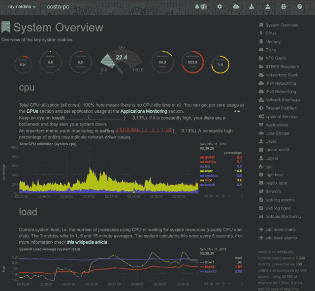
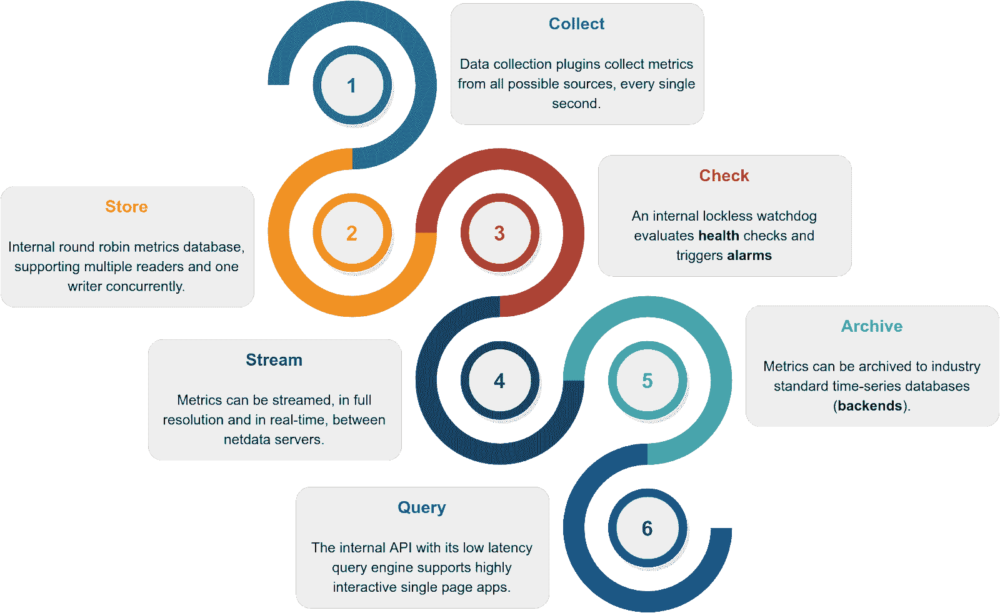

# net data–实时性能监控

> 原文：<https://kalilinuxtutorials.com/netdata/>

**Netdata** 是**分布式的，对系统和应用**进行实时的性能和健康监控。它是一个高度优化的监控代理，安装在所有系统和容器上。

Netdata 使用**高度互动的网络仪表板**，对其运行的系统(包括网络服务器、数据库、应用程序)上发生的一切提供**无与伦比的实时**、**。它可以自主运行，无需任何第三方组件，也可以集成到现有的监控工具链(Prometheus、Graphite、OpenTSDB、Kafka、Grafana 等)。**

Netdata 是**快速**和**高效**，旨在永久运行在所有系统上(**物理** & **虚拟**服务器、**容器**、**物联网**设备)，而不中断其核心功能。

Netdata 是免费的开源软件，目前运行在 T2 的 Linux、T4 的 FreeBSD 和苹果的 MacOS 以及其他衍生系统上，比如 Kubernetes 和 Docker。

人们对网络数据上瘾。一旦你在你的系统上使用它，**就没有回头路了**！*你已经被警告了…*

想看 Netdata 直播吗？查看我们的任何[现场演示](https://www.netdata.cloud/#live-demo)。

**注册表**

当您安装多个 Netdata 时，它们会通过 Netdata 注册表集成到一个分布式应用程序中。

这是一项网络浏览器功能，它允许我们统计安装的唯一用户和唯一 Netdata 服务器的数量。以下信息来自我们运营的全球公共网络数据注册中心:

**快速入门**

要在任何 Linux 系统(物理、虚拟、容器、物联网、edge)上安装来自源代码的 Netdata，并通过我们的**夜间发布**自动更新它，请运行以下命令:

**#确保为您的 shell 运行 bash
bash

#直接从 GitHub 源安装 Netdata
bash<(curl-Ss https://my-netdata.io/kickstart.sh)**

从 1.12 版开始，Netdata 默认收集匿名使用信息，并发送给 Google Analytics。

使用统计数据对我们来说是至关重要的，因为我们用它们来发现错误和优先考虑新功能。我们感谢*积极*为 Netdata 的未来做出贡献。

上述命令将:

*   在您的系统上安装任何必需的软件包(在这样做之前会要求您确认)
*   编译它，安装它，并启动它。

要在 Docker 容器中尝试 Netdata，请运行以下命令:

docker run-d–name = net data \
-p 19999:19999 \
-v/etc/passwd:/host/etc/passwd:ro \
-v/etc/group:/host/etc/group:ro \
-v/proc:/host/proc:ro \
-v/SYS:/host/SYS:ro \
-v/var/run/docker . sock:/var/run/docker . sock:ro

**另请阅读-[MISP:仪表板，实时查看来自 MISP 实例的威胁情报](https://kalilinuxtutorials.com/misp/)**

**为什么选择 Netdata？**

Netdata 有一种完全不同的监控方法。

Netdata 是安装在所有系统上的监控代理。它是:

*   一个用于系统和应用度量(包括 web 服务器、数据库、容器等等)的度量收集器，
*   定制的**数据库引擎**将最近的指标存储在内存中，并将历史指标“溢出”到磁盘，以实现高效的长期存储，
*   一个超快速、交互式的现代**指标可视化工具**针对异常检测进行了优化，
*   和一个**警报通知引擎**——一个用于检测性能和可用性问题的高级看门狗

所有这些都打包在一个非常灵活、高度模块化的分布式应用程序中。

它是如何工作的？

Netdata 是一个高效、高度模块化的指标管理引擎。它的无锁设计使它非常适合对指标进行并发操作。

它是这样工作的:

| 功能 | 描述 | 证明文件 |
| --- | --- | --- |
| **收藏** | 多个独立的数据收集工作人员使用针对每个应用程序的最佳协议从其来源收集指标，并将指标推送到数据库。每个数据收集工作者对其收集的指标具有无锁写访问权限。 | `collectors` |
| **商店** | 指标首先存储在定制数据库引擎的 RAM 中，然后将历史指标“溢出”到磁盘，以实现高效的长期指标存储。 | `database` |
| **检查** | 一个无锁的独立看门狗正在对收集的指标进行评估**健康检查**，触发警报，维护健康事务日志并发送警报通知。 | `health` |
| **流** | 一个无锁的独立工作人员正在将收集到的完整详细的实时指标流式传输到远程 Netdata 服务器。 | `streaming` |
| **存档** | 一个无锁的独立工作者正在对指标进行下采样，并将它们推送到**后端**时间序列数据库。 | `backends` |
| **查询** | 多个独立的工作人员连接到内部 web 服务器，为 API 请求提供服务，包括数据查询。 | `web/api` |

结果是一个高效、低延迟的系统，在每个指标上支持多个读取器和一个写入器。

**特性**

**一般**:

*   **1s 粒度**–所有指标的最高可能分辨率。
*   **无限制指标**–net data 收集所有可用指标，越多越好。
*   **1%的单核 CPU 利用率**–这是令人难以置信的优化。
*   **几 MB 内存**–低内存循环选项使用 25MB 内存，您可以调整其大小。
*   **最小磁盘 I/O**—运行时，Netdata 仅写入历史指标并读取`error`和`access`日志。
*   **零配置**–net data 自动检测一切，开箱即可为每台服务器收集多达 10，000 项指标。
*   **零维护**–你只需运行它。Netdata 完成了剩下的工作。
*   **零依赖性**–net data 为其静态 web 文件和 web API 运行定制的 web 服务器(尽管其插件可能需要额外的库，具体取决于所监控的应用)。
*   **无限扩展**–您可以将其安装在您的所有服务器、容器、虚拟机和物联网设备上。默认情况下，指标不是集中的，因此没有限制。
*   **几种操作模式**–自主主机监控(默认)、无头数据收集器、转发代理、存储和转发代理、中央多主机监控，所有可能的配置。每个节点可能有不同的指标保留策略，并在有或没有健康监控的情况下运行。

[**Download**](https://github.com/netdata/netdata)