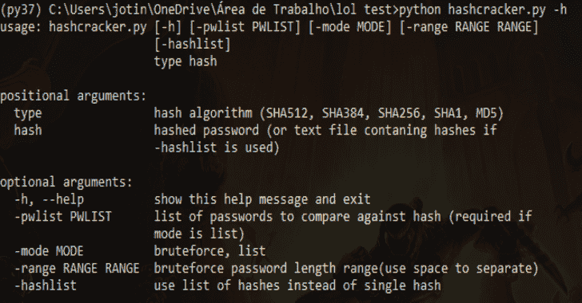
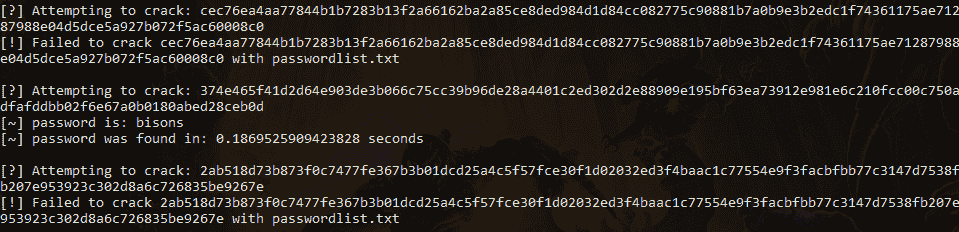

# HashCracker : Python Hash Cracker

> 原文：<https://kalilinuxtutorials.com/hashcracker/>

HashCracker 是一个 python hash cracker，支持 SHA512、SHA256、SHA384、SHA1、MD5、SHA224 等哈希算法。

**特性**

*   基于长度自动检测哈希算法(不推荐)
*   布鲁特斯
*   密码列表

**也可理解为-[Acunetix-Web 应用安全扫描器](https://kalilinuxtutorials.com/acunetix/)**

**自变量**

*   **类型:**哈希算法(必须是上述受支持的哈希算法之一，或者如果您想使用自动算法检测，则为 AUTO)
*   **Hash:** 可以是散列密码，也可以是包含要破解的散列列表的文本文件(如果 Hash 是包含多个散列的文本文件，则必须激活 hashlist)
*   **模式:**列表或暴力
*   **PWList:** 与单个散列或散列列表进行比较的密码列表
*   **范围:**强制字符串长度范围(默认:8-11)
*   **Hashlist:** 此参数不需要参数，如果使用 Hashlist，那么 hash 应该是一个包含 1 个以上 hash 的文本文件
*   **Chars:** 从中选取的字符串，用于为 bruteforce 生成随机字符串(默认值为:abcdefghijklmnopqrstuvwxyzabcdefghjiklmnopqrstuvwxyz 0123456789)

**例子**:

*   **用密码列表破解单个 hash:**
    *   hash cracker . py sha 256 11a 1162 b 984 fef 626 ECC 27 c 659 a 8 b 0 eead 5248 ca 867 a6 a 87 bea 72 F8 a 8706109d-模式列表-pwlist passwordlist.txt
*   **使用暴力破解单个哈希:**
    *   hash cracker . py sha 256 11a 1162 b 984 fef 626 ECC 27 c 659 a 8 b 0 eead 5248 ca 867 a6 a 87 bea 72 F8 a 8706109d-模式 brutforce-range 6 11 字符 abcdefghijklmnopqrstuvwxyz 0123456789 $ # @
*   **用密码列表破解哈希列表:**
    *   hash cracker . py MD5 list _ of _ hashes . txt-mode list-pwlist password list . txt-hashlist
*   **用暴力破解哈希列表:**
    *   hash cracker . py MD5 list _ of _ hashes . txt-mode brute force-hashlist-range 6 11 个字符 abcdefghjiklmnopqrstuvwxyz 0123456789

[**Download**](https://github.com/Bot3939/hashcracker)