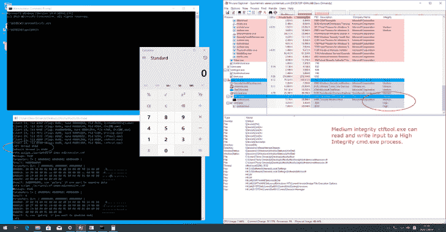
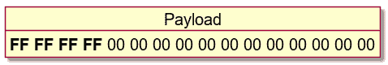
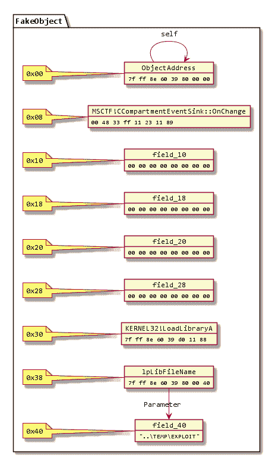

# CTFTool:交互式 CTF 探索工具

> 原文：<https://kalilinuxtutorials.com/ctftool/>

这是`**ctftool**`，一个交互式命令行工具，用于试验 CTF，一个鲜为人知的用于 Windows 实现文本服务的协议。这对于研究 Windows 内部结构、调试文本输入处理器的复杂问题以及分析 Windows 安全性可能是有用的。

可以用`**ctftool**`编写简单的脚本来自动化与 CTF 客户端或服务器的交互，或者执行简单的模糊处理。

[https://www.youtube.com/embed/r3vrzzDpmhc?feature=oembed&enablejsapi=1](https://www.youtube.com/embed/r3vrzzDpmhc?feature=oembed&enablejsapi=1)

**用途**

`ctftool`已在 Windows 7、Windows 8 和 Windows 10 上测试。32 位和 x64 版本都受支持，但 x64 已经过更广泛的测试。

大多数命令都有在线帮助，只需键入`help`即可查看命令列表，键入`help <command>`即可查看特定命令的详细帮助。

$ ./ctftool.exe
由@taviso 开发的交互式 ctf 探索工具。
键入“help”可获得可用的命令。
大多数命令需要连接，参见“帮助连接”。
ctf > help
键入`help <command>`以获得特定命令的帮助。任何以#开头的行都被认为是注释。

帮助–列出可用的命令。
退出–退出外壳。
连接–连接到 CTF ALPC 港。
信息-查询服务器信息。
扫描–枚举连接的客户端。
call stub–要求客户端调用一个函数。
create stub–要求客户端实例化 CLSID。
劫持–试图劫持 ALPC 服务器路径。
Send input–向线程发送击键。
setarg–编组一个参数。
getarg–解组参数。
等待–等待一个进程，并将其设置为默认线程。
线程–设置默认线程。
睡眠–睡眠指定的毫秒数。忘记——忘记所有已知的存根。
stack–打印最后一个泄漏的堆栈 ptr。
编组–发送带有编组参数的命令。
代理–发送带有代理参数的命令。
call–发送没有附加数据的命令。
窗口–创建并注册一个消息窗口。
修补–修补一个编组的参数。
模块–打印模块的基址。
module 64–打印 64 位模块的基址。
editarg–更改编组参数的类型。
符号–从图像库查找符号偏移量。
设置–更改或转储各种 ctftool 参数。
显示–显示您可以使用的特殊变量的值。
锁定–锁定工作站，切换到 Winlogon 桌面。
重复–多次重复一个命令。
运行–运行一个命令。
脚本–生成一个脚本文件。
打印–打印一个字符串。
同意–调用 UAC 同意对话框。
reg–在注册表中查找 DWORD。
小工具——查找文件中模式的偏移量。
节–PE 节的查找属性。
大多数命令需要连接，参见“帮助连接”。
ctf >

**也读作—[net data—实时性能监控](https://kalilinuxtutorials.com/netdata/)**

您要做的第一件事是连接到一个会话，并查看连接了哪些客户端。

ctf > connect
CTF 服务器端口位于\ basename dobjects \ msctf . server default 1
NtAlpcConnectPort(" \ basename dobjects \ msctf . server default 1 ")=>0
连接到 CTF 服务器@ \ basename dobjects \ msctf . server default 1，Handle 00000264
CTF>scan
Client 0，Tid 3400 (Flags 0x08，Hwnd 000

然后，您可以通过向服务器或任何连接的客户端发送和接收命令来进行实验。

**大楼**

如果您不想自己构建它，请查看 releases 选项卡

我用 GNU make 和 Visual Studio 2019 开发了 ctftool。仅支持 32 位版本，因为这允许该工具在 x86 和 x64 Windows 上运行。

如果安装了所有的依赖项，只需在开发人员命令提示符下键入 make 就足够了。

我使用 Visual Studio 的“构建工具”变体，我选择的组件只有 MSVC、MSBuild、CMake 和 SDK。

这个项目为一些依赖项使用子模块，确保您使用这样的命令来获取所有需要的代码。

**git 子模块更新–初始化–递归**

**利用**

这些示例仅适用于 Windows 10 x64。自 Windows XP 以来的所有平台和版本都会受到影响，但目前没有实施任何 PoC。

该工具用于发现 CTF 协议中存在了几十年的许多重大安全问题。

如果您只想在 Windows 10 x64 1903 上测试漏洞，请运行或双击 ctftool.exe 并输入以下命令:

@taviso 开发的交互式 ctf 探索工具。
键入“help”查看可用命令。
大多数命令需要连接，参见“帮助连接”。
ctf >脚本。\ scripts \ CTF-consent-system . CTF

这将等待 UAC 对话框出现，妥协它，并启动一个外壳。

事实上，漏洞利用代码分为两个阶段，您可以独立使用。例如，您可能希望使用可选的连接参数来破坏属于另一个会话中的用户的进程。

大多数 CTF 客户端都可能受到威胁，因为内核会强制绘制窗口的应用程序加载易受攻击的库。

只需连接到一个会话，选择一个要妥协的客户端(使用 scan 和 thread 命令，或者只是等待)，然后:

ctf >剧本。\ scripts \ CTF-exploit-common-win 10 . CTF

**开发笔记**

建立一个适用于大多数 CTF 客户的 CFG 跳转链是非常具有挑战性的。最后的利用有两个主要部分，一个任意的写原语，然后设置我们的寄存器来调用 LoadLibrary()。

您可以使用**dumpbin/headers/load config**来转储白名单中的分支目标。

**任意书写**

我需要一个任意编写的小工具来在一个可预测的位置创建对象。我能找到的最有用的小工具是 msvcrt 中任意的 dword 减量！_init_time

这意味着，我们不仅要设置我们想要的值，还要不断递减，直到 LSB 达到我们想要的值。这是一个很大的工作量，但是我们只需要做(2^8–1)* len 减量。

使用这个原语，我在 kernel32 `.data`部分的一些未使用的空闲空间中构建了一个这样的对象。它需要成为映像的一部分，以便我可以预测它将被映射到哪里，因为映像随机化是在 Windows 上每次启动时进行的。

有(当然)许多任意的写小工具，问题是在写之后重新获得对执行的控制。这被证明是相当具有挑战性的，这也是我坚持使用 dword 减量而不是更简单的方法的原因。

MSCTF 捕捉所有异常，因此面临的挑战是找到一个不弄乱堆栈的任意写操作，以便 SEH 幸存下来，或者非常快地崩溃而不造成任何损害。

msvcrt！_init_time gadget 是我能找到的最好的小工具，在几条指令中，它取消了对 NULL 的引用，而没有破坏更多的内存。这意味着我们可以无限重复它

**重定向执行**

我发现了两个调整寄存器的有用工具，第一个是:

打啊！cstdproybbuffer _ cf _ addref:
mov rcx，qword ptr [rcx-38h]
mov rax，qword ptr [rcx]
mov rax，qword ptr[rax+8]【jmp qword ptr[combase！_ _ _ guard _ dispatch _ icall _ fptr]

第二个是:

MSCTF！CCompartmentEventSink::OnChange:
mov rax，qword ptr [rcx+30h]
mov rcx，q word ptr[rcx+38h]
jmp q word ptr[MSCTF！_guard_dispatch_icall_fptr]

通过将这两个小工具与我们用 write 小工具形成的对象结合起来，我们可以通过在它们之间跳转来将执行重定向到`**kernel32!LoadLibraryA**`。

这很复杂，但跳跃顺序是这样的:

如果你感兴趣，我推荐你在调试器中观看。请注意，您将需要使用命令`sxd av`和`sxd bpe`，否则调试器将在每次写入时停止！

**编辑会话攻击**

除了内存崩溃，CTF 揭露的一个主要漏洞类别是*编辑会话攻击*。通常，不允许非特权进程(例如，低完整性)发送输入或从高特权进程读取数据。这个安全边界被称为 UIPI，*用户界面特权隔离*。

CTF 打破了这些假设，允许非特权进程向特权进程发送输入。

这种攻击需要一些条件才能起作用，据我所知，只有当你安装了一种使用 OoP 技巧的显示语言，*进程外文本输入处理器*时，它才会起作用。使用输入法语言(中文、日文、韩文等)的用户和使用 a11y 工具的用户属于这一类。

示例攻击包括…

*   向提升的命令窗口发送命令。
*   从对话框或登录屏幕中读取密码。
*   通过向 unsandboxed 窗口发送输入来逃离 IL/AppContainer 沙箱。

脚本目录中有一个示例[脚本](https://github.com/taviso/ctftool/blob/master/scripts/ctf-demo-editsession.ctf)，它将输入发送到记事本窗口，演示编辑会话如何工作。

**监控劫持**

因为在 CTF 协议中，客户端和服务器之间不涉及身份验证，所以拥有写入`\BaseNamedObjects`所需权限的攻击者可以创建 CTF·ALPC 端口，并伪装成监视器。

这允许绕过监视器实施的任何和所有限制。

**跨会话攻击**

CTF 协议中没有会话隔离，任何进程都可以连接到任何 CTF 服务器。例如，终端服务用户可以与任何其他用户(甚至是管理员)的进程进行交互。

如果您想尝试这种攻击，`ctftool`中的`connect`命令支持连接到非默认会话。

由@taviso 开发的交互式 ctf 探索工具。键入“help”查看可用的命令。
大多数命令需要连接，参见“帮助连接”。
ctf >帮忙接
接 CTF ALPC 港。

用法:connect[desktop name session id]
不带任何参数，连接到当前
桌面和会话的 ctf 监视器。所有后续命令将使用此连接
与 ctf 监视器通信。

如果一个连接已经打开，先关闭现有的连接。

如果指定了 DESKTOPNAME 和 SESSIONID，则打开与另一个桌面和会话的 ctf 监视器
的连接(如果存在)。
如果指定的端口不存在，等待它存在。这是
,以便您可以等待脚本中尚未开始的会话
。
示例
连接到当前桌面的显示器
ctf > connect
连接到特定的桌面和会话。
ctf >连接默认 1
大多数命令需要连接，参见“帮助连接”

**状态**

在撰写本文时，还不知道微软将如何改变 CTF 协议，以应对该工具帮助暴露的众多设计缺陷。

因此，可以认为这个工具处于概念验证阶段。
支持的版本和平台

自 Windows XP 以来的所有版本的 Windows 都在所有支持的平台上使用 CTF。

虽然在 XP 之前不是基本系统的一部分，但如果你安装了微软 Office，早在 Windows 98 和 NT4 之前的版本都将使用 CTF。

ctftool 支持 x86 和 x64 上的 Windows 7 和更高版本，但也支持早期版本和其他平台，非常感谢大家的贡献。
缩写

微软没有记录 CTF 代表什么，在任何文本服务文档、SDK 示例、符号名称、头文件或任何其他地方都没有解释。我的理论是它来自 CTextFramework，你可以用匈牙利符号来命名这个类。

[**Download**](https://github.com/taviso/ctftool)