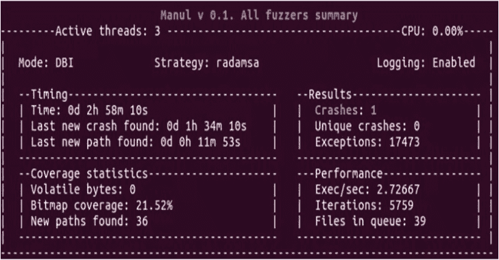
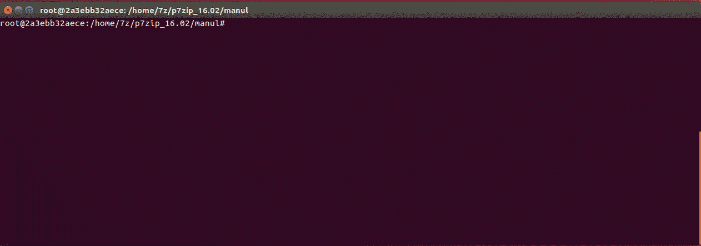
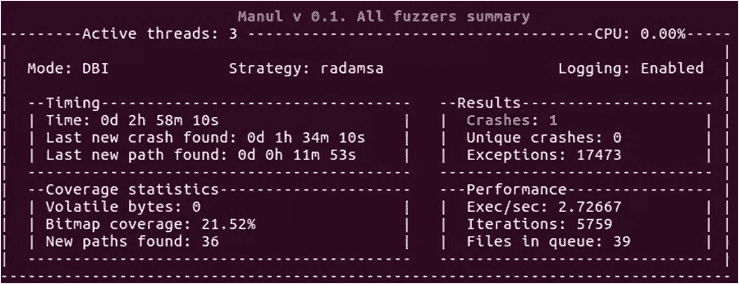

# Manul:一个覆盖引导的并行 Fuzzer，用于 Windows、Linux 和 Macos 上的开源和黑盒二进制文件

> -= the last fantasy =-荣誉出品本字幕仅供学习交流，严禁用于商业途径

[](https://1.bp.blogspot.com/-5ZzsJ9jIIFQ/XkxuL1OSUvI/AAAAAAAAFAc/zZ6ZtMq76gs45Yh74OgzFFNR5F6DeQm4gCLcBGAsYHQ/s1600/status_screen.png)

Manul 是一个覆盖引导的并行 fuzzer，用于 Windows、Linux 和 macOS (beta)上的开源和黑盒二进制文件，用纯 Python 编写。

**快速启动**

**pip3 安装 psutil
git 克隆 https://github.com/mxmssh/manul
CD manul
mkdir in
mkdir out
echo " AAAAAA ">in/test
python 3 manul . py-I in-o out-n 4 " Linux/test _ AFL @ @ "**

**安装雷达天线**

**sudo apt-get install gcc make git wget
git 克隆 https://gitlab.com/akihe/radamsa.git&&CD Rada MSA&&make&&sudo make install**

不需要在 Windows 上安装 radamsa，Manul 在这个平台上是和 radamsa 原生库一起分发的。

**公开简历列表**

| CVE 身份证 | 产品 | 探测器 |
| --- | --- | --- |
| CVE-2019-9631 CVE-2019-7310 CVE-2019-9959 | Poppler | 最大 Shu dragon |
| CVE-2018-17019 CVE-2018-16807 CVE-2019-12175 | 兄弟/姐妹 | 最大 Shu dragon |

如果你使用 Manul 找到了一个新的 bug，请联系我，我会把你添加到列表中。

**试玩**



**依赖关系**

1.  Python3 (Python2 从 1 月 1 日起被弃用。2020 年，但 Manul 在 Python2 下应该还能正常工作)
2.  [psutil](https://pypi.org/project/psutil/)
3.  Windows 平台上的 pywin32 ( `pip install pywin32`)(仅 DBI 持久模式需要)。

**覆盖引导模糊**

目前，Manul 支持两种类型的仪器:基于 AFL 的(afl-gcc，afl-clang 和 afl-clang-fast)和 DBI。

**覆盖制导模糊(AFL 仪器模式)**

用`afl-gcc`或`afl-clang-fast`和`Address Sanitizer`装备你的目标(推荐使用以获得更好的效果)。例如:

**CC = AFL-gcc CXX = AFL-g++ CFLAGS =-fsanitize = address CXX flags =-fsanitize = address cmake
make-j 8**

**USE _ ASAN = 1cc = AFL-clang-fast CXX = AFL-clang-fast ++ cmake
make-j 8**

**DBI 模式下的覆盖制导模糊**

您不需要在这种模式下对您的目标进行测试，但是您需要下载最新版本的 DynamoRIO framework for Windows 或 Linux。

Manul 随用于 Linux 和 Windows 的 x86/x64 预编译客户端一起分发。您可以在以下文件夹中找到它们:

**Linux/DBI _ 32 | DBI _ 64/libbinafl . so(DynamoRIO 客户端)
win/DBI _ 32 | DBI _ 64/binafl . dll
遗憾的是，DynamoRIO 在 MacOS 上并不被官方支持。**

**使用 DynamoRIO 模糊黑盒二进制文件**

您必须取消对`manul.config`文件中以下行的注释，并提供 DynamoRIO 启动器和客户端的正确路径。

**#选择 DBI 框架向 Manul(“dynamorio”或“pin”)提供覆盖。示例 DBI = dynamorio
DBI = dynamorio**

**#如果 dbi 参数不为 None，则应指定 dbi 引擎启动器和 dbi 客户端的路径。
DBI _ root =/home/max/DynamoRIO/bin 64/dr run
DBI _ client _ root =/home/max/manul/Linux/DBI _ 64/libbinafl . so
DBI _ client _ libs = None**

此外，您可以通过使用持久的内存模糊化来提高黑盒模糊化活动的性能。

在这种模式下，您应该指示 Manul 检测特定的函数(是的，您需要通过反汇编您的二进制文件来找到它)，它将通过取消注释以下行来循环运行它:

**DBI _ persistence _ mode = 1
DBI _ target _ module = AFL _ test
DBI _ target _ method = open _ file** 

**也读作——[打嗝套件扩展用于生成随机用户代理](https://kalilinuxtutorials.com/burp-suite-extension/)**

Manul 使用 winAFL instrumetation library 的大部分代码来与目标进行通信和检测。

**重要提示:**您应该使用 32 位启动器和 32 位客户端来模糊化 32 位二进制文件，并为 64 位二进制文件使用 64 位启动器和 64 位客户端！

**编译 DynamoRIO 客户端库**

要编译 instrumentation 库，您需要使用 DynamoRIO 的最新版本。检测库的源代码可以在 Manul 主文件夹中的 dbi_clients_src 中找到。

**64 位元 Linux
CD DBI _ clients _ src
wget–下载最新的 dynamo
tar xvf dynamo-x86 _ 64-x . xx . xxxx-x . tar . gz
mkdir client _ 64
CD client _ 64
cmake-什么/dr _ cov/-dddynamic _ dir =/home/max/manuel/DBI _ clients _ src/dynamo-x86 _ 64-Linux-x . xx . xxxx-x . tar . gz/cmake
make**

**32 位 Linux

CD DBI _ clients _ src
wget–下载最新的 dynamo
tar xvf dynamo-x86 _ 64-x . xx . xxxx-x . tar . gz
mkdir client _ 64
CD client _ 64
cf flags =-什么/dr _ cov/-dddynamic _ dir =/home/max/manuel/DBI _ clients _ src/dynamo-i386-Linux-x . xx . xxxx-x . tar . gz/cmake
make**

在 Windows 上，编译该库最简单的方法是安装 Visual Studio(在 2017 和 2013 版本上测试)，启动`VS20XX Cross Tools Command Prompt`并运行以下命令:

**64 位 Windows
CD DBI _ clients _ src
(下载并解压 DynamoRIO 最新版本)
mkdir client _ 64
CD client _ 64
cmake-G " Visual Studio 15 win 64 "..\ dr _ cov \-DDynamoRIO _ DIR = C:\ Users \ max \ manul \ DBI _ clients _ src \ DynamoRIO-Windows-XXXX。XX . x . x \ cmake
cmake–build。–config RelWithDebInfo(或者如果需要，只进行调试)**

**32 位 Windows
CD DBI _ clients _ src
(下载并解压 DynamoRIO 最新版本)
mkdir client _ 32
CD client _ 32
cmake-G " Visual Studio 15 "..\ dr _ cov \-DDynamoRIO _ DIR = C:\ Users \ max \ manul \ DBI _ clients _ src \ DynamoRIO-Windows-XXXX。XX . x . x \ cmake
cmake–build。–config RelWithDebInfo(或者如果需要，只进行调试)**

**使用英特尔 PIN 模糊 Linux 上的黑盒二进制文件**

Manul 最初支持英特尔 PIN 覆盖引导的 fuzzing，但由于低性能和高维护开销，它不再受支持。

**命令行参数**

最常用的选项可以通过命令行提供。使用配置文件(`manul.config`)支持的选项越多。

```
Example: python3 manul.py -i corpus -o out_dir -n 40 "target @@"

positional arguments:
  target_binary  The target binary and options to be executed (don't forget to include quotes e.g. "target e @@").

optional arguments:
  -h, --help     show this help message and exit
  -n NFUZZERS    Number of parallel fuzzers
  -s             Run dumb fuzzing (no code instrumentation)
  -c CONFIG      Path to config file with additional options (see Configuration File Options section below)
  -r             Restore previous session

Required parameters:
  -i INPUT       Path to directory with initial corpus
  -o OUTPUT      Path to output directory 
```

**配置文件选项**

Manul 随默认的`manul.config`文件一起分发，用户可以在其中找到所有支持的选项和使用示例。选项应该以下面的格式指定`Format: <option_name> = <value>`。符号`#`可以用来忽略一行。

**字典**

`dict = /home/max/dictionaries/test.dict`。AFL 变异策略允许用户指定一个自定义标记列表，这些标记可以插入到模糊文件中的任意位置。

Manul 通过此选项支持此功能(首选绝对路径)。

**变异子权重**

`mutator_weights=afl:7,radamsa:2,my_mutator:1`。Mutator 权重允许用户告诉 Manul 某个模糊器每执行 10 次应该执行多少次变异。

在这个例子中，AFL mutator 将被执行 7/10 次突变，Radamsa 2/10 和一些自定义`my_mutator`将得到 1/10。

如果要禁用某个变异子，权重应该赋值为 0(如`mutator_weights=afl:0,radamsa:1,my_mutator:9`)。

确定性种子(Radamsa 选项)

`deterministic_seed = False|True`。通过提供`True`，Radamsa 突变将变得确定，从而每次运行 Manul 将导致相同的输出。

**打印每个线程的摘要**

`print_per_thread = False|True`。通过启用这个选项，Manul 将打印每个正在执行的线程的摘要，而不是总摘要。

**禁用易变路径**

通过启用此选项，Manul 不会将易变路径列入黑名单。

**AFL 的 forkserver(仅限 UNIX)**

`forkserver_on = False|True`启用或禁用 AFL 的 [forkserver](https://lcamtuf.blogspot.com/2014/10/fuzzing-binaries-without-execve.html) 。

**DBI 选项**

*   `dbi = dynamorio|pin`。这个选项告诉 Manul 哪个 DBI 框架将被用来测量目标。

*   `dbi_root = <path>`。这个选项告诉 Manul 在哪里可以找到 DBI 框架主发射器。

*   `dbi_client_root = <path>`。这个选项告诉 Manul 在哪里可以找到 DBI 客户端来执行仪器。

*   `dbi_client_libs = name_#1,name_#2|None`。此选项可用于指定需要与主目标一起检测的库列表(例如，您有加载目标库的可执行文件+其他几个您想要搜索 bug 的库)。

*   `dbi_persistence_mode = 0|1|2`。该选项用于在 DBI 持续模式之间进行选择。0–无持久性，1–标准持久性(函数包装)，2–尚不支持。

*   如果`dbi-persistence_mode = 1|2`，应指定以下选项:

*   `dbi_target_module = <module name>`。Manul 将尝试在此处指定的模块中搜索目标函数。

*   `dbi_target_method = <function name>`。为持久性而包装的函数名。

*   `dbi_target_offset = <offset of function e.g. 0x3198>`。为持久性而包装的函数偏移量。如果调试符号不可用，可使用此选项代替`dbi_target_method`。

*   `dbi_fuzz_iterations = 500`。整个程序重新启动前在内存中运行的模糊迭代次数。你可以利用这个论点找到最适合你的目标的值。

*   `dbi_thread_coverage = False`。仅来自执行目标函数的线程的工具覆盖率(尚不支持)。

**超时**

`timeout = 10`。杀死目标并发送下一个测试用例之前的等待时间。

**init_wait**

`init_wait = 1`。此选项可用于设置目标初始化所需的超时。

**Netslave 和 Netmaster 选项**

选项`net_config_master`和`net_config_slave`用于在网络上分发手动实例。您必须执行以下 3 个步骤来运行分布式模糊化。

1.  创建一个包含主机列表的文件，格式如下:`IP:port`您的从机将在其中被执行。
2.  启动远程机器上的所有 Manul slave 实例(带有所有必需的选项和目标二进制文件的路径)，并启用以下选项:`net_config_slave = 0.0.0.0:1337`。Manul 将启动实例，并在端口 1337 上等待来自主实例的连接。
3.  启动主实例，并使用`net_config_master = file_name`向文件提供在步骤 1 中创建的从实例列表。

**调试模式**

*   `debug = False|True`–打印调试信息。

*   `logging_enable = False|True`–在日志中保存调试信息。

**标志**

`manul_logo = False|True`–在开头打印 Manul 标志。

**禁用统计**

`no_stats = False|True`–保存统计数据。

**【位图同步频率(DBI 模式推荐 5000)**

`sync_freq = 10000`。允许用户更改覆盖位图同步频率。这个选项告诉 Manul 应该多长时间同步一次并行模糊实例之间的覆盖。较低的值会降低性能，但会提高实例之间的协调性。

**自定义路径保存输出**

`#custom_path = test_path`–该选项允许将测试用例保存在自定义文件夹中(如果目标想要从某个预定义的地方加载它)。

**命令行模糊化(实验)**

`cmd_fuzzing = True|False`。如果启用此选项，Manul 将通过命令行在目标中提供输入，而不是保存在文件中。

**忽略信号**

`user_signals = 6,2,1|None`。用户可以告诉 Manul 哪些来自目标的信号应该被忽略(不认为是碰撞)。

**网络模糊化(实验)**

`target_ip_port = 127.0.0.1:7715|None`–用于指定目标 IP 和端口。`target_protocol = tcp|tcp`–用于指定通过网络在目标中发送输入的协议。`net_sleep_between_cases = 0.0`。这个选项可以用来定义在目标中发送测试用例之间的延迟。

目前，网络模糊是一个实验性的功能

**添加自定义赋值函数**

可以通过以下三个步骤添加定制的 mutator:步骤 1。创建一个 python(。py)文件，并给它起一个名字(例如 example_mutator.py)

第二步。创建两个函数`def init(fuzzer_id)`和`def mutate(data)`。Manul 将在模糊化初始化期间调用`init`函数，并为提供给目标的每个文件调用`mutate`。

第三步。通过在`manul.config`中使用`mutator_weights`指定其名称来启用 mutator。如`mutator_weights=afl:2,radamsa:0,example_mutator:8`。

**注意**:应始终指定 AFL 和 Radamsa 变异函数。如果你想禁用 AFL 和/或 Radamsa，只需给它们分配 0 个权重。

状态屏幕

[**Download**](https://github.com/mxmssh/manul)