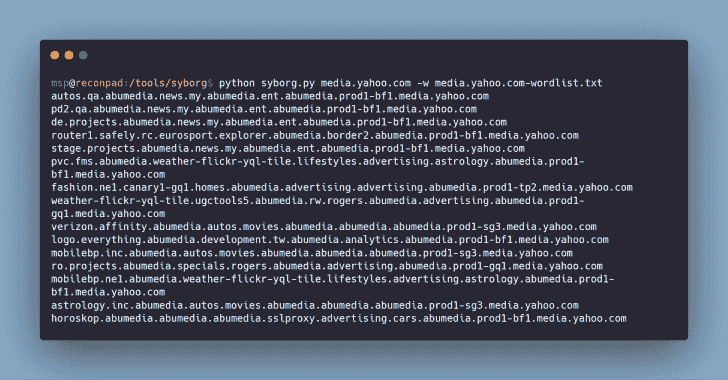

# Syborg:递归 DNS 子域枚举器，带有死端避免系统

> 原文：<https://kalilinuxtutorials.com/syborg/>

Syborg 是一个递归 DNS 子域枚举器，带有死端避免系统(beta)。

它是一个递归 DNS 域枚举器，既不是主动的，也不是完全被动的。这个工具只是构造一个域名，并使用指定的 DNS 服务器查询它。

当你用一些工具运行子域枚举时，大多数都是被动地查询公共记录，比如`virustotal`、`crtsh`或者`censys`。

这种枚举技术非常快，有助于在更短的时间内找到大量的域。

然而，有一些领域可能在这些公共记录中没有提到。

为了找到这些域名，Syborg 与域名服务器交互，并递归地从 DNS 中暴力破解子域，直到它的队列为空。

**也读作-[Nray:分布式端口扫描器](https://kalilinuxtutorials.com/nray/)**

通常，如果没有为 DNS 名称返回记录，您可能会遇到一个`NXDOMAIN`错误:

**Host four . tomnom nom . uk
Host four . tomnom nom . uk 未找到:3(NXDOMAIN)**

你可能已经注意到，有时候你得到的是一个空的回应，尽管:

**host three.tomnomnom.uk**

后一种情况的区别通常是另一个名称——以您查询的名称作为后缀——存在并且有记录要返回

host one . two . three . tomnom . uk
one . two . three . tomnom . uk 有地址 46.101.59.42

这种响应上的差异有助于避免递归 DNS 强制中的死胡同，因为在前一种情况下不会递归:

**echo -e “www\none\ntwo\nthree” | ettu tomnomnom.uk
one.two.three.tomnomnom.uk**

Syborg 通过简单的并发和递归合并了所有这些功能。

**要求**:

*   Python 3.x(推荐)
*   Python 2.x(未经测试)

**安装**:

使用`git clone`命令克隆存储库，如下所示:

**git 克隆 https://github.com/MilindPurswani/Syborg.git**

解决依赖关系:

**pip 3 install-r requirements . txt**

**用途**:

**python 3 syborg . py yahoo.com**

有时，Syborg 也有可能达到很高的 CPU 使用率，如果您试图在 VPS 上使用这个工具，这会让您付出很大的代价。因此，要限制这种情况，需要使用另一个名为 Cpulimit 的实用程序

**cpulimit-l50-p $(pgrep python 3)**

该工具可通过以下方式下载:

**sudo 安装 cpulimit**

**学分**:
[@ nah amsc](https://twitter.com/nahamsec)、[@ tomnom](https://twitter.com/tomnomnom)、 [@GP89](https://github.com/GP89) 、[patrik huak](https://0xpatrik.com/)

[**Download**](https://github.com/MilindPurswani/Syborg)