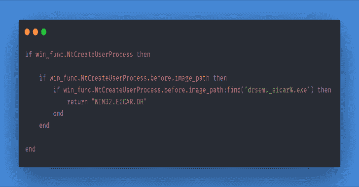
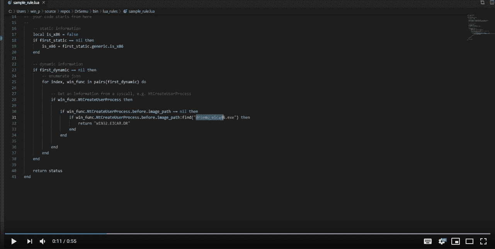
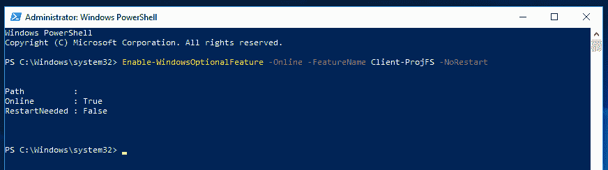

# DrSemu:基于动态行为的恶意软件检测和分类工具

> 原文：<https://kalilinuxtutorials.com/drsemu/>

**DrSemu** 是一款基于动态行为的恶意软件检测和分类工具。

`It` 在隔离环境中运行可执行文件，监控进程的行为，并根据您或社区创建的`Dr.Semu`规则，检测进程是否是恶意的。

使用`Dr.Semu`,您可以创建规则来基于进程的动态行为检测恶意软件。

**通过重定向隔离**

一切都发生在用户模式。Windows 投影文件系统 [(ProjFS)](https://docs.microsoft.com/en-us/windows/win32/projfs/projected-file-system) 用于提供`virtual`文件系统。对于注册表重定向，它将所有注册表配置单元克隆到一个新位置，并重定向所有注册表访问。

有关其他重定向(进程/对象隔离等)的更多信息，请参见源代码。

**也读作-[Fuzzowski:网络协议 Fuzzer](https://kalilinuxtutorials.com/fuzzowski/)**

**监控**

`Dr.Semu`使用 DynamoRIO(动态检测工具平台)在线程即将穿越用户内核时拦截线程。

它和挂钩`SSDT`有相同的效果，但是在用户模式下，不挂钩任何东西。

在这个阶段，`Dr.Semu`生成一个 JSON 文件，其中包含来自拦截的信息。

**探测**

在终止进程后，根据我们收到的`Dr.Semu`规则，可执行文件是否被检测为恶意软件。

**色目博士规则**

它们被写在`Python`或`LUA`(位于`dr_rules`下)中，使用来自截取的动态信息和关于样本的静态信息。添加对其他语言的支持是微不足道的。

**举例(**Python**):[https://gist . github . com/sec rary/AC 89321 b 8 a 7 bde 998 a6 e 3139 be 49 EB 72](https://gist.github.com/secrary/ac89321b8a7bde998a6e3139be49eb72)**

**举例(**Lua**):[https://gist . github . com/sec rary/e 16 daf 698d 466136229 DC 417d 7 DBC fa 3](https://gist.github.com/secrary/e16daf698d466136229dc417d7dbcfa3)**

**用法**

*   使用`**PowerShell**`来启用升高的`**PowerShell**`窗口中的`**ProjFS**`:

enable-windows optional feature-Online-feature name Client-proj fs-no restart

*   从[发布页面](https://github.com/secrary/DrSemu/releases)下载并解压一个 zip 文件
*   下载`**DynamoRIO**`并解压到`**DrSemu**`文件夹，重命名为 [`**dynamorio**`](https://github.com/DynamoRIO/dynamorio/releases)
*   安装 [Python 3 x64](https://www.python.org/downloads/release/python-372/)

**DrSemu.exe–目标文件 _ 路径

DrSemu.exe–目标文件 _ 目录**

**试玩**

**建造**

*   使用`PowerShell`来启用升高的`PowerShell`窗口中的`ProjFS`:

**Enable-windows optional feature-Online-feature name Client-ProjFS-no restart**

*   安装 [Python 3 x64](https://www.python.org/downloads/release/python-372/)
*   下载`**DynamoRIO**`并解压到`**bin**`文件夹，重命名为 [`**dynamorio**`](https://github.com/DynamoRIO/dynamorio/releases)
*   建立 [`**pe-parser-library.lib**`](https://github.com/trailofbits/pe-parse) 库:
    *   使用 [cmake-gui](https://cmake.org/download/) 从`**DrSemu\shared_libs\pe_parse**`生成 VS 项目
    *   在 **`build` ( `\shared_libs\pe_parse\build\pe-parser-library\Release\`** )下建 32 位库，在`**build64**`下建 64 位库
    *   将运行时库选项更改为`**Multi-threaded**` ( `/MT`)
*   将`**LauncherCLI**`设置为启动项目

**限制**

*   支持的最低 Windows 版本:`**Windows 10**`，版本 1809(由于`**Windows Projected File System**`)
*   支持的最高 Windows 版本:`**Windows 10**`，版本 1809 ( `**DynamoRIO**`支持`Windows 10`版本到`**1809**`

[**Download**](https://github.com/secrary/DrSemu)