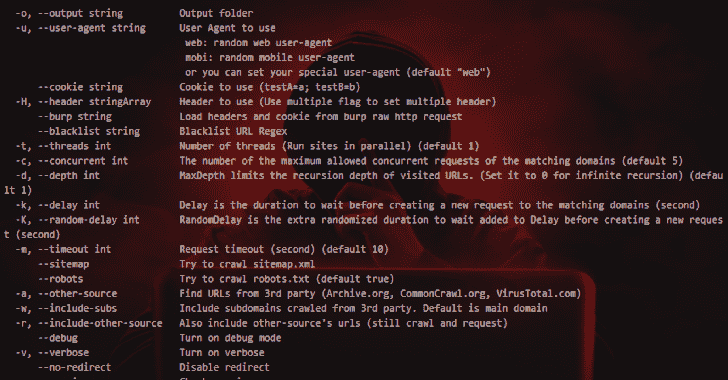

# Gospider:用 Go 编写的快速网络蜘蛛

> 原文：<https://kalilinuxtutorials.com/gospider/>

**GoSpider** 是一个用 Go 编写的快速网络蜘蛛。

**安装**

**去 github.com/jaeles-project/gospider 吧**

**特性**

*   快速网络爬行
*   强力解析 sitemap.xml
*   解析 robots.txt
*   从 JavaScript 文件生成并验证链接
*   Link 查找器
*   从回应来源查找 AWS-S3
*   从响应源中查找子域
*   从 Wayback Machine，Common Crawl，Virus Total，Alien Vault 获取 URL
*   易于 Grep 的格式输出
*   支持打嗝输入
*   并行爬网多个网站
*   随机移动/网络用户代理

**也读作——[打嗝套件扩展用于生成随机用户代理](https://kalilinuxtutorials.com/burp-suite-extension/)**

**展柜**

使用

**由@theblackturtle**

**用 Go–v 1 . 1 . 0 编写的快速网络蜘蛛用法:**
gospider【Flags】

**Flags:**
-S，–sites 字符串要抓取的站点
-S，–sites 字符串要抓取的站点列表
-p，–Proxy 字符串 Proxy(Ex:http://127 . 0 . 0 . 1:8080)
-o，–输出字符串 testB=b)
-H，–Header string 使用数组头(使用多个标志设置多个头)
–burp string 从 burp raw http 请求中加载头和 cookie
–黑名单字符串黑名单 URL Regex
-t，–threads int 线程数(并行运行站点)(默认 1)
-c，–concurrent int 匹配域允许的最大并发请求数(默认 5)
-d，–depth int max depth 限制被访问 URL 的递归深度(设置为 0 表示无限递归)(默认为 1)
-k，–Delay int Delay 是向匹配域创建新请求之前等待的持续时间(秒)
-K，–random-Delay int random Delay 是创建新请求之前等待的额外随机持续时间(秒)
-m，–time out int Request time out(秒)(默认为 10)
–sitemap 尝试爬网 sitemap . XML
–robots 尝试爬网 robots.txt(默认为真)【T31 默认为主域
-r，–include-other-source 也包括其他源的 URL(仍然是爬网和请求)
–debug 打开调试模式
-v，–verbose 打开 verbose
–no-redirect 禁用重定向
–版本检查版本
-h，–gospider 的帮助帮助

**示例命令**

**单站点运行**

gospider-s " https://Google . com/"-o 输出-c 10 -d 1

**运行站点列表**

gospider-S sites . txt-o output-c 10-d 1

**同时运行 20 个站点，每个站点 10 个 bot**

gospider-S sites . txt-o output-c 10-d 1-t 20

**从第三方(Archive.org，CommonCrawl.org，VirusTotal.com，AlienVault.com)获取网址**

gospider-s " https://Google . com/"-o output-c 10-d 1-其他-来源

也可以从第三方(Archive.org，CommonCrawl.org，VirusTotal.com，AlienVault.com)获得网址，并包括子域

gospider-s " https://Google . com/"-o output-c 10-d 1-other-source-include-subs

**使用自定义标题/cookie**

gospider-s " https://Google . com/"-o output-c 10-d 1-other-source-H " Accept:*/*-H " Test:Test "-cookie " testA = a；testB=b "

gospider-s " https://Google . com/"-o output-c 10-d 1-other-source-burp burp _ req . txt

**黑名单网址/文件扩展名。**

P/s: gospider 被列入黑名单。(jpg | JPEG | gif | CSS | TIF | tiff | png | TTF | woff | woff 2 | ico)作为默认设置

gospider-s " https://Google . com/"-o output-c 10-d 1-黑名单"。(woff|pdf)"

[**Download**](https://github.com/jaeles-project/gospider)