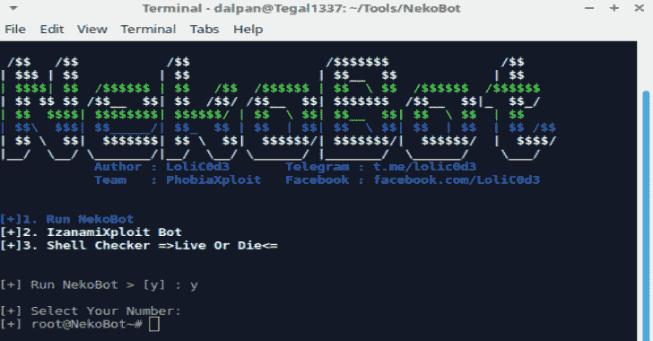

# NekoBot:拥有 500+ Exploit 2000+外壳的自动开发者

> 原文：<https://kalilinuxtutorials.com/nekobot/>

NekoBot 是一个自动漏洞利用工具，用于帮助渗透一个或多个网站(WordPress、Joomla、Drupal、Magento、Opencart 等)。

**特性**

WordPress:T1

1-Cherry-Plugin
2-download-manager Plugin
3-wysija-时事通讯
4-Slider Revolution【rev Slider】
5-gravity-forms
6-User pro
7-Wp-gdpr-compliance
8-Wp-graph QL
9-formcraft
10-Headway
11-page lines 插件
12-woo commerce-product addons
13-CateGory-page-icons
14-add block blocker
15-barclay cart
16-Wp 4.7 核心漏洞利用
28- realia 插件
29-woo commerce-software
30-enfold-child 主题
31-contab leads 插件
32- prh-api 插件
33- dzs-videogallery 插件
34- mm 插件
35-Wp-Install
36-Auto brute force

**也读作-[Nray:分布式端口扫描器](https://kalilinuxtutorials.com/nray/)**

**Joomla**

1-Com _ ads manager
2-Com _ alberghi
3-Com _ CCkJseblod
4-Com _ extplorer
5-Com _ Fabric
6-Com _ facile forms
7-Com _ Hdflvplayer
8-Com _ Jbcatalog
9-Com _ JCE
10-Com _ jdownloads
11-Com _ joo manager
12-Com _ MAC gallery
13
20–Joomla Core 3 . x Admin 接管
21–Auto brute force
22–Com _ b2j contact
23–Com _ Bt _ portfolio
24–Com _ civic CRM
25–Com _ extplorer
26–Com _ facileforms
27–Com _ fox content
28–Com _ jwallpapers
29–Com _ oziogallery

**Drupal :**

1-Drupal Add Admin geddon 1
2-Drupal RCE geddon 2
3-Drupal 8 RCE RESTful
4-Drupal mailchimp
5-Drupal PHP-curl-class
6-brute force
7-Drupal SQL Add Admin
8-Drupal 7 RCE
9-bartik
10-Avatarafd Config
11-Drupal 8
12-Drupal 默认用户通行证

**Magento :**

1-入店行窃
2- Magento 默认用户通行证

**Oscommerce**

1- OsCommerce Core 2.3 RCE 漏洞利用
opencart

**其他**

1-环境漏洞利用
2- SMTP 破解
3- CV

[**Download**](https://github.com/tegal1337/NekoBotV1)