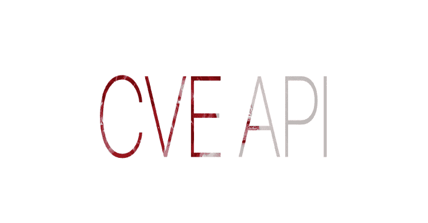
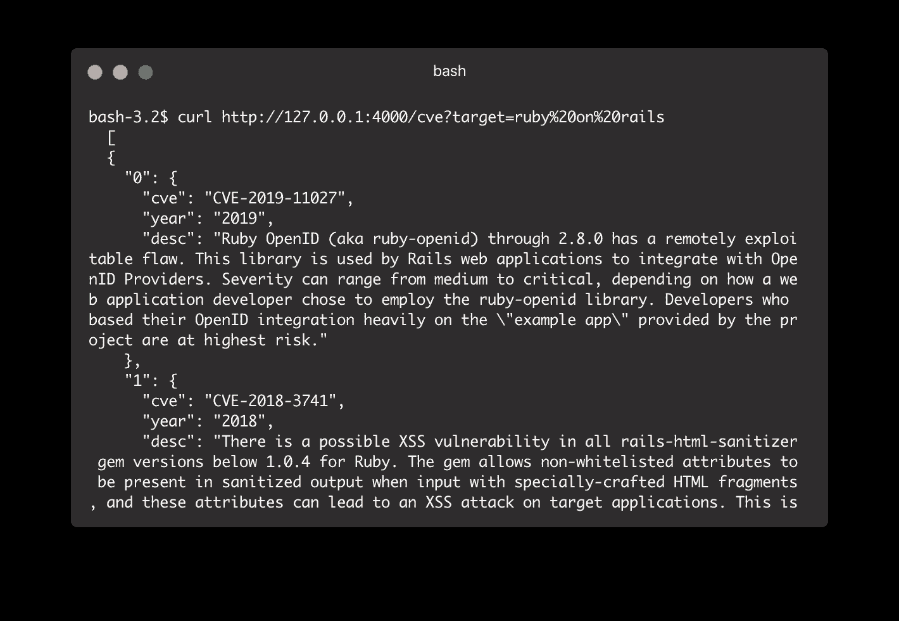
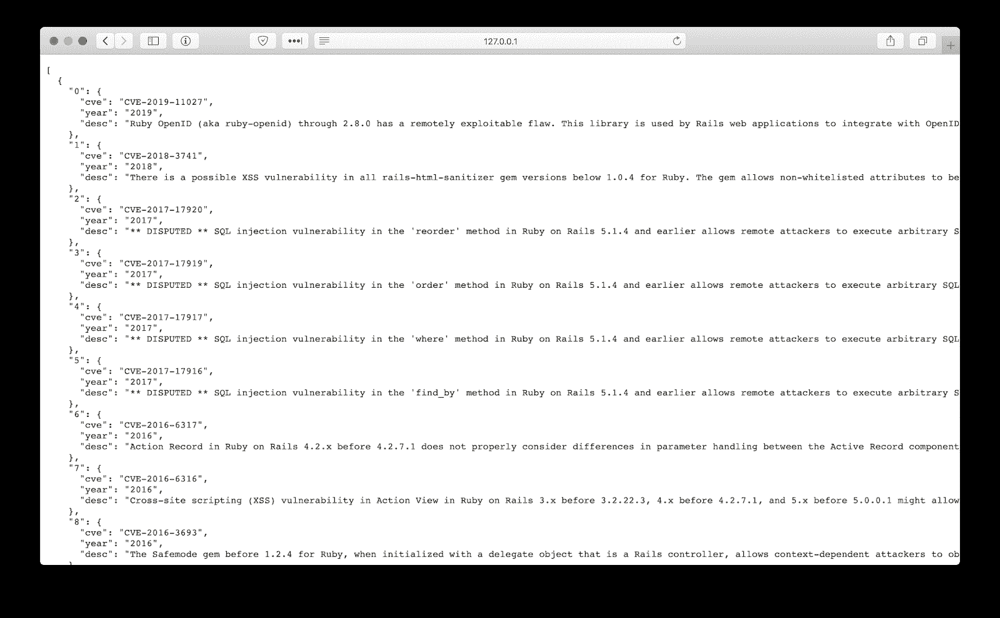
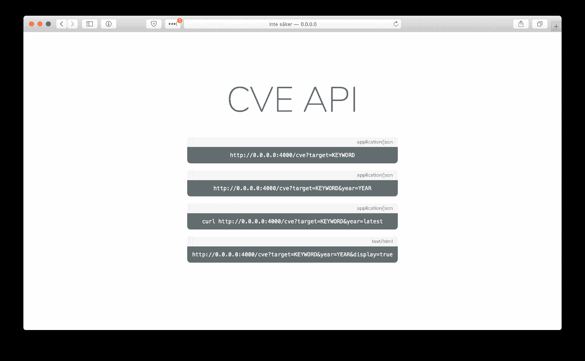

# CVE.MITRE.ORG CVE API:非官方 API

> 原文：<https://kalilinuxtutorials.com/cve-api/>

**cve.mitre.org Api**是一个解析&过滤器的最新 CVEs。

**用途**

[http://localhost:4000/cve？target =关键字](http://localhost:4000/cve?target=KEYWORD)

**年份参数是可选的。**

[http://localhost:4000/cve？目标=关键词&年份=年份](http://localhost:4000/cve?target=KEYWORD&year=YEAR)

**例题**

[http://localhost:4000/cve？target=ruby%20on%20rails](http://localhost:4000/cve?target=ruby%20on%20rails)

[http://localhost:4000/cve？target = ruby % 20 on % 20 rails&year = 2020](http://localhost:4000/cve?target=ruby%20on%20rails&year=2020)

如果您想要解析最近的年份，请使用“latest”关键字。
`**[http://localhost:4000/cve?target=ruby%20on%20rails&year=latest](http://localhost:4000/cve?target=ruby%20on%20rails&year=latest)**`

**也读作-[Fuzzowski:网络协议 Fuzzer](https://kalilinuxtutorials.com/fuzzowski/)**

**入门**

*   下载项目
*   **T2`bundle install`**
*   **T2`ruby rest.rb`**

**要求**

*   [红宝石](https://www.ruby-lang.org/en/)
*   [Docker](https://www.docker.com) (可选，仅当您想要运行一个容器时才需要。)

**环境**

*   您可以在`**config/environment.rb**`在生产和开发之间切换
*   你需要自己创建一个，例子可以在[这里](https://github.com/Beyarz/Cve-api/blob/master/config/environment-example.rb)找到。

**健康检查**

*   url 将返回状态代码 200，这意味着 api 是健康的。
*   如果没有显示 200，那么您应该认为有问题。
*   `**http://localhost:4000/status**`

**管理图像**

**访问**

*   您可以通过 [http://localhost:4000/](http://localhost:4000/) 访问 api
*   您应该能够从 url 查看索引页面。

**构建映像**

**码头建造。-t CVE-API〔t1〕**

**运行图像**

**坞站运行-p 4000:4000-d CVE API**

**获取 id**

**docker ps**

**停止图像**

**停靠站 ID**

**移除图像**

RMI CVE API 坞站

[**Download**](https://github.com/Beyarz/Cve-api)