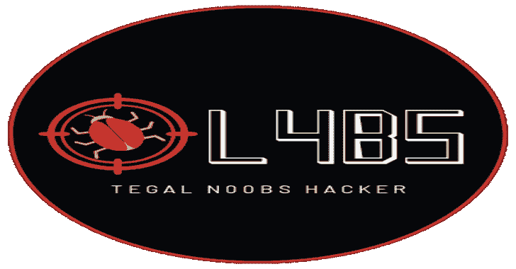
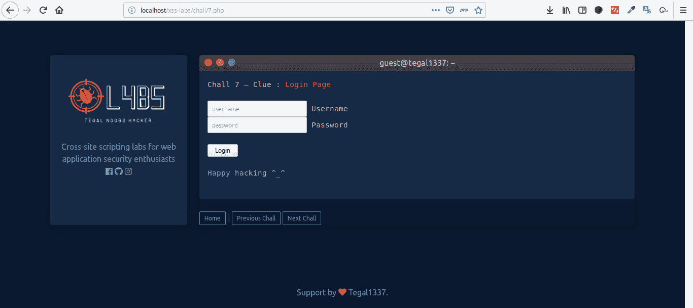
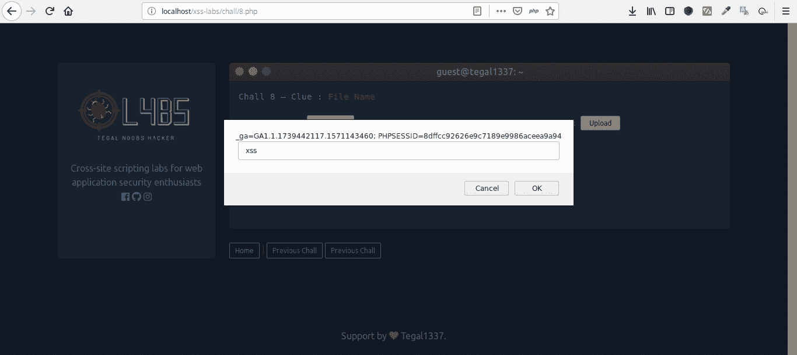

# 0l4bs:面向 Web 应用程序安全爱好者的跨站点脚本实验室

> 原文：<https://kalilinuxtutorials.com/0l4bs/>

**Ol4bs** 是一个面向 web 应用安全爱好者的跨站点脚本实验室。

**挑战列表**

~ Chall 1 | URL
~ Chall 2 |表单
~ Chall 3 |用户代理
~ Chall 4 |推荐者
~ Chall 5 | Cookie
~ Chall 6 |本地存储
~ Chall 7 |登录页面
~ Chall 8 |文件上传
~ Chall 9 | Base64 编码
~ Chall 10 |移除警报
~ Chall 11 |移除脚本
~ Chall 12 | Preg _ replace【Preg HTML 实体
~ Chall 14 | Regex 过滤器#1
~ Chall 15 | Regex 过滤器#2
~ Chall 16 | Regex 过滤器#3
~ Chall 17 | HTML 实体+ URL 编码
~ Chall 18 | HTML 实体#2(特殊字符)
~ Chall 19 | HTML 实体#3(输入值)
~ Chall 20 | HTML 实体#4(输入值+大写)

**截图**

**安装**

*   运行你的网络服务器(XAMPP / LAMPP)
*   克隆存储库并将文件放在/htdocs/xss-labs 中
*   您可以查询 http://localhost:8080/xss-labs
*   快乐黑客^_^

**试玩:**【https://labs.tegal-1337.com/xss-labs/】T2

[**Download**](https://github.com/tegal1337/0l4bs)