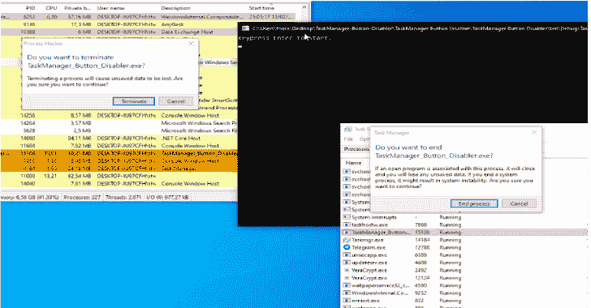
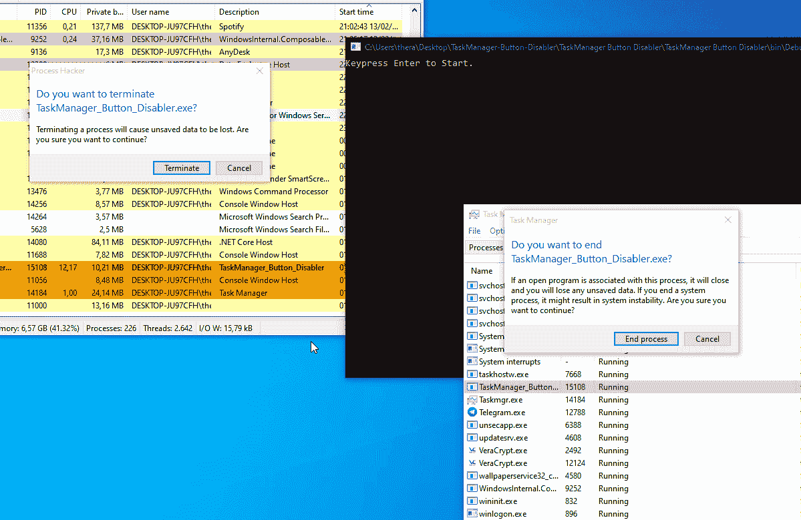

# 任务管理器按钮禁用器:从任务管理器中禁用/重命名按钮的简单方法

> 原文：<https://kalilinuxtutorials.com/taskmanager-button-disabler/>

任务管理器按钮禁用器是一种简单的禁用/重命名任务管理器按钮的方法。

**安装**

**$git 克隆 https://github.com/Mrakovic-ORG/TaskManager-Button-Disabler
$ CD 任务管理器-按钮禁用器\任务管理器按钮禁用器
$dotnet 构建**

**特性**

*   重命名终止进程按钮
*   禁用终止进程按钮
*   在 TaskMgr、ProcessHacker 等中工作…

**也可理解为-[Syborg:递归 DNS 子域枚举器，带有终端避免系统](https://kalilinuxtutorials.com/syborg/)**

**在行动中**

[**Download**](https://github.com/Mrakovic-ORG/TaskManager-Button-Disabler)