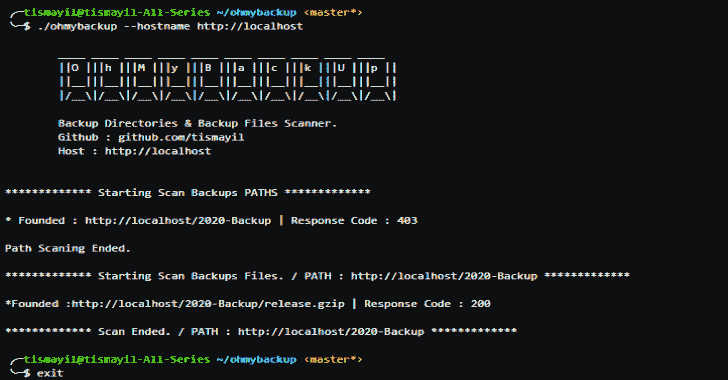

# 扫描受害者备份目录和备份文件

> 原文：<https://kalilinuxtutorials.com/ohmybackup/>

**Ohmybackup** 是扫描受害者备份目录下的&备份文件。它扫描目标站点上的备份文件夹。

在找到的文件夹中搜索存档文件。使用双文件扫描系统，它以不同的方式添加扩展名和文件名，使其更容易被发现。

*   **files/extensions . txt**–为文件添加新的扩展名，例如:以。示例允许您在新的扩展中重试所有尝试过的可能性。
*   **files/files . txt**–它可以根据您添加的扩展名扫描这些文件夹，给它们新的文件名。
*   **files/folders . txt**–递归扫描指定的文件夹。您可以自己添加到此列表中。

**也可阅读—[如何只用号码](https://kalilinuxtutorials.com/how-to-hack-a-mobile-phone-with-just-the-number/)黑手机**

**安装**

**运行 ohmy backup . go–hostname victim . host**

**或**

**去构建 ohmybackup.go**

**运行**

**。/ohmy backup–hostname victim . host**

[**Download**](https://github.com/tismayil/ohmybackup)