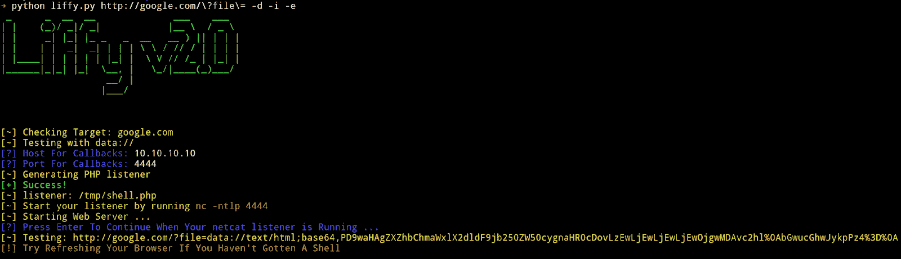

# Liffy:本地文件包含利用工具

> 原文：<https://kalilinuxtutorials.com/liffy-local-file-inclusion-exploitation-tool/>

Liffy 是一个本地文件包含利用工具。一个执行本地文件包含的小 python 工具。

Liffy-v2.0 是它的改进版本，最初由 rotlogix/liffy 创建。后者不再可用，前者也很长时间没有任何发展。

**主要特征**

*   data://用于代码执行
*   expect://用于代码执行
*   输入://用于代码执行
*   filter://用于任意文件读取
*   /proc/self/environ 用于 CGI 模式下的代码执行
*   Apache access.log 中毒
*   Linux auth.log SSH 中毒
*   无中转的直接有效载荷交付
*   支持绝对和相对路径遍历
*   支持 cookies 进行身份验证

**安装**

确保在安装过程中使用 **`python3`** 。**`liffy doesn't support python2`**

*   **克隆存储库**

**git 克隆 http://github.com/mzfr/liffy**

*   **制作虚拟环境**

**python3 -m venv <name-of-virtual-env>例如:python3 -m venv liffy</name-of-virtual-env>**

*   **启动静脉阀**

**源 liffy/bin/activate**

*   **安装依赖关系**

**pip 3 install-r requirements . txt**

**注意**-它使用 msfvenom 来生成 php 负载，所以您应该安装了 metasploit

**也读作-[Metabigor:智能工具但没有 API 键](https://kalilinuxtutorials.com/metabigor/)**

**用途**

**用法:**liffy . py[-h][-d][-I][-e][-f][-p][-a]
[-ns][-r][–ssh][-l LOCATION][–COOKIES COOKIES]
URL

**位置参数:**
url 测试 LFI 的 URL

**可选参数:**
-h，–help 显示此帮助消息并退出
–访问访问日志技术
-ns，–no stager 直接执行有效负载，不使用 stager
-r，–相对使用路径遍历序列进行攻击
–SSH SSH auth log poisoning
-l LOCATION，–LOCATION LOCATION
目标文件的路径(访问日志、auth log 等。 )
–用于验证的 cookies COOKIES 会话 cookie

*   **用数据检查网址://**

选项:**T0 或`--data`T3**

**Ex:python liffy . py http://example.com/?id=-d**

*   **检查输入的网址://**

选项:**T0 或`--input`T3**

例如:python liffy . py http://example.com/?id=-I

*   **用 expect://** 检查网址

选项:**T0 或`--expect`T3**

**Ex:python liffy . py http://example.com/?id=-e**

*   **用过滤器检查网址://**

选项:**T0 或`--filter`T3**

e**x:python liffy . py http://example.com/?id=-f**

*   **使用/proc/self/environ 执行代码**

选项:**T0 或`--proc`T3**

**Ex:python liffy . py http://example.com/?id=-p**

*   **使用 Apache access.log 中毒**

选项:**T0 或`--access`T3**

**Ex:python liffy . py http://example.com/?id=-a**

*   **利用 SSH auth.log 中毒**

选项:**T0 或`--ssh`T3**

**Ex:python liffy . py http://example.com/?id=-s**

*   **相对遍历目录**

选项:`**-r**`

该选项可以与其他选项一起使用，以便相对地遍历目录。

例如:

**python liffy . py http://example.com/?id=-s-r
python liffy . py http://example.com/?id=-p-r
python liffy . py http://example.com/?id=-a-r**

*   **指定日志路径**

选项:`**-l**`或`**--location**`

该选项必须与所有测井技术一起使用，如 **`authlog`、`sshlog`**

例如:

**python liffy . py http://example.com/?id=-s-l/var/auth . log
python liffy . py http://example.com/?id=-a-l/var/Apache 2/access . log**

默认情况下，使用以下位置:

*   对于 SSH 验证日志-`**/var/log/auth.log**`
*   对于 Apache 2 access . log-`**/var/log/apache2/access.log**`

**学分**:

*   所有的开发技术都取自它。
*   这个项目的标志取自[渲染森林](https://www.renderforest.com/)

[**Download**](https://github.com/mzfr/liffy)