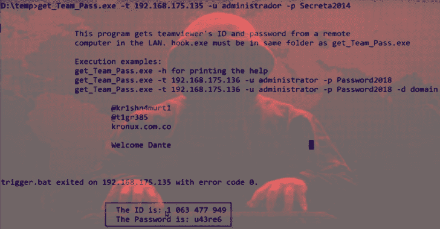

# 获取团队通行证:从局域网中的远程计算机获取 Teamviewer 的 ID 和密码

> 原文：<https://kalilinuxtutorials.com/get-team-pass/>

**Get Team Pass** 是一个工具，你可以用它从局域网中的远程计算机获取 teamviewer 的 ID 和密码。对开发后或系统管理员最有用，并在 windows 7 和 windows 10 x86 和 x64 上经过测试。

**先决条件**

您必须拥有远程计算机上的有效凭据，目标计算机上的端口 445 必须是可访问的

**执行实例:**

**hook.exe 必须和 get_Team_Pass.exe 在同一个文件夹里**

–get _ Team _ pass . exe-h 用于打印帮助
–get _ Team _ pass . exe-t[target IP]-u[Username]-p[Username password]-d[Username domain]#-d 参数可选
–get _ Team _ pass . exe-t 192 . 168 . 175 . 136-u administrator-p password 2018
–get _ Team _ pass . exe-t 192 . 168 . 175 . 136-u

**也可阅读-[0l4bs:面向 Web 应用安全爱好者的跨站点脚本实验室](https://kalilinuxtutorials.com/0l4bs/)**

**演示**

[https://www.youtube.com/embed/ibRYtqjnjZo?feature=oembed&enablejsapi=1](https://www.youtube.com/embed/ibRYtqjnjZo?feature=oembed&enablejsapi=1)

**[点击此处](https://github.com/kr1shn4murt1/get_Team_Pass)** 下载链接，并为那些不想使用。但是 python 中的脚本。

有了这些数据，无需安装额外的软件，无需使用更多的侵入性有效载荷，也无需在防病毒或其他保护系统中生成警报，就可以实现获取 teamviewer id 和密码的目标，因此我们可以连接到机器并访问图形环境。

[**Download**](https://github.com/kr1shn4murt1/get_Team_Pass)