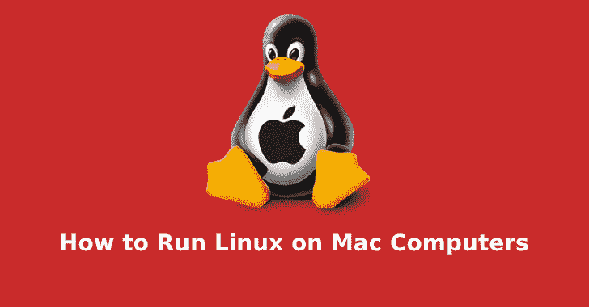

# 通过本指南了解如何在 Mac 电脑上运行 Linux

> 原文：<https://kalilinuxtutorials.com/linux-on-mac/>

一些人认为 Linux 在 Windows 和苹果主导的操作系统领域处于劣势。

然而，访问 Linux 有很多有用的方法。编码人员和临时用户都相信它，而且理由也很充分。这是一个高度通用、可配置、功能强大的平台。

是的，从硬件的角度来看，Mac 在所有气缸上点火。这是卓越性能和耐用性的完美结合。但是，它在软件领域确实有所欠缺。

好消息是你可以通过在 Mac 设备上安装 Linux 来克服这个障碍。他们可以在计算天堂里成为真正的一对。

如果你不知道如何在 Mac 上运行 Linux，不用担心。我们准备了一份易于理解的指南，阐明了整个过程的具体细节。

所以，事不宜迟，让我们开始吧。

## **Linux 价值主张**

Mac OS 在很多方面都优于 Windows，但落后于 Linux。

也就是说，这个操作系统是开源的，这意味着人们可以自由共享它的代码。难怪如此多的程序员认为这是一个显而易见的问题。但是，它不仅仅是软件爱好者所珍视的某种专门工具。

有大量可能的用例需要考虑。你可以在智能手机、超级计算机以及介于两者之间的任何设备上运行这个系统。是的，这包括稍微旧一点的 Mac 电脑，它们甚至不能正确安装 Mac OS X。

这就是说，你可以给你久经沙场的老将 Mac 一个新的生命。您基本上解决了缺乏更新和支持的问题。

问题是，Mac 电脑非常适合 Linux。任何采用英特尔处理器的基于 EFI 的苹果机器都是可以工作的。更大更坚固的是更好的选择，因为它们能带来平稳的性能。

好消息是安装相当简单明了。即使是不太懂技术的人也应该不难理解这个过程。

如果你是苹果产品世界的新手，试着看看这本 Mac 用户指南。它以简单的方式解释了所有的基础知识。

## **权衡你的选择**

第一步是确定选择哪个版本的 Linux。

有许多选项，它们被称为“分配”。这完全取决于个人喜好和你寻求什么样的 OS 体验。

Ubuntu 是初学者的首选，我们推荐这是一个很好的起点。它有一个叫做 Unity 的桌面用户界面。它与 Mac OS 有一些相似之处，降低了学习曲线。

巨大的社区支持是另一个主要卖点。

Linux Mint 是 Ubuntu 的一个受欢迎的替代品，它正在获得很大的吸引力。它适用于许多桌面，如 MATE 和 Cinnamon。Windows 用户在这里比 Mac OS 用户更有家的感觉。

Debian 可能值得你花时间，尽管安装起来有点麻烦。主要优势在于加载的特性堆栈的形式。此外，它在服务器软件环境中表现出色。

至于 Fedora，它代表了 Linux 生态系统中的尖端。许多源自那里的解决方案后来渗透到了其他发行版中。这是高级用户的首选武器。

这个列表还在继续，包括了一些可靠的选项，比如 Debian 衍生的 Kali Linux。它们的用例更窄，更专业。所以，你可以自由探索。

## **在虚拟环境中运行**

有几种方法可以让 Linux 工作。

我们应该首先解决虚拟环境技术。在这里，虚拟化软件是您最好的盟友，因为它大大简化了安装。

说到工具，Parallels Desktop 和 VirtualBox 是一个安全的赌注。它们易于安装和充分利用。它们使您能够在虚拟环境中，在 Mac OS 中启动 Linux。

首先，将选定的发行版文件下载到您要用于安装的文件夹中。该文件应该有一个“iso”扩展。

之后，您必须在您选择的工具中导航到正确的选项。在 Parallels 的情况下，你点击“文件”和“新建”。然后，选择从 DVD 或映像文件安装操作系统的选项。

剩下的就是填写用户名、密码和其他细节。一旦你解决了这个问题，程序就会在虚拟域中安装 Linux。从那以后就差不多是自动驾驶了。

## **一个完整的开关**

第二种方法是用 Linux 取代 Mac OS。

这对已经熟悉 Linux 生态系统的用户来说是有意义的。好处是您可以释放更多的资源，并将您的硬件转变为专用的 Linux 平台。当然，也有不好的一面:您会丢失 Mac OS 安装文件和恢复分区。

此外，请注意，与在 Windows 机器上安装相比，此过程需要您做更多的工作。更准确地说，你需要做一些调整和准备活动。

记住这一点，您可以从下载发行版开始。复制“iso”文件到你的 USB 设备上，最好是通过 Etcher 这样的工具。

此过程将清除您在 USB 上的所有内容，因此请确保您已对其进行了备份。

下一步是在蚀刻机中选择正确的驱动器。根据您有多少个驱动器，它应该是这样的:/dev/disk1、/dev/disk2 或/dev/disk3。不要选择/dev/disk 0——那是你的硬盘。

最后，你可以点击“闪存”，让复制开始。一旦完成，你可以关闭你的电脑。

## **开机**

下一阶段，我们需要从 USB 引导 Linux。

为此，请在按住启动按钮的同时给 Mac 通电。它允许您选择“电喷启动”，然后“返回”。应该会弹出一个黑白屏幕，显示尝试或安装操作系统的选项。

在选择任何东西之前，按“e”键。这将允许您编辑启动条目。事实上，您必须更改以“Linux”开头的行。插入以下短语:“nomodeset”和“安静飞溅”。

完成此操作后，按 F10 并在试用模式下启动操作系统。现在你可以点击安装选项，然后点击“安装这个第三方软件”和“擦除磁盘并安装 Ubuntu”。

最后，是时候选择你的硬盘、位置、键盘布局、用户名和密码了。这些是安装前的最后步骤。

点击“继续”,等待过程结束。

记得我们说过，这种方法会删除您的 Mac OS 安装和恢复文件。嗯，如果你把它们备份到 u 盘上，你随时可以恢复到这个系统。

最好保持你的选择是开放的，不是吗？

## **双启动的利与弊**

在这一点上，我们要再次提到双启动。

尽管我们建议不要使用这种方法，但是一些用户报告说这种方法对他们很有效。归根结底，你更看重什么:拥有多个操作系统还是确保最高性能。

如果答案是两个操作系统，确保你有足够的空间和一个 EFI 启动管理器。

遵循我们已经描述过的发行版下载和复制过程。这次的不同之处在于对你的 Mac 硬盘进行分区。这需要在两个系统之间划分你认为合适的空间。

较新版本的 Mac OS 具有“[容器容量](https://www.lifewire.com/volume-vs-partition-2260237)”功能。它们支持本机操作系统，但是对于 Linux，您确实需要“分区”选项。你基本上必须创建一个有足够空间的 MS-DOS (FAT)格式的空白板。

这些步骤为安装做好了准备。我们不再赘述，因为这个过程与之前讨论的几乎相同。

但是，一定要熟悉修复由双重引导引起的任何性能问题的方法。做一个平稳的操作者，无论你想让你的 Mac 车辆带你去哪里，你都可以坐在驾驶座上。

#### **现在你知道如何在 Mac 上运行 Linux 了:是时候行动了**

Linux 是最好的可配置操作系统。

它给了你一个机会来摆脱 Apply 想要你做的事情的严格限制。这给了你更高的自由度和灵活性。

它的美妙之处在于，你不必成为一个科技奇才来实现它。我们已经向您展示了如何以多种方式在 Mac 上运行 Linux。这并不一定是一件乏味耗时的工作。

你的任务是简单地遵循一个循序渐进的过程。记得备份所有东西，并仔细检查兼容性。通过尽职调查，您将避免诸如删除有价值的数据之类的陷阱。

最终，是否双引导是你的选择。此外，您可以随意在 Mac OS 和 Linux 之间切换，或者完全过渡到新的 OS。如果您想运行这个发行版，请查看我们的 Kali Linux 部分。给你更多的力量