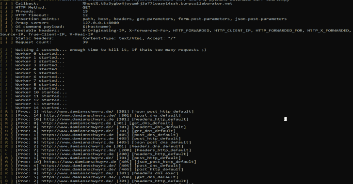
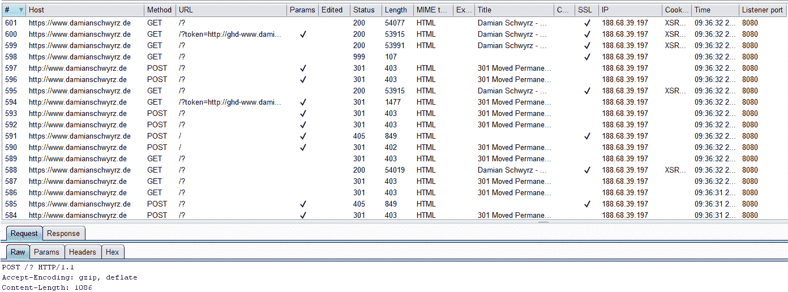
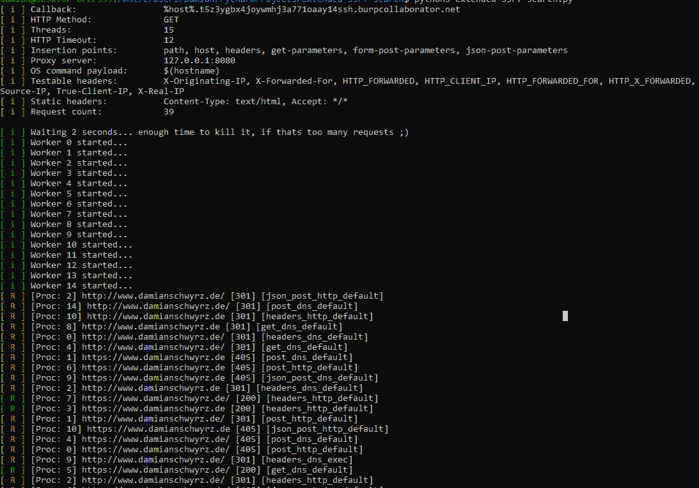

# 扩展 SSRF 搜索:使用不同方法的智能 SSRF 扫描仪

> 原文：<https://kalilinuxtutorials.com/extended-ssrf-search/>

该工具使用请求不同部分的预定义设置(路径、主机、头、post 和 get 参数)来搜索 **SSRF** 。将**example . app-settings . conf**重命名为 **app-settings.conf** 并调整设置。

最重要的设置是回调 url。我建议使用打嗝合作者。然后您可以将您的 url 添加到 config/url-to-test.txt 中。

如果您愿意，您可以将自己的 cookie 添加到 config/cookie-jar.txt 中，并为您的请求添加额外的头。post 和 get 请求中使用的暴力列表目前很小，我不认为增加 2000 个参数是明智的。

我们应该把重点放在那些最有可能受到伤害的人身上。如果你不这么认为:就自己加吧！

**也可阅读-[ABD:高级二进制去模糊](https://kalilinuxtutorials.com/abd-advanced-binary-deobfuscation/)课程材料 **

**执行**

该工具不希望通过 CLI 获得任何参数，因此只需键入:

**python 3 extended-ssrf-search . py**

**配置**

它可以设置许多选项和设置，所以这里有一些解释。

*   **文件**

主配置文件是“app-settings.conf”，所有的事情都必须在这个文件中完成！除此之外，还有一些其他文件允许设置更复杂的数据，如标题，网址和 cookies。

*   **config/cookie-jar.txt**

使用此文件添加 cookie 字符串。我通常复制你能在每个打嗝请求中看到的那个。请复制“Cookie:”头的值。默认文件中有一个示例输入。

*   **config/http-headers.txt**

这个文件定义了添加到请求中并被操作的 http 头(每个头都添加了有效负载)。最重要的已经在文件里了。但是请随意添加更多内容。

*   **配置/参数. txt**

该工具具有强力获取和发布参数的选项。在这种情况下，将使用这些参数(以及查询字符串中的参数)。每个参数都以值的形式获得有效负载。最重要的已经在文件里了。

*   **配置/静态请求标题. txt**

这些头被添加到每个请求中，但是它们不会被操纵。它们是静态的。这是添加授权或不记名 cookies 的最佳位置。每行一个(键:值)！

*   **config/urls-to-test.txt**

这就是你需要的文件！请在此添加您要扫描的链接。允许以下格式:

*   [https://domain.com](https://domain.com)
*   [https://domain.com/path](https://domain.com/path)
*   [https://domain.com/path?param=value&param 1 = value 1](https://domain.com/path?param=value&param1=value1)
*   domain.com

当检测到最后一种情况时，在前面加上“http://”。该工具旨在处理一个良好的 URL 列表。得到它的一个好方法是使用打嗝输出它。那么你就有了一个有效的 URL 列表。你需要做的只是添加你的饼干。

**设置**

app-settings.conf 定义了程序工作流程。这是最重要的文件，你可以激活/关闭不同的模块。

**基础设置**

*   **呼叫回主机**

所有 dns 和 http 请求被发送回的 URL/主机——我在这里主要使用 burp collaborator，但 DNSBin 或您自己的服务器也很好。

*   **HTTPMethod**

定义请求方法。有效的选项有:GET，POST，PUT，DELETE，PATCH，GET，options 无效的值将产生大量错误，因为 http.client 不允许其他方法！我不检查你是否做错了什么😉

*   http time out

有些请求可能需要很长时间。您可以在这里定义最大值。一个请求的执行时间。我推荐 2 到 6 秒之间的值。

*   **最大线程数**

线程越多，脚本越快——但是因为我们要处理大量的连接，我通常在我的个人电脑上保持在 10 以下，在我的 VPS 上保持在 30 左右。

*   **洗牌测试**

特别是在处理一个大的 URL 列表时，将这个设置为“true”将会打乱所有创建的测试。这样，同一个主机就不会受到太多的攻击。如果您只扫描一台主机，那也没关系。

*   **GetChunkSize**

当处理较大的参数列表时，这可能会很方便，并且可以防止 400 个太大的实体错误。

**插入点**

每个插入点都可以激活(设置为真/1)或停用(设置为假/0)

*   **路径中的**

该示例显示了一个 GET 请求，但是根据您的设置，这也可以是 POST、PUT、DELETE 等等

获取[在此注入有效负载] HTTP/1.1
…

*   **InHost**

该示例显示了一个 GET 请求，但是根据您的设置，这也可以是 POST、PUT、DELETE 等等

GET /path HTTP/1.1
主机:[在此注入有效负载]
…

*   **附加标题**

该示例显示了一个 GET 请求，但是根据您的设置，这也可以是 POST、PUT、DELETE 等等

GET/path HTTP/1.1
…
X-Forwarded-For:[在此插入有效负载]

*   **输入参数获取**

这里的方法是固定的。

获取/路径？[在此注入有效载荷] HTTP/1.1
…

*   **参数发布**

这里的方法是固定的。

POST/path HTTP/1.1
…
Content-Type:application/x-www-form-urlencoded
Content-Length:XXX
【在此注入有效负载】

*   **InParamsPostAsJson**

这里的方法是固定的。

POST /path HTTP/1.1
…
内容类型:应用/json
内容长度:XXX
【在此注入 JSON-PAYLOAD】

**攻击**

在默认设置中，该工具只是试图通过 SSRF 触发 http 请求。但是，当注入操作系统命令时，也有可能使用 DNS 泄漏数据。最常见的有效负载是“$(主机名)”。有一些选项允许额外使用这种攻击。

*   使用执行有效负载

使用此设置，您可以激活/禁用该行为。

*   **ExecPayload**

在这里，您可以定义自己的有效负载，例如$(uname -a)

**标识符**

为了使识别变得容易一点，当前主机和方法的组合(以简短的形式，参见 Tests.py)被附加或预先添加到有效载荷中。

*   **位置**

有效选项是“追加”和“前置”！

如果选取了“附加”,则有效负载如下所示:

….burpcollaborator.net/www.attacked-domain.com-testmethod
http://…. burpcollaborator . net/www . attached-domain . com-test method

如果选取了“前置”,则有效负载如下所示:

www.attacked-domain.com-testmethod.burpcollaborator.net
http://www . attached-domain . com-test method . burpcollaborator . net/

**隧道挖掘**

也可以使用隧道，例如“127 . 0 . 0 . 1:8080”(Burp 代理)，来监控 Burp 内的所有流量。

*   **激活**

将此项设置为“true”将强制脚本使用隧道连接。

*   **隧道**

在这里设定你的代理服务器“ip:port”。

结果如下，当你打开 Burp 你可以看到你的 http 历史:

**截图**

[**Download**](https://github.com/Damian89/extended-ssrf-search)