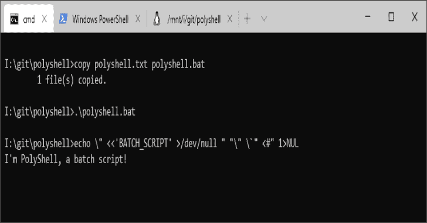
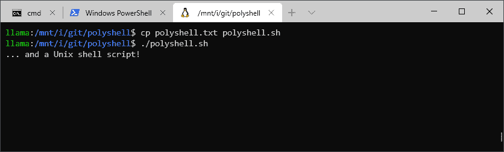
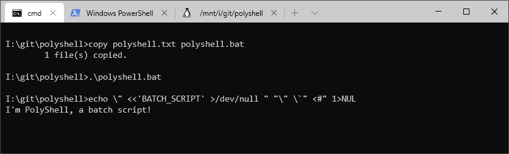
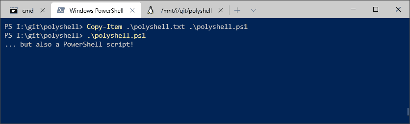

# Polyshell:一个 Bash/Batch/PowerShell 多语言程序

> 原文：<https://kalilinuxtutorials.com/polyshell/>

[](https://1.bp.blogspot.com/-lmvR6XJPhvk/Xls7KQh-XgI/AAAAAAAAFNM/4w0Ovk8GnqULOGxIa8qK7RRZA2-Q7jhlQCLcBGAsYHQ/s1600/polyshell-1%25281%2529.png)

**PolyShell** 是一个在 Bash、Windows Batch 和 PowerShell 中同时有效的脚本。这使得 PolyShell 成为渗透测试的有用模板，因为它可以在大多数系统上执行，而不需要特定于目标的有效载荷。

它还被专门设计为通过使用 [USB Rubby Ducky](https://shop.hak5.org/collections/usb-rubber-ducky/products/usb-rubber-ducky-deluxe) 、 [MalDuino](https://malduino.com/) 或类似设备的输入注入来交付。



**也可阅读-[SSF:安全套接字漏斗网络工具](https://kalilinuxtutorials.com/ssf-secure-socket-funneling/)**

**怎么用？**

*   **作为独立脚本**

1.  复制/重命名脚本，使其具有正确的文件扩展名( **`.sh`、`.bat`或`.ps1`** )。
2.  使用 Unix shell、批处理文件或 PowerShell 运行脚本。

*   **使用输入注入**

1.  在目标机器上打开一个终端。
2.  运行有效载荷。
3.  按 Ctrl-C，然后运行`**exit**`。

输入注入方法的行为与脚本方法略有不同。当作为脚本运行时，一旦语言被处理，有效负载将立即退出。当通过注入交付时，有效负载运行一个读循环。没有它，有效负载将关闭终端窗口，但继续输入未知窗口。Ctrl-C 将脚本从读取循环中分离出来，允许它在没有意外副作用的情况下运行。

此外，将脚本粘贴到终端可能会失败。一旦脚本到达读取循环，一些终端会将剩余的粘贴文本视为读取循环的输入(好)，但其他终端可能会在读取循环退出时继续执行脚本(坏)。

它是如何工作的？

主要的技巧是，当我们想运行特定于其中一种语言的代码时，让彼此的语言“移开视线”。这是通过利用围绕引用、重定向和注释的语言怪癖来实现的。
考虑下面一行:

**echo】<<【batch _ script】>/dev/null】>【空】<**

每种语言都看到了`echo`命令，但是会以不同的方式解释该行的其余部分。
例如，这是每种语言将解释为字符串的内容:

```
 echo \" <<'BATCH_SCRIPT' >/dev/null ">NUL "\" \`" <#"
Bash                                      [-----]     [---]
Batch       [-----------------------------]     [-]   [---]
PS          [-----------------------------]     [-] 
```

执行完这一行后，bash 脚本将在 [here 文档](https://www.tldp.org/LDP/abs/html/here-docs.html)中，PowerShell 脚本将在[多行注释](https://ss64.com/ps/syntax-comments.html)中，批处理脚本将继续正常执行。每种语言执行完毕后，我们就终止它。这防止我们需要在脚本的后面解决它的问题。

**怪癖**

显然，制作这种多语种语言所需的技巧并不遵循*正常的*编码惯例。
有相当多的怪癖被利用或需要解决:

*   这三种语言都有不同的转义字符:
    *   Bash:反斜杠(`**\**`)
    *   批处理:插入符号(`**^**`)
    *   PowerShell:反斜杠(`**`**`)
*   转义字符在 Bash 和 PowerShell 字符串中有效，但在批处理字符串中无效。
*   除非被引用，否则重定向(即`**<**`和`**>**`)在所有三种语言中都有特殊的含义。
*   重定向不一定要在命令的末尾。
    *   这是有效的 Bash/Batch/PowerShell:**`echo >output.txt "Hello World"`**
*   Batch 是唯一没有多行字符串或注释的语言*。*
*   Batch 将`>`视为重定向，即使它直接触及一个字符串，但 PowerShell 不这样做。
*   批处理脚本`GOTO`语句仅在作为脚本运行时有效，在交互运行时无效。
*   PowerShell 的多行注释(`<#`)前面必须紧跟空格。
*   Bash 的 here 文档可以在任何地方开始*，只要它没有被引用并且不是注释。*

[**Download**](https://github.com/llamasoft/polyshell)