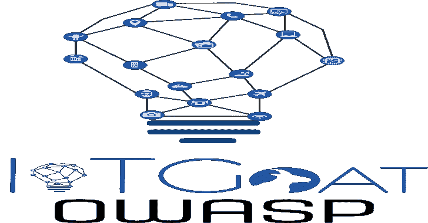
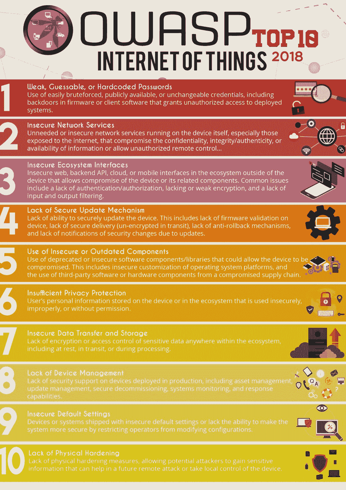

# IoTGoat:基于 OpenWrt 的故意不安全固件

> 原文：<https://kalilinuxtutorials.com/iotgoat/>

项目是一个基于 OpenWrt 的故意不安全的固件。该项目的目标是让用户了解物联网设备中最常见的漏洞。

这些漏洞将基于 OWASP 记录的物联网十大漏洞:[https://www . OWASP . org/index . PHP/OWASP _ Internet _ of _ Things _ Project](https://www.owasp.org/index.php/OWASP_Internet_of_Things_Project)。

要开始开发 IoTGoat 挑战，请查看[构建环境指南](https://github.com/scriptingxss/IoTGoat/blob/master/BuildEnvironment.md)页面。预编译固件和最新版本的 OVA 可以通过[https://github . com/scripting XSS/IOT goat/tree/master/build _ environment](https://github.com/scriptingxss/IoTGoat/tree/master/build_environment)找到。

如果缺少一个关键的挑战想法，请联系下面的项目负责人，或者在[项目任务页面](https://docs.google.com/spreadsheets/d/1KXX2K7ikkve6wmdfAVu-sZONgKEBuAkRij_paJUgX2w/edit?usp=sharing)添加详细信息。请务必加入 [OWASP Slack 团队](https://join.slack.com/t/owasp/shared_invite/enQtNjExMTc3MTg0MzU4LWQ2Nzg3NGJiZGQ2MjRmNzkzN2Q4YzU1MWYyZTdjYjA2ZTA5M2RkNzE2ZjdkNzI5ZThhOWY5MjljYWZmYmY4ZjM)，然后加入 **#iot-security** ，了解即将到来的项目会议和更新的新闻。

**也读作-[进度打嗝:跟踪漏洞评估进度的打嗝套件扩展](https://kalilinuxtutorials.com/progress-burp/)**

**项目负责人**

*   亚伦·古兹曼(@scriptingxss)
*   福蒂奥斯·尚齐斯
*   保利诺·卡尔德龙

[**Download**](https://github.com/scriptingxss/IoTGoat)